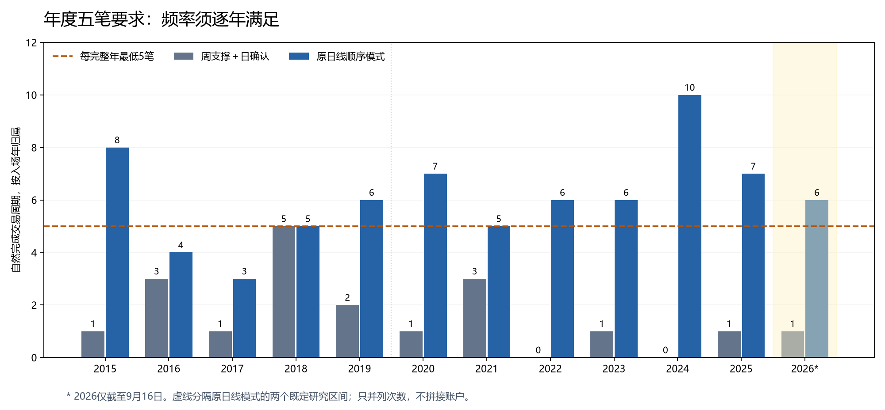

# 每年至少五次，胜率或实际盈亏比：现有日周线结果复核

用户最新要求已落实：每个完整自然年至少5个完整交易周期，优势来自较高胜率或较大实际盈亏比，二者满足一项即可。此次对35份已有指标记录重新计数，未新增策略或账户。仍没有证据足以认定完整策略达标。

## 当前研究标准

一次买入到全部卖出计一笔，按入场年归属；分批买卖不拆成多笔。逐年补齐零交易年份，不用多年平均替代。不完整年份单列；未退出和样本终点强制清仓不用于凑次数。此处每年5次是策略验收要求，并非年底补单指令。

胜率或盈亏比的数值尚未由用户指定。为保证比较连续，本轮沿用上一轮研究口径：压力成本后胜率≥55%，或平均实际盈亏比≥2，同时要求平均净收益及平均净利润为正。55%和2只是待明确的研究比较线，不是保证。旧的20万元、完整账户净夏普≥1.2、净年化≥10%、最大回撤≤10%及仓位风险约束保留。

只用日线与已完成周线。股票ETF按T+1交易：[上交所说明](https://www.sse.com.cn/assortment/fund/etf/question/c/c_20240118_5734755.shtml)。本轮只读取原保存交易记录，没有假设同日买卖。

## 与新增要求最相关的结果

| 既有方案及原区间 | 自然完成笔数 | 压力净胜率 | 实际盈亏比 | 平均单笔净收益率 | 满5次的完整年/完整年总数 | 原账户净夏普 |
|---|---:|---:|---:|---:|---:|---:|
| 周支撑＋日确认 | 19 | 73.68% | 0.84 | 1.21% | 1/11 | 未定义 |
| 再加计划净空间至少2 | 4 | 50.00% | 1.74 | 0.87% | 0/11 | 未定义 |
| 再加周MACD回升 | 2 | 50.00% | 1.34 | 0.69% | 0/11 | 未定义 |
| 再加日MACD、低波动、相对放量 | 0 | 未计算 | 未定义 | 未计算 | 0/11 | 未定义 |
| 日线顺序模式：2015—2019 | 26 | 50.00% | 0.77 | -0.32% | 3/5 | -0.22 |
| 日线顺序模式：2020—2026 | 47 | 40.43% | 2.44 | 0.50% | 6/6 | 0.44 |
| 日线顺序模式：最近504日 | 16 | 62.50% | 2.31 | 1.76% | 1/1 | 1.19 |

表中实际盈亏比统一按每笔净利润/该笔买入支出得到的收益率计算；金额盈亏比单独保存在结果表。因仓位与成交支出不同，两者不能混称。最近日周线点位的平均收益是单笔投入收益，连续完整账户尚未计算。三个顺序模式区间沿用原研究边界，彼此存在重叠，不能把次数相加或拼接收益。年化沿用来源口径：日线顺序模式252日，原14方案242日；本轮不据此跨组排名。

基础周支撑点位的胜率73.68%可列入胜率路线观察，但19笔样本的胜率描述性95%区间约51.21%—88.19%，上一轮净均值区间也跨零。2015—2025只有2018年达到5笔；增加MACD、低波动、放量条件后次数更少。因此它不符合新的年度频率要求。

日线突破/收复/修复对照在原2020年至2026年9月16日期间共47笔，胜率40.43%，收益率盈亏比2.44、金额盈亏比2.35，平均每笔净收益约0.50%；2020—2025每个完整年有5—10笔，符合新增的频率与大盈亏比比较线。但是完整账户净夏普仅0.4416、净年化3.20%、最大回撤11.19%，没有达到保留的账户目标。它只是显示这种优势形态在保存结果中存在，不构成旧策略恢复。

该日线模式的2015—2019原对照期有26笔、胜率50%、收益率盈亏比0.77，平均净收益为负，且2016年4笔、2017年3笔。不能只保留2020年以后的有利区间。2020年后最大一笔盈利来自2024年9月25日至10月9日，占总净利润约92.67%；移除该笔后剩余净利润仅约3304元。这是集中度说明，未据此删除该笔或重新回测。

原14个历史方案在2020—2025均有年份不足5笔：2021年统一4笔、2022年统一2笔、2023年0—2笔；该组全部不满足每完整年五笔。其较高的保存夏普不能代替频率要求；14项高度相关的变体也不是14份独立证据。旧方案中的样本终点退出已在计数表中另列。

## 逐年次数

| 年份 | 周支撑＋日确认 | 原日线顺序模式 | 日线顺序模式当年次数判断 |
|---|---:|---:|---|
| 2015 | 1 | 8 | 通过 |
| 2016 | 3 | 4 | 不足5次 |
| 2017 | 1 | 3 | 不足5次 |
| 2018 | 5 | 5 | 通过 |
| 2019 | 2 | 6 | 通过 |
| 2020 | 1 | 7 | 通过 |
| 2021 | 3 | 5 | 通过 |
| 2022 | 0 | 6 | 通过 |
| 2023 | 1 | 6 | 通过 |
| 2024 | 0 | 10 | 通过 |
| 2025 | 1 | 7 | 通过 |
| 2026（截至9月16日） | 1 | 6 | 未完整，不裁决 |

日线顺序模式的2015—2019和2020—2026来自原先分开的账户实验；这里只并列逐年次数，不拼接为新账户。2026年没有完整覆盖，6笔可以披露，但不据此宣称全年已经通过所有要求。

## 对下一阶段研究的约束

频率不足与质量不足应分别处理：周线支撑低频节点可作为补充观察，不能独自承担年度五笔；日线确认机制能够形成更密集的机会，但仍须证明收益不只依赖少数行情。胜率路线和大盈亏比路线分别报告，不再要求每笔事前目标空间都≥2，也不强制两种优势同时存在。MACD、波动率和成交量继续作为解释条件，任何新增筛选都要同时显示它减少了多少机会；不因次数不足临时松阈值，也不在看到结果后延长持有期。

未重新运行当前50%最高仓位和尾部约束下的账户。已有日线顺序模式按原规则接近满仓入场；旧完整账户数字仅是历史对照，不能直接作为当前风险合同的验证。样本均已被使用，独立验证未建立。最新价格仅到2026年9月16日，本报告没有当前进场价。

可复核文件：[任务标准](protocol.json)、[35项方案比较](results/方案对照.csv)、[逐年完整次数](results/逐年交易次数.csv)、[原周期统一口径](results/重新计数周期.csv)、[计算结果](result.json)、[验证](verification.json)。
