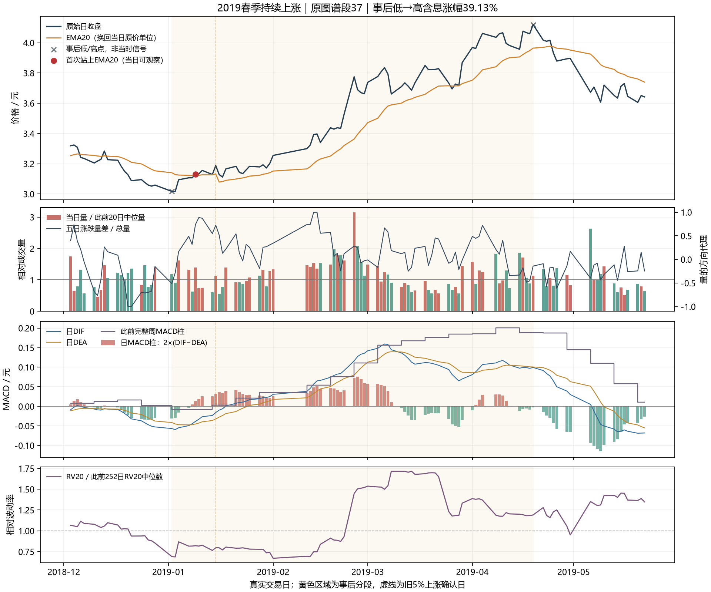
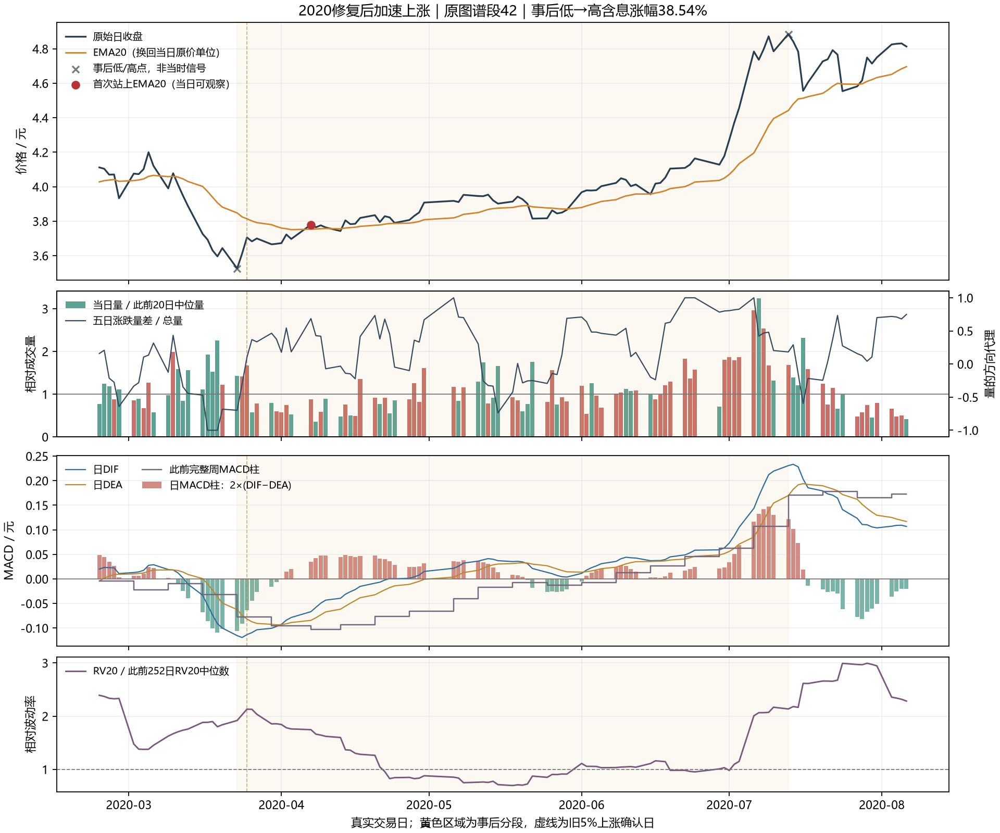
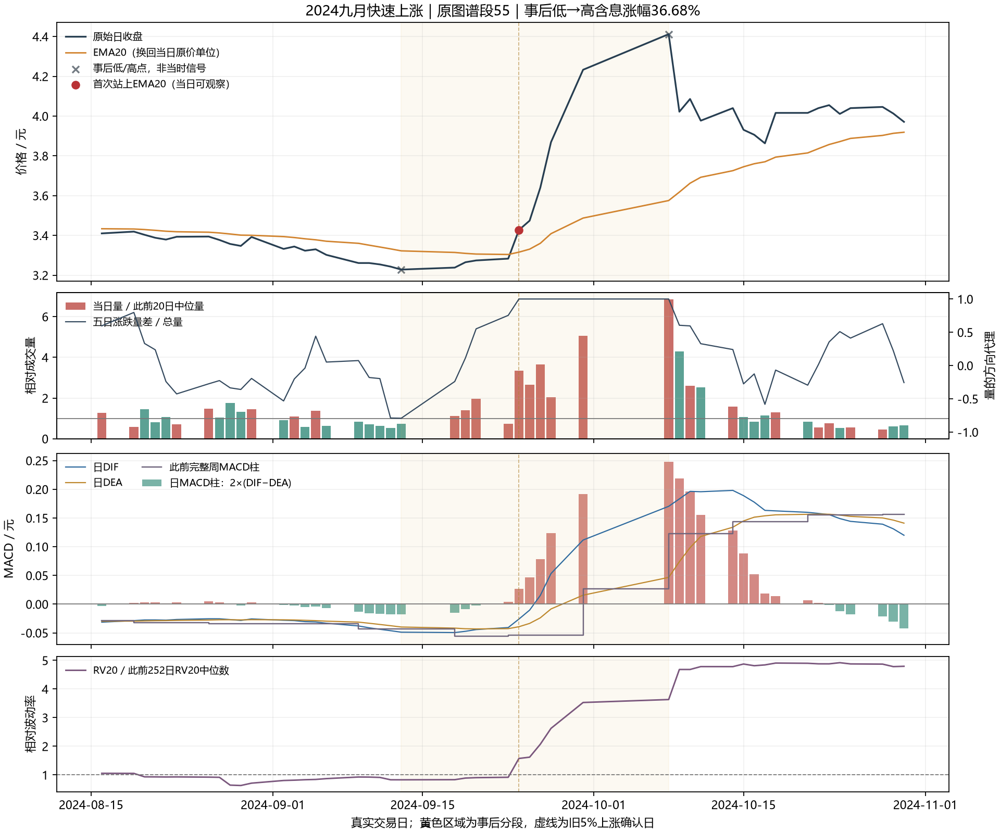
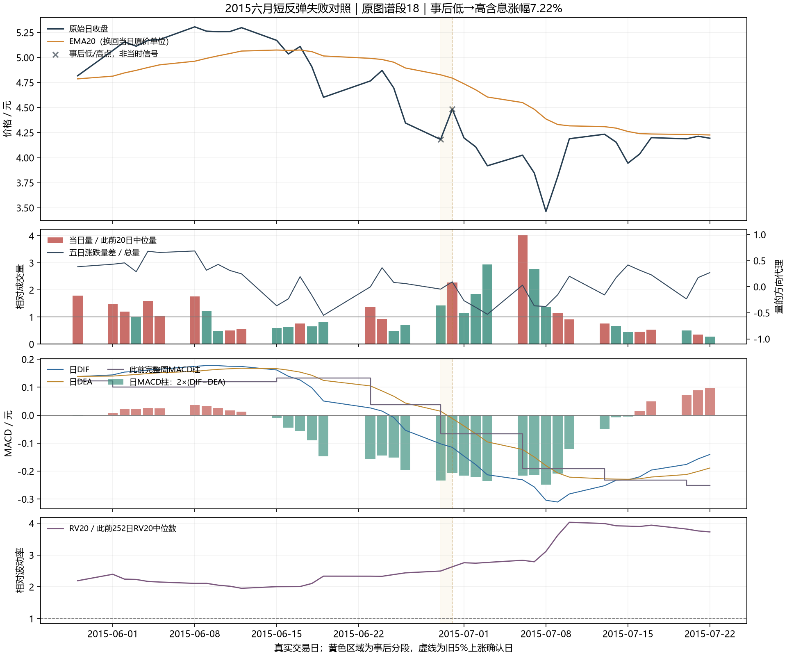

# 先解释具体上涨，再反推进场点位

用户明确要求先解释具体上涨段的量价与指标，再反推当时能识别的点位。本报告复用旧49段图谱，形成三个上涨路径与一个短反弹的直观解释；不是新图谱、新策略回测或独立验证。

旧图谱数据为2012-05-28至2026-09-16，合格49段、2826成熟原点。低/高点用于事后对齐，不能把最低点已知、最高点能卖当成策略。日MACD12/26/9柱为2×(DIF−DEA)，周线只取此前完整周；相对量对前20日中位量，RV20对此前252日中位数，五日涨跌量差是量价代理，不是主动买卖差或资金身份。

## 1. 2019：先止跌修复，随后价格确认

原段2019-01-02至04-19，事后含息涨幅39.13%。01-03日MACD负柱首次收敛，01-04相对量1.62倍且五日涨跌量差转正，01-08日柱转正，01-09价格站上EMA20，01-14前完整周MACD转正。

01-09可以观察到价格确认与量的方向改善，当时相对量1.40倍、波动比0.82、周MACD仍负。价格较事后低点已经涨3.75%，因此不是‘最低点买入’。01-03只是下跌速度减缓；真正持续上涨不能由一个负柱变短推出。

## 2. 2020：高波动修复与后段加速

原段2020-03-23至07-13，事后含息涨幅38.54%。03-24负柱开始收敛，03-25相对量1.67倍、五日涨跌量差转正，但波动比2.13、价格尚未站上EMA20、前完整周MACD仍负。04-01日柱转正，04-07才首次站上EMA20；前完整周MACD到06-08才转正。

这段不能套用‘上涨前必须低波动’或‘必须先周线金叉’：修复早段仍高波动，周线转正时距事后低点已经涨14.07%。早段修复与后段加速是不同阶段，风险距离和可成交价格需要分别判断。这里仅解释原路径，不将04-07自动认定为高胜率入场。

## 3. 2024：早段确认与晚段拥挤看起来都很强

原段2024-09-13至10-08，事后含息涨幅36.68%。09-18日负柱开始收敛，09-19五日涨跌量差转正，09-20相对量1.97倍，09-23日柱转正；09-24价格站上EMA20且突破此前20个收盘，相对量3.34倍、五日涨跌量差1.00，波动比1.57，而前完整周MACD仍负。

09-24是当时已经可观察的价格和量确认，较事后低点已涨6.16%。09-30周MACD才转正，价格距低点已经涨31.13%。10-08日/周MACD、量和涨幅更强，相对量6.85倍、波动比3.63，却处于这段事后高点。最新固定事件模型在10-08决定、10-09进场、10-10退出，实际扣费−5.32%。这个真实反例说明指标强度不能直接等同于进场质量，也不能仅用‘放量且MACD好’表达整个路径。

## 4. 2015：放量反弹和MACD回升也会失败

原段2015-06-29至06-30，事后只持续一个上涨区间，但涨幅7.22%。06-30日MACD负柱收敛、相对量2.27倍、五日涨跌量差转正；价格仍在EMA20下，日DIF和此前完整周MACD仍负，波动比2.63。随后07-01再次下跌并触发旧5%回落确认。

最新固定事件模型在06-30决定、07-01进场、07-03退出，实际扣费−7.23%。06-30的量与日柱改善确实存在，但没有建立价格持续修复。2020早段也曾价格在均线下且高波动，所以不能据这一个反例后验写成‘均线下永不买’或一个波动阈值。

## 这些案例支持怎样的研究顺序

先分清三层事实：日MACD负柱收敛描述下跌减速；量与价格确认描述修复是否得到支持；距离前期价格和风险边界、次日开盘跳空及后续维持情况决定这一点位能否形成好的实际盈亏。周MACD适合提供此前阶段背景，在这些案例中等待转正会不同程度延后入场。后续维持只有逐日发生后才可用，不能回填到首次信号日。

更值得先研究的不是指标越多越好，而是相同初始改善之后的顺序：价格是否随后确认、确认是否很快失败、以及到实际能进场时是否已过度延伸。具体日期可作为解释和候选研究原点，不能仅凭三个成功例和一个失败例得出胜率或盈亏比。

旧完整图谱提供必要约束：49段中日MACD柱回升很常见，但在186个相同上穿EMA20价格事件上，单项日/周MACD、量、波动等九个附加状态没有一个通过原固定增量门。该失败保持；本报告没有重跑门或把案例改称新策略。旧顺序模型和已试过滤也需要按具体完整定义判断，不能用改名或阈值搜索恢复。

现已把旧186个价格确认事件全部映射为当时可知顺序：只读取本次上穿前连续均线下区间和当前日，不使用事后低点；MACD、量的首次出现与已在区间起点满足分开，未来20日结果独立存为后验列。下一步从此表提出一个有明确事前证据、失效条件与可成交时点的完整机制。相同旧表达直接保留原裁决；实质不同的机制才单独固定，再评价完整账户。现在没有已冻结的新规则，不先选止盈止损、窗口或指标组合使案例看起来获利。

[逐关键日原值和原结果标签](关键日事前量价指标与原结果标签.csv) · [四段顺序表](四段路径与指标顺序.csv) · [复用来源与范围](source_and_scope.json) · [原49段全集](../510300_upward_episode_anatomy_v1/results/上涨段全集.csv) · [原九项增量失败](../510300_upward_episode_anatomy_v1/results/反推规则证据表.csv) · [最近模型全部真实点位](../510300_point_first_passage_study_v1/results/实际进出点位与事前指标.csv)

当前全部历史仍为开发资料，供应首版未认证；没有新的独立验证、收益/夏普提升或实盘授权。原实际模型金融裁决TECH.R158保持，TECH.R159只接受研究顺序与这些有限描述事实。

[全部186个当时已知顺序](原186个确认事件的当时已知顺序.csv) · [映射定义](sequence_map_definition.json) · [映射结果](sequence_map_summary.json)
