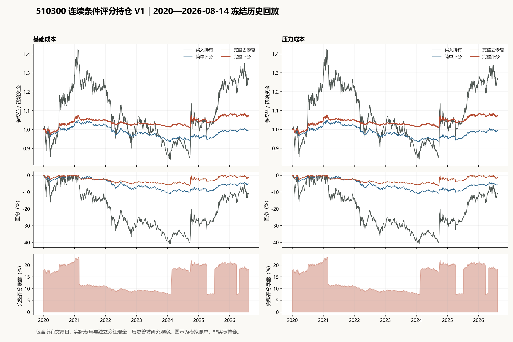

# 510300 连续条件评分持仓 V1 研究结果

**裁决：未通过验收，完整负结果冻结保留。** 完整模型基础净夏普0.353，压力净夏普0.351；验收线始终为1.2。

主评价为2020-01-02至2026-08-14，共1604个连续交易日。初始20万元，只模拟510300.SH和人民币现金；2015—2019完成训练，主评价期不重训。末日收盘估值，终值仍可持有ETF，未扣未来退出费用。年化统一242天，现金利息为零。

本轮使用已存在且已核验到2026-08-14的行情和分红，因此截止日早于本次执行日期。数据为历史下载/更正版本，不是逐日原始发布快照；这段历史已被多次研究观察，不能称为完全未见样本或未来收益证明。

## 完整经济比较

| 模型 | 成本 | 净夏普 | 复合年化净收益 | 算术年化净收益 | 年化波动 | 最大回撤 | 平均暴露 | 年化双向换手 | 总摩擦/元 |
|---|---|---:|---:|---:|---:|---:|---:|---:|---:|
| 买入持有 | 基础 | 0.287 | 3.60% | 5.16% | 18.01% | -40.95% | 95.32% | 0.15 | 185.11 |
| 买入持有 | 压力 | 0.286 | 3.60% | 5.16% | 18.02% | -40.97% | 95.38% | 0.15 | 321.86 |
| 简单评分 | 基础 | 0.001 | -0.06% | 0.00% | 3.41% | -11.06% | 19.68% | 0.98 | 1,038.48 |
| 简单评分 | 压力 | -0.010 | -0.09% | -0.03% | 3.44% | -11.22% | 19.86% | 1.09 | 2,133.40 |
| 完整评分 | 基础 | 0.353 | 1.05% | 1.10% | 3.10% | -6.21% | 14.49% | 0.13 | 148.74 |
| 完整评分 | 压力 | 0.351 | 1.05% | 1.09% | 3.10% | -6.22% | 14.50% | 0.13 | 267.17 |
| 完整去修复 | 基础 | 0.352 | 1.05% | 1.10% | 3.11% | -6.24% | 14.52% | 0.13 | 149.14 |
| 完整去修复 | 压力 | 0.349 | 1.04% | 1.09% | 3.11% | -6.25% | 14.52% | 0.13 | 268.28 |

年化双向换手为每日成交额/成交前权益的合计乘242/交易日数，全仓买入和全仓卖出各计1倍。佣金和滑点含最低收费及不利价位舍入。

## 冻结模型与开发

同一九组gamma/lambda配置用于完整和简单两个模型，各3个内层验证年，共54次内层拟合和2次2015—2019重估；总实际候选评估291,014次。未追加种子、窗口、交易规则或优化预算。

**完整评分**：gamma=10，lambda=0.1；内层选择分数-0.017391；最终优化状态`FIXED_BUDGET_EXHAUSTED_BEST_FEASIBLE`。

| 系数 | 冻结值 |
|---|---:|
| intercept | -0.890730637 |
| T | 0.052188398 |
| Q | 0.101781114 |
| B | 0.004114209 |
| D | 0.180322946 |
| R | 0.029517038 |

**简单评分**：gamma=10，lambda=0.001；内层选择分数-0.012595；最终优化状态`FIXED_BUDGET_EXHAUSTED_BEST_FEASIBLE`。

| 系数 | 冻结值 |
|---|---:|
| intercept | -0.661308424 |
| T | 0.005026402 |
| Q | 0.001555383 |
| V_PLUS | 0.576599166 |

预算耗尽时使用已登记预算内最优可行解，不把它称为全局最优；无后续种子救援。消融仅把完整模型R系数置零，其余保持不变，不重训。

## 验收与增量

| 固定验收项 | 结果 |
|---|---|
| BASE_sharpe_at_least_1_2 | 未通过 |
| BASE_cagr_above_buy_hold | 未通过 |
| BASE_cagr_above_simple | 通过 |
| BASE_utility_above_simple | 通过 |
| BASE_turnover_at_most_12 | 通过 |
| STRESS_sharpe_at_least_1_2 | 未通过 |
| STRESS_cagr_above_buy_hold | 未通过 |
| STRESS_cagr_above_simple | 通过 |
| STRESS_utility_above_simple | 通过 |
| STRESS_turnover_at_most_12 | 通过 |
| all_account_identities | 通过 |

基础成本：完整相对简单的复合年化差+1.110个百分点，固定gamma=5效用差+0.011454；相对买入持有的复合年化差-2.551个百分点。保留修复项相对删除修复项的复合年化差+0.002个百分点。

压力成本：完整相对简单的复合年化差+1.139个百分点，固定gamma=5效用差+0.011773；相对买入持有的复合年化差-2.551个百分点。保留修复项相对删除修复项的复合年化差+0.002个百分点。

## 年度贡献

| 年份 | 基础完整净收益 | 压力完整净收益 | 基础买入持有 | 压力买入持有 | 基础完整净损益/元 |
|---|---:|---:|---:|---:|---:|
| 2020 | 5.06% | 5.05% | 28.15% | 28.08% | 10,119.63 |
| 2021 | 0.04% | 0.03% | -3.91% | -3.91% | 74.10 |
| 2022 | -2.22% | -2.23% | -19.55% | -19.57% | -4,676.50 |
| 2023 | -0.86% | -0.86% | -9.16% | -9.17% | -1,762.50 |
| 2024 | 3.27% | 3.26% | 15.92% | 15.93% | 6,653.40 |
| 2025 | 2.43% | 2.41% | 19.00% | 19.01% | 5,105.90 |
| 2026 | -0.52% | -0.54% | 1.87% | 1.87% | -1,123.56 |

2026年为截至8月14日的部分年度；年度净收益未再年化。每年损益衔接同一账户，未拼接内层模型。

## 固定路径费用及不确定性

完整模型基础实际成交份额在压力费用下，额外佣金31.84元、额外滑点86.60元，合计118.44元。压力账户真实终值与固定份额压力反事实终值相差-0.00元，后者包含账户路径变化，不能归为纯费用。反事实现金不足日数0，最低现金164,098.14元。

基础完整净夏普的20日区块95%区间[-0.394, 1.018]；相对简单复合年化差区间[-0.022, 2.371]个百分点。20阶Newey-West校正夏普0.381、均值t值0.982。
压力完整净夏普的20日区块95%区间[-0.396, 1.014]；相对简单复合年化差区间[-0.013, 2.442]个百分点。20阶Newey-West校正夏普0.378、均值t值0.974。

上述2000次区块抽样使用相同日期联合抽取所有模型，只刻画给定模型和样本的不确定性，不是未来达标概率，也不清除历次搜索造成的选择偏差。

## 复现与交付

- `每日决策表.csv`：五项分数、总分、原始目标、执行规则调整目标、实际份额/暴露、未交易原因、请求原点与下一执行日期；末日请求仅作模拟记录，不执行到样本外。
- `development/all_inner_results.csv`及JSON：54次内层完整结果；`configuration_ranking.csv`：两模型各九组排名；`model_freeze.json`：主评价读取前的模型与开发文件哈希。
- `evaluation/economic_comparison.csv`、`annual_contributions.csv`、8条完整账户/成交/决策路径及固定费用路径；`result.json`：所有指标、验收项与统计区间。
- `freeze_manifest.json`、`run_claim.json`、`stage_events.jsonl`、`frozen_sources/`、`frozen_inputs/`：本轮协议、一次运行声明、阶段证据和小型原始输入副本。

训练批量实现与既有账户引擎在54个验证终解、两个2015—2019最终模型以及主评价模型逐日核对，股数和成交份额要求完全一致，现金/权益误差小于1e-6元。真实路径使用既有Account和execute_order；没有导入旧失败模型的预测或持仓。

状态为`REJECTED_FROZEN_CONDITIONAL_SCORE_POLICY_V1`。未满足保留条件，不拟合全历史未来模型，不晋升简单或消融模型，不营救本分支。 `POSITION_IMPACT=0`，未创建Paper/Shadow、自动化、券商连接或真实订单。

具体公式、时钟、成本、优化规则与方法来源见冻结协议；本轮只执行必要的合同、会计和复现检查。
