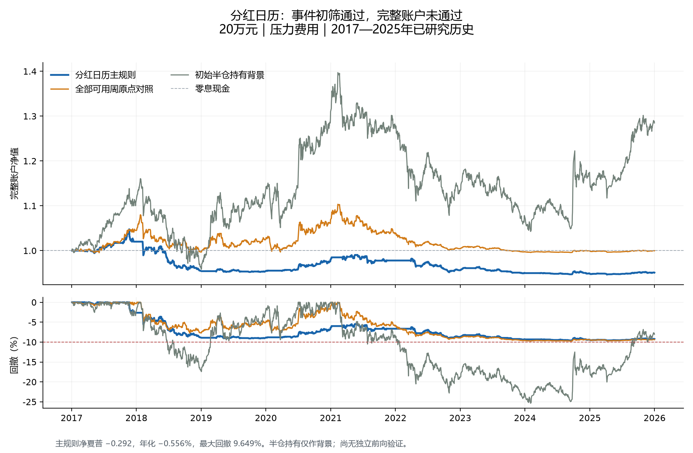

成员分红支付覆盖面的毛收益初筛通过，但完整账户未达到目标，本版本停止。20万元主方案在2017—2025年压力费用下，净夏普-0.291530、日历复合年化-0.5564%、最大回撤9.6485%，期末190211.15元。夏普1.2、年化10%与既定风险约束的共同目标仍未实现。

|20万元压力成本账户|净夏普|日历年化|最大回撤|期末权益|
|---|---:|---:|---:|---:|
|分红日历主规则|-0.292|-0.556%|9.648%|190,211.15元|
|所有可用周原点对照|0.015|-0.002%|9.741%|199,957.62元|
|初始半仓买入持有背景|0.335|2.825%|25.367%|256,940.20元|
|零利息现金|未定义|0.000%|0.000%|200,000.00元|

2万元主账户压力净夏普-0.475723、日历年化-0.6773%、最大回撤9.6306%，期末18814.10元。两个本金、两档费用和四个方案共16个账户全部完成，历史联合点值通过0个。现金无波动时夏普未定义，不把它报告为0或合格策略。半仓持有只是背景，持仓市值漂移后可超过50%，没有冒充符合主策略动态风险合同。

本轮复用645个供应商缓存、40192行原始分红记录及2015年起官方重建的历史指数成员。相关正现金实施记录6353条，按实施公告、登记、除息及支付日去重为6153个日历安排；同一发行人多份安排在窗口内仍只计一次，没有相加存在不同披露口径的金额。源缓存最少覆盖当日288/300成员（96%）；缺缓存者没有被当成零派息。实施公告日末之后才可进入次日或更晚决策，[供应商字段说明](https://tushare.pro/document/2?doc_id=103)明确区分预案公告日、实施公告日与派息日。

它是M05的成员数量代理，原M05需要的现金总额/流通市值与历史首版证据仍缺失。历史源实际于2026年9月取得；本轮不称严格点时来源、不称已经观察到再投资资金。分红是价值转移，除息与到账不能凭空产生利润。没有新数据接口请求。

事前固定规则：每交易日计算未来20个A股交易日内、已公告支付现金的历史成员覆盖面，减去此前两年内同一自然月份的中位数；每ISO周第一个交易日收盘后只观察一次。差值为正才形成下一开盘买入请求。461个周原点资料均足够，456个20日标签成熟，1个涨停未成交，4个期末未成熟。主组207个可评估事件的平均毛收益0.8433%，同年同月匹配对照0.7395%，差值0.1038个百分点。前后子期均值分别1.0580%、0.7081%，满足预先登记的展开条件，才运行本账户阶段。

初筛证据并不强：同月增量的描述性95%区间为[-0.1343, 0.3203]个百分点，跨零。周事件的20日持有窗口大量重叠，不能把每周回报独立复利。全期210次实际可知的主组周触发中，144次发生在已有持仓期间，按原约定忽略；只形成66次入场，65个周期已平仓，1个在期末仍有仓位并计提清算费用准备。

主账户每日风险预算导致154次减仓成交，平均收盘仓位6.4627%。收盘10%回撤永久停止在这条实际路径中没有触发，不能把亏损归因于已经停机。佣金2034.85元、滑点3536.30元；固定实际份额和路径返还费用后仍亏4205.20元，对应诊断夏普-0.1197。费用会侵蚀收益，但仅免除费用不足以兑现初筛中的优势；这没有证明撤销风控或改变持有期会改善结果，也不据此修改合同。

完整账户主夏普的描述性95%区间为[-0.882, 0.340]；相对所有周原点对照的年化日均收益差-0.584%，配对区间[-2.158%, 0.938%]。两阶段区间都没有校正项目长期反复研究的选择偏差，不能当作独立验证。

订单份额在前一收盘固定；次日只应用现金、整手、T+1和方向涨跌停限制，不用开盘价反算风险股数。入场后固定20个开盘间隔，新信号不加仓也不延长期限。风险模块复用此前已保存的两年日更、126近邻五日条件尾部估计，只用于风险预算；旧模型均值不参与买卖。主方案最多50%事前仓位，5日ES95预算2.5%，-10%冲击预算5%并保留回撤空间。市场跳空和延迟退出仍可能令事后回撤超过事前预算。

BASE单边佣金万二、滑点万五，STRESS单边佣金万四、滑点千一，最低佣金5元，100份一手、价格档位0.001元。现金利息及无风险基准均0；所有现金日计入账户夏普，主口径242交易日，252日与HAC20只作敏感性，CAGR按实际日历。分红登记资格、除息应收和派息到账分别入账。

本轮8项关键测试通过，覆盖来源时钟、同月阈值、未来数据、固定股数、期限、分红会计及跌停后的停止行为；另有1个真实数据未来公告前缀检查、456个事件标签复算。账户阶段核对34976行已保存账本、2186个风险原点，最大账户恒等式误差7.8e-11元。独立前向样本0；实现核对不是有效性认证。

最终状态为REJECTED_ACCOUNT_TARGET_FAILED_NO_PARAMETER_RESCUE。保留毛收益初筛通过这一事实，也保留完整账户失败这一最终裁决，不覆盖旧文件。停止本版本，不改方向、期限、阈值或风险预算救结果。总目标保持active，交易资产仍限510300与人民币现金，原PCF/IOPV计划任务继续暂停，不制作ZIP，不产生订单。

主要证据：account_stage/metrics.csv（16账户）、account_stage/period_metrics.csv（固定子期）、account_stage/annual_metrics.csv（逐年）、account_stage/accounts（逐日账本、订单与决策）、account_stage/fixed_path_attribution.json（固定份额返费）、account_stage/protocol.json与freeze.json（账户事前冻结）、全部周原点与收益.csv（初筛全量原点）、source_files.json（缓存清单）、风险输入核对保存在account_stage/risk_input_receipts.parquet。
