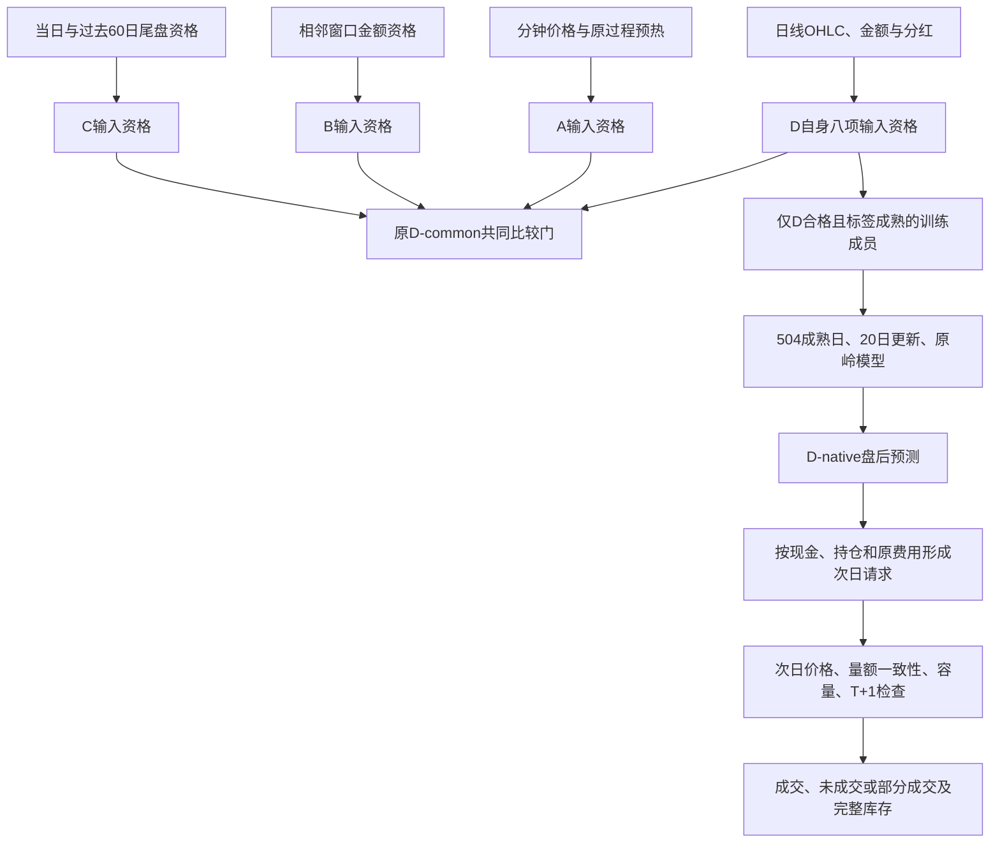

# 依赖与运行合同

图中A/B/C只展示输入依赖，本批未训练其独立模型。D-native仍使用日线金额变量；独立于C尾盘金额不等于独立于所有金额。预测形成时，次日执行资格尚未知。原请求不能根据最终开盘价格事后撤销再声称按开盘买到。

运行状态入口：scripts/run_510300_daily_native_baseline_v1.py，使用`--stage status --date YYYY-MM-DD`。原点输入表和1211日四层状态均已保存。没有对应日期时返回LOCAL_DATE_NOT_COVERED/NO_VIEW_NO_CURRENT_LOCAL_RECEIPT，实际持仓UNKNOWN；不会把历史空仓状态当作当前仓位。该入口是本地历史与覆盖诊断，不是自动获取行情或券商服务。D08/F系列仍未实施。
