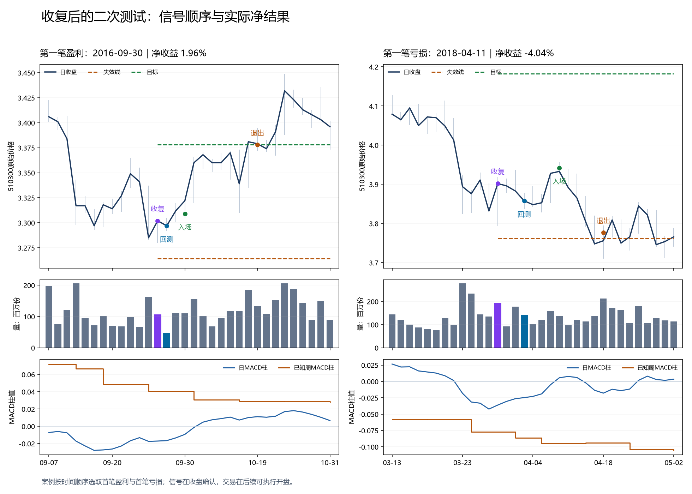

# 510300日线二次供给测试：完整账户结果

**本轮没有实现目标。** 已完成3项固定比较、2档成本、共6条连续账户。等待回测、缩量缩幅、再转强的主方案只有12个完整周期；压力净胜率50%、实际平均盈亏比0.994、净夏普-0.078、净年化-0.10%、最大回撤4.49%。主方案为REJECTED_FROZEN_NO_PARAMETER_RESCUE，总研究目标继续进行。

研究范围为510300及人民币现金，20万元起始，2015年首个交易日至2026年9月16日；只用日线与上一完成周背景，保留全部空仓交易日，252日年化。最高50%仓位、五日条件ES预算2.5%、10%跳空损失预算5%及回撤余量约束均纳入。没有实盘指令。

## 这轮检验了什么

[Wyckoff Analytics原文](https://www.wyckoffanalytics.com/wyckoff-method/)把收复后的较高低点、缩量回测作为供给减弱的观察依据。这里把这个假说写成可逐日识别的条件；没有把图形称为真实主动买卖订单，也不把作者的高概率表述直接用于510300。此次阅读的是作者原文，未声称观看完整视频。

母事件：最低价跌破此前20日最低，收盘重新收复该支撑。事件日固定止损为低点减0.5个前日ATR20，目标为收盘加两倍初始结构风险。随后10日内首次出现较高低点回测，回测收盘位于支撑上、母事件收盘下；再等最多3日收盘超过回测日最高。主方案另要求该次回测的量和高低价差均小于母事件。

直接收复、价格回测、缩量缩幅回测共用结构目标、成本与账户风险规则。信号后次日开盘入场；目标、失效及20日持有期限只在收盘判断，下一可卖开盘退出。没有利用日内高低点先后顺序。登记、应收股息和支付分账；分批风险减持不增加交易次数。

第26轮同日量价反转、第55轮突破回踩及本任务上一轮周支撑均保留原结论。本次仅新增收复后的二次测试，未恢复旧突破回踩，也未调整旧策略参数。

## 压力成本后的结果

| 固定方案 | 周期数 | 净胜率 | 实际盈亏比 | 净夏普 | 净年化 | 最大回撤 |
|---|---:|---:|---:|---:|---:|---:|
| 首次收复直接入场 | 71 | 40.85% | 1.251 | -0.325 | -0.72% | 9.12% |
| 等待价格回测再转强 | 13 | 46.15% | 0.855 | -0.236 | -0.29% | 5.98% |
| 回测同时缩量缩幅再转强 | 12 | 50.00% | 0.994 | -0.078 | -0.10% | 4.49% |

压力成本为单边佣金万分之四、滑点千分之一、每次最低佣金5元，成交按0.001元价格刻度和100份整手。实际盈亏比按每笔净利润除以买入支出得到的收益率计算，不是目标/止损比，也不是利润因子。

## 信号、成本、账户约束的分解

85个母事件中，34个等待期间结构失败、16个没有出现合格回测而到期、13个已经到达原目标、8个回测后未及时转强、13个完成价格回测确认、1个截止时尚未结束。13个确认中12个已同时缩量缩幅，所以这两项条件只排除一笔。

主方案12个原始事件，在统一10万元单笔预算且不做动态风险减持的诊断标签中，毛收益均值约+0.329%，压力净收益均值只剩+0.0266%。这类标签只是单笔事件比较，不是完整账户。实际风险账户会因已知波动和回撤预算缩减份额，12个完整周期的平均净收益率约-0.0075%。

按实际成交时点与份额加回摩擦，主账户毛损益仅+692.40元，佣金与滑点共2953.64元，净损益-2261.24元。该加回是账簿归因，不是无成本重新投资回测。即使把这笔摩擦全加回，11年多的毛利润也远不足以支持年化10%，因此不能仅归咎于手续费。直接收复及仅价格回测在原实际份额下的毛损益本来就为负。

主方案相对价格回测的年化算术收益增量约+0.187个百分点，20日循环区块95%区间为-0.158至+0.717个百分点，跨零。该比较只说明这一次预设增量的结果，未因此选择更有利窗口、放宽回测条件或延长持有。

## 每年至少五笔

| 年份 | 直接收复 | 价格回测 | 缩量缩幅回测 |
|---|---:|---:|---:|
| 2015 | 2 | 0 | 0 |
| 2016 | 9 | 1 | 1 |
| 2017 | 4 | 0 | 0 |
| 2018 | 9 | 3 | 3 |
| 2019 | 4 | 0 | 0 |
| 2020 | 1 | 0 | 0 |
| 2021 | 6 | 1 | 1 |
| 2022 | 12 | 1 | 0 |
| 2023 | 10 | 2 | 2 |
| 2024 | 9 | 2 | 2 |
| 2025 | 1 | 0 | 0 |
| 2026（未完整） | 4 | 3 | 3 |

主方案2015—2025没有一个完整年达到5笔，2026截至9月16日有3笔。年度次数按完整持仓周期入场年归属；风险减持订单不能凑成额外交易。仅直接收复也有2015、2017、2019、2020、2025等年份不足5笔。

## MACD、波动和量带来了什么

12笔主方案全部在日MACD柱回升时确认，说明日MACD在这些事件中没有再增加区分能力。上一完整周MACD回升的子组只有3笔、2赢1亏，表面盈亏比约22.46；其中唯一亏损很小，分母不稳定，而且年度频率更低，不能从这个事后子组建立新策略。低波动7笔仅2笔盈利，高波动5笔有4笔盈利；这也只是已固定分组的解释，没有反向改为只做高波动。

图例按时间选择主方案第一笔盈利与第一笔亏损，并非最漂亮的个例。所有成交与失败过程都已保存。周MACD使用上一完成周的数据，在日线图中阶梯显示；图内的价格为原始报价，失效和目标按当时已知除息平移。

## 已有研究的检查与当前结论

附带只读检查旧指标快照中149份去重后的已声明压力成本记录。原夏普1.2、年化10%、回撤10%三项数字同时过线的8份记录全部来自旧选择混合家族；该家族的既有停用及独立性问题保留，没有换同族名称复活，也没有把旧trade_count当完整周期。这个旧快照不是全项目最新穷尽清单。

本轮的限制已经明确：二次测试把机会压缩过多，净收益分布仍不够强，成本进一步吞噬了很小的毛优势。继续研究需要能覆盖更多交易年份且具有可识别净优势的信息；本支路不再扫描等待期、ATR倍数、止盈止损或高低波动阈值。

8项针对性测试通过；6个真实历史前缀的信号、6个前缀的日周指标一致；212条原始事件收益和6个账户17076日、192个含两成本重复周期已复算；风险训练标签均在决策前成熟。原验证器的空日期None/NaT差异通过独立只读适配处理，冻结策略及结果未改写。

复核入口：[协议](protocol.json)、[结果](result.json)、[账户表](results/账户结果.csv)、[逐年次数](results/逐年次数.csv)、[成本归因](results/信号成本账户归因.csv)、[背景分组](results/背景逐项观察.csv)、[验证](verification.json)。
