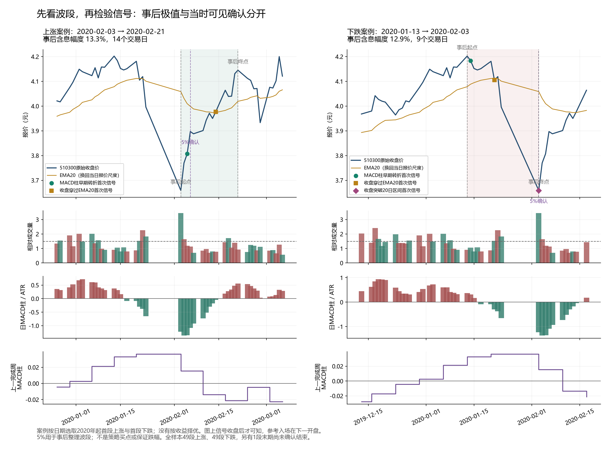
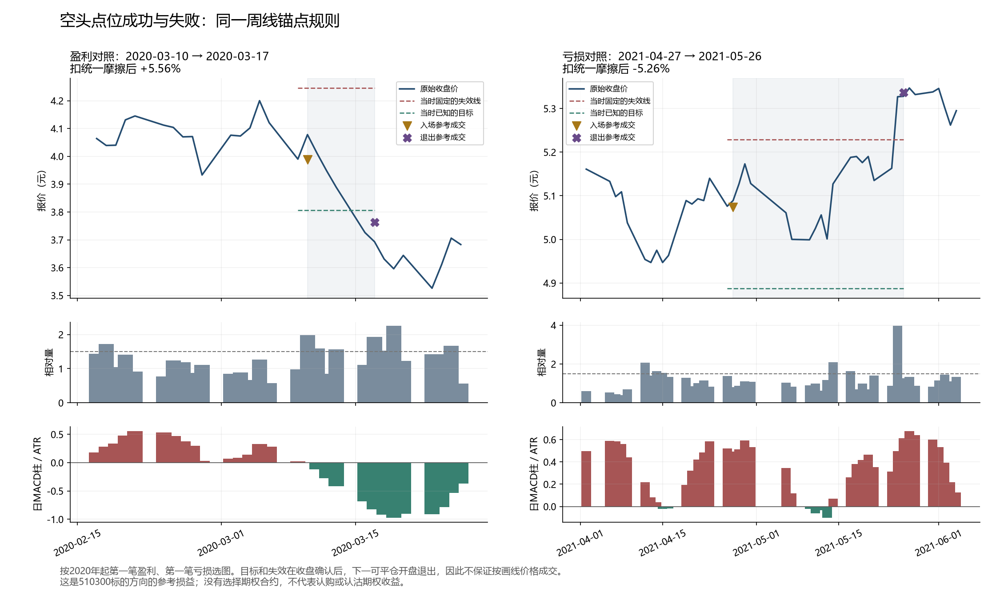
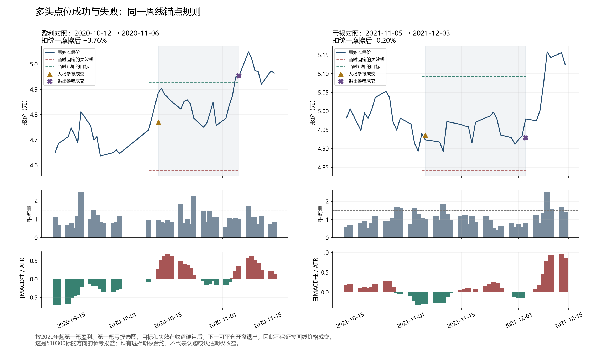

# 510300多空点位研究：先解释波段，再比较点位质量与次数

**已按最新要求取消每年5次硬门槛，并将扣参考摩擦后的胜率×实际盈亏比>1设为质量硬门槛。六组点位当前全部不合格。** 本轮只研究510300标的多空点位，次数作为希望提高的软目标。允许未来用期权表达方向，但本报告没有选择期权合约，也没有把标的收益叫作期权收益。

本轮完成49段上涨、49段下跌的技术量价图谱，并计算三个确认时点的398个完整点位记录；它们是三个独立规则的结果，不能加总为一条策略的交易。随后保持原周支撑多头不变，新增对称周阻力空头，得到37个不重叠的双向结构点位。

周支撑/周阻力在历史上呈现较高胜率，但乘积仍不足。加入空头后，完整年份平均次数从原多头的1.64提高到3.00，样本胜率从73.68%降至64.86%，实际盈亏比约0.85，乘积约0.550，未过新门槛；单笔参考净回报均值约+0.65%，近期转负，均值区间也跨零。频率增加和表面高胜率都不能代替质量验收。

## 数学口径与最新门槛

记p为盈利笔数/总笔数，q为亏损笔数/总笔数，B为平均盈利收益率/平均亏损收益率绝对值。标准数学期望（以平均亏损为1单位）是E=p×B−q；没有平手时q=1−p。标准正期望要求E>0，等价于利润因子p×B/q>1（q>0）。用户最新指定的p×B>1，比标准正期望要求更严格，本报告按该额外硬门槛执行，不能将三者混为一谈。

例如胜率60%、实际盈亏比1.5时，p×B=0.9，标准期望E=0.5个平均亏损单位：正期望成立，但不符合本次额外的p×B>1。胜率以小数计算，盈亏比使用实际兑现且扣参考摩擦的结果，不使用图上计划目标代替。原先55%胜率或盈亏比2的工作比较线，已不再作为通过标准。

## 1. 上涨确实能用指标描述，但不等于提前识别

数据为2012-05-28至2026-09-16的3479根日线；正式观察2015年起。以收盘含息总回报指数的5%方向变化统一整理波段，覆盖49段已完成上涨、49段已完成下跌，另有1段下跌尚未确认结束。全部样本保留，没有挑最好看的几段。低点/高点是事后标签，确认日期单列，信号计算不读取这些标签。

| 观察状态 | 上涨段出现 | 上涨中位时差 | 已涨中位幅度 | 下跌段出现 | 下跌中位时差 | 已跌中位幅度 |
|---|---|---|---|---|---|---|
| MACD柱朝交易方向变化 | 49/49 | 1日 | 2.54% | 48/49 | 1日 | 1.23% |
| 日MACD进入对应金叉/死叉侧 | 44/49 | 4.5日 | 3.10% | 42/49 | 4日 | 2.91% |
| 收盘越过EMA20 | 44/49 | 5日 | 3.87% | 46/49 | 4日 | 3.39% |
| 突破/跌破前20日收盘区间 | 34/49 | 13日 | 6.40% | 34/49 | 9日 | 5.54% |

表中时差从事后起点算起，取波段内首次观察到该状态的日期；起点已经满足记0。中位数仅在该状态出现的波段中计算，不能解释为能提前知道极值。日MACD柱变化与“柱的斜率发生转折”也不是同一个条件，后面的早期点位规则要求真正发生转折。

日MACD柱回升在上涨低点前5日仅出现34.7%，在低点后5日出现83.7%，而在首次涨到5%的确认日为100.0%。这主要描述价格动能已恢复，不能只从成功上涨段倒推它的胜率。

MACD本身来自价格的指数均线差，12/26/9是本轮固定参数。其金叉、死叉与震荡时反复交叉的含义可见[Fidelity指标说明](https://www.fidelity.com/learning-center/trading-investing/technical-analysis/technical-indicator-guide/macd)。本轮用实际失败对照检查区分能力，没有把教材用语当作510300的胜率证据。

成交量提供的线索也不稳定：49段上涨首次涨到5%的当天，只有16段达到此前20日中位量的1.5倍；另外33段没有。上涨日/下跌日成交量比较只是量价代理，不等于主动买卖订单流。关于量配合趋势的常见解释见[Schwab成交量说明](https://www.schwab.com/learn/story/trading-volume-as-market-indicator)，能否增加预测价值仍以本地对照为准。

本轮还从全部2826个成熟交易日原点看未来20日，并在186次上穿EMA20的相同价格事件上逐一加入MACD、周背景、成交量或波动率条件。所有单项净均值增量的区块95%区间都跨零；不能据此把多指标叠加直接升格为策略。20日原点有重叠，另存固定相位非重叠对照；从未把2826条当作2826次独立交易。

## 2. 三个确认时点：次数多，但点位优势不足

早期转折：多头在日MACD柱仍为负时，柱变化从不升变为上升；空头镜像。均线确认：收盘向交易方向越过EMA20。区间确认：首次收盘突破/跌破此前20日收盘区间。这三项各自形成多空序列，同族只允许一个活跃点位。

三项共用过去5日极值加0.5个前日ATR的失效线，信号收盘到失效距离的2倍作固定目标；次日开盘参考入场，收盘确认失效/目标或持有20日后，下一可平仓开盘退出。目标距离为2倍风险，不保证实际平均盈亏比等于2。

| 固定点位规则 | 完成周期 | 完整年平均次数 | 扣摩擦胜率p | 实际盈亏比B | p×B | 单笔平均参考回报 |
|---|---|---|---|---|---|---|
| MACD柱早期转折 | 182 | 15.73 | 41.21% | 1.113 | 0.459 | -0.42% |
| 收盘穿过EMA20 | 101 | 8.64 | 38.61% | 1.366 | 0.527 | -0.36% |
| 收盘突破20日区间 | 115 | 9.91 | 46.96% | 1.171 | 0.550 | 0.07% |
| 原周支撑多头 | 19 | 1.64 | 73.68% | 0.835 | 0.615 | 1.21% |
| 周阻力镜像空头 | 21 | 1.64 | 57.14% | 0.884 | 0.505 | 0.24% |
| 周支撑与周阻力双向 | 37 | 3.00 | 64.86% | 0.847 | 0.550 | 0.65% |

这里的实际盈亏比＝平均盈利点位收益率÷平均亏损点位收益率绝对值；不是计划目标/止损比，也不是利润因子。参考摩擦按单边万四佣金、千一滑点、最低5元及报价刻度计算，股息对多空分别加减。空头没有假设可以融券，也未计借券费或任何期权成本，所以仅是统一条件下的方向质量比较。毛回报、毛胜率和逐笔记录另表完整保存。

普通技术确认的主要问题并不只是次数或手续费。MACD早期转折182笔中84笔失效，只有36笔达到预定目标；EMA20穿越101笔只有12笔达到目标。20日区间突破115笔中73笔最终是持有到期退出，只有13笔达到目标；其毛均值约+0.37%，扣参考摩擦仅余+0.07%，均值区间仍跨零。不能通过把计划盈亏比写为2，声称实际盈亏比已经很高。

## 3. 结构点位：用双向机会增加次数

多头沿用已有周支撑首次接近、日线转强规则。空头采用本轮首次测试的对称表达：接近已经确认的周阻力后，收盘回到阻力之下、跌破前日最低且为阴线；失效线是准备至确认的最高价加0.5个准备ATR，目标为准备时已经知道的最近下方周低点。周枢轴需要右侧2周确认，并到下一周才可使用。

单独多头19笔、单独空头21笔；多空共用一个活跃点位后为37笔，不能直接相加为40笔。原多头的入场日、退出日及毛回报已逐笔核对一致，未因新空头结果调整旧参数。原旧主方案P1的失败及所有旧记录保留。

| 入场年 | 单做多 | 单做空 | 双向单一活跃点位 |
|---|---|---|---|
| 2015 | 1 | 1 | 2 |
| 2016 | 3 | 0 | 3 |
| 2017 | 1 | 5 | 5 |
| 2018 | 5 | 2 | 6 |
| 2019 | 2 | 3 | 5 |
| 2020 | 1 | 2 | 3 |
| 2021 | 3 | 2 | 4 |
| 2022 | 0 | 0 | 0 |
| 2023 | 1 | 0 | 1 |
| 2024 | 0 | 1 | 1 |
| 2025 | 1 | 2 | 3 |
| 2026 | 1 | 3 | 4 |

2026只统计到9月16日，不作为完整年平均分母。双向完整年平均3次，2022年为零，包含样本边缘的最长空档328个交易日。增加方向使机会增加，但仍有长时间无合格点位；本次没有放宽锚点或重复触发来凑次数。

| 固定时期 | 周期 | 胜率 | 实际盈亏比 | 平均参考回报 |
|---|---|---|---|---|
| 2015_2019 | 21 | 66.67% | 1.011 | 1.08% |
| 2020_2023 | 8 | 75.00% | 0.716 | 0.78% |
| 2024_2026 | 8 | 50.00% | 0.680 | -0.61% |

双向样本净均值的20日区块95%区间为-0.47%至1.79%，跨零；胜率描述性区间约48.8%至78.2%。2024年至截止日只有8笔、4赢4亏，平均参考净回报约-0.61%。两个最大盈利点位合计占所有点位参考收益率加总的83.3%，这是集中度诊断，不是账户收益归因。

因此64.86%是历史样本胜率，尚不是可用于未来的稳定胜率估计。这条路线体现的是较高胜率、平均盈利小于平均亏损；按新要求p×B>1也不合格。大实际盈亏比路线本轮没有找到，不能因频率软化就将它改称合格策略。

## 4. 反推规则目前落在哪里

当前证据支持把研究问题收敛为：已确认周支撑/阻力附近的日线拒绝，为什么容易形成较多小盈利，但平均盈利没有覆盖平均亏损；以及更早或更晚的普通技术确认为什么也没有形成足够优势。已有结构点位只是诊断材料，未通过用户的乘积门槛、近期稳定性或均值不确定性检查。

后续优先分析这37笔成功与失败在入场前的差别，以及目标距离、收盘确认与次日开盘之间的损耗；必须同时保留未发生交易的锚点失败过程。在没有额外证据前，不从最近8笔的负结果反向交易，不选最有利年代，不用日内高低点假定止损成交，也不改变固定等待期或目标做救援。

## 5. 文件与复核

- 六组质量/频率比较：`六组点位质量与频率.csv`。
- 37笔双向点位，包括原价、参考成交、已知失效/目标、日期、实际R：`37笔双向点位明细.csv`。
- 逐年次数：`周线多空逐年次数.csv`；上下行确认时差：`上涨下跌指标时差.csv`。
- 完整上涨图谱、三个确认规则、周锚点双向实验的协议、代码、全量信号及拒绝过程保存在各自独立研究目录；`sources.json`记录路径和哈希。

必要复核包含7项边界单元测试、历史前缀不变性、当前周禁用、原多头一致性与方向/股息损益重算。没有新采集分钟线，没有生成订单，也没有把这些检查称为独立预测验证。数据截止2026-09-16，本报告不提供2026-10-01的即时多空点位。
