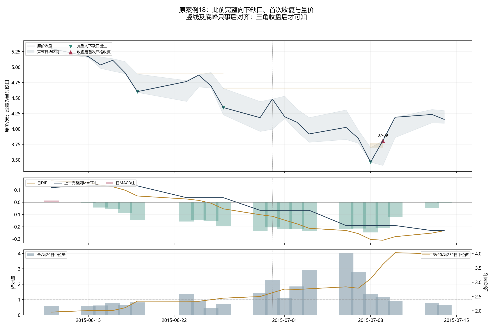
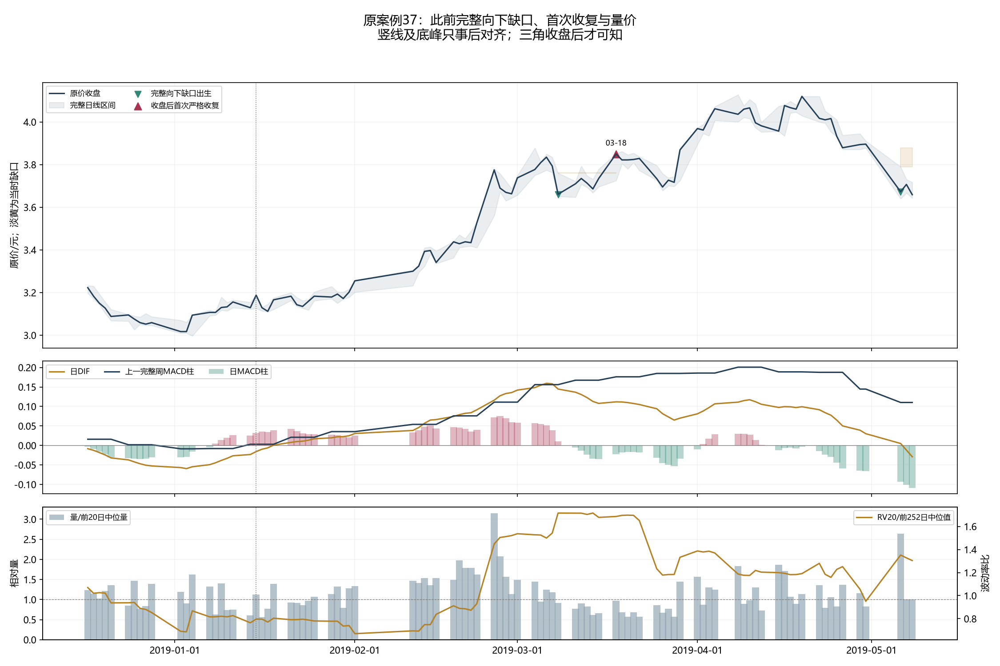
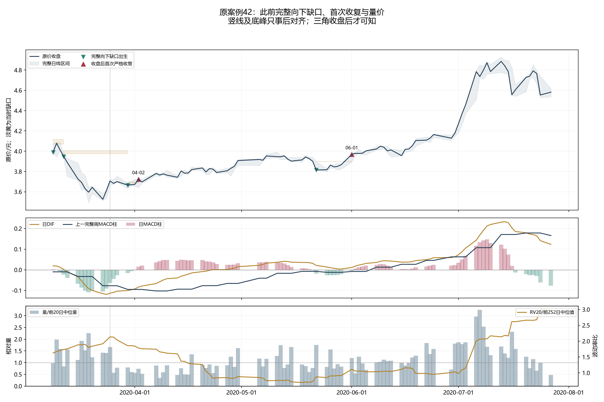
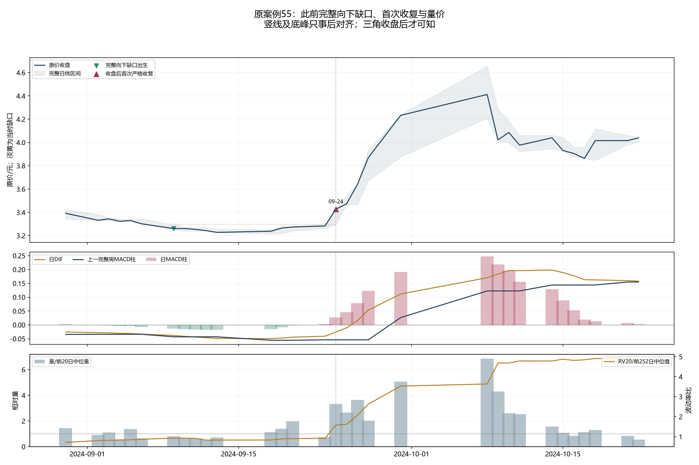

# 具体上涨的量价解释与向下缺口收复反推

先观察原具体上涨及失败，再检验此前完整向下区间是否被已知收盘否定。TECH.R183完整用途已经在新事件结果连接前固定；本解释没有新金融账户。

日MACD和上一完整周指标只描述已发生动量，量比和RV只描述交易量及波动；日线不能识别主动买卖流或证明上涨因果。缺口收复也只是历史价格区间被否定，不保证新趋势。

## 原案例18：2015-06-29至2015-06-30

原分段上涨7.22%，底峰仅事后定位；原5%确认日2015-06-30。固定前后各10交易日观察窗的全部收复如下，不按获利筛选。

| 收复确认 | 原缺口出生 | 收盘 | 固定线原价 | 原上沿原价 | 相对量 | 日DIF | 日柱 | 上一完整周柱 | RV比 | 原A份额 |
|---|---|---:|---:|---:|---:|---:|---:|---:|---:|---:|
| 2015-07-09 | 2015-07-08 | 3.809 | 3.700 | 3.769 | 1.143 | -0.310533 | -0.208237 | -0.190523 | 3.620 | 0 |

2015-07-09处于原分段之后，收复的是2015-07-08已经出生的整日下跌缺口；日柱仍负、上一完整周柱仍负。相对量1.143与RV比3.620是当时原值，不据其符号或大小新增过滤。真正可尝试时间是下一真实开盘，尚不能把后来的底峰涨幅记作本信号回报。

## 原案例37：2019-01-02至2019-04-19

原分段上涨39.13%，底峰仅事后定位；原5%确认日2019-01-15。固定前后各10交易日观察窗的全部收复如下，不按获利筛选。

| 收复确认 | 原缺口出生 | 收盘 | 固定线原价 | 原上沿原价 | 相对量 | 日DIF | 日柱 | 上一完整周柱 | RV比 | 原A份额 |
|---|---|---:|---:|---:|---:|---:|---:|---:|---:|---:|
| 2019-03-18 | 2019-03-08 | 3.850 | 3.760 | 3.763 | 0.975 | +0.111858 | -0.022029 | +0.176042 | 1.686 | 0 |

2019-03-18处于原上涨分段内，收复的是2019-03-08已经出生的整日下跌缺口；日柱仍负、上一完整周柱已非负。相对量0.975与RV比1.686是当时原值，不据其符号或大小新增过滤。真正可尝试时间是下一真实开盘，尚不能把后来的底峰涨幅记作本信号回报。

## 原案例42：2020-03-23至2020-07-13

原分段上涨38.54%，底峰仅事后定位；原5%确认日2020-03-25。固定前后各10交易日观察窗的全部收复如下，不按获利筛选。

| 收复确认 | 原缺口出生 | 收盘 | 固定线原价 | 原上沿原价 | 相对量 | 日DIF | 日柱 | 上一完整周柱 | RV比 | 原A份额 |
|---|---|---:|---:|---:|---:|---:|---:|---:|---:|---:|
| 2020-04-02 | 2020-03-30 | 3.723 | 3.685 | 3.698 | 0.741 | -0.084009 | +0.014690 | -0.095094 | 1.781 | 0 |
| 2020-06-01 | 2020-05-22 | 3.968 | 3.898 | 3.899 | 1.201 | +0.011283 | -0.005070 | -0.007950 | 1.110 | 0 |

2020-04-02处于原上涨分段内，收复的是2020-03-30已经出生的整日下跌缺口；日柱已非负、上一完整周柱仍负。相对量0.741与RV比1.781是当时原值，不据其符号或大小新增过滤。真正可尝试时间是下一真实开盘，尚不能把后来的底峰涨幅记作本信号回报。

2020-06-01处于原上涨分段内，收复的是2020-05-22已经出生的整日下跌缺口；日柱仍负、上一完整周柱仍负。相对量1.201与RV比1.110是当时原值，不据其符号或大小新增过滤。真正可尝试时间是下一真实开盘，尚不能把后来的底峰涨幅记作本信号回报。

## 原案例55：2024-09-13至2024-10-08

原分段上涨36.68%，底峰仅事后定位；原5%确认日2024-09-24。固定前后各10交易日观察窗的全部收复如下，不按获利筛选。

| 收复确认 | 原缺口出生 | 收盘 | 固定线原价 | 原上沿原价 | 相对量 | 日DIF | 日柱 | 上一完整周柱 | RV比 | 原A份额 |
|---|---|---:|---:|---:|---:|---:|---:|---:|---:|---:|
| 2024-09-24 | 2024-09-09 | 3.427 | 3.296 | 3.300 | 3.338 | -0.026019 | +0.026645 | -0.053959 | 1.574 | 0 |

2024-09-24处于原上涨分段内，收复的是2024-09-09已经出生的整日下跌缺口；日柱已非负、上一完整周柱仍负。相对量3.338与RV比1.574是当时原值，不据其符号或大小新增过滤。真正可尝试时间是下一真实开盘，尚不能把后来的底峰涨幅记作本信号回报。

## 四段的阶段区别与下一可知点位

2019春季是先形成上升路径，再在3月8日回调产生完整下跌缺口、3月18日收复。收复时日DIF和上一完整周柱已正、日柱负、相对量0.975；它描述趋势中的回调修复，不能解释为提前捕捉1月低点，也不能要求放量才算已有收复。

2020年3月低点后，4月2日日柱先正而DIF和上一完整周柱仍负，相对量0.741、RV比1.781；它描述下跌后的局部修复，长周期指标仍反映此前跌势。6月1日收复另一锚时DIF小幅正、日柱和上一周柱仍负，相对量1.201。后来的7月上涨不能单凭这些符号预先保证，必须看按失效规则实际持有到了何时。

2024年9月24日收盘3.427已越过9月9日原缺口上沿3.300，量是前20日中位量的3.338倍、日柱正而DIF/上一周柱负；它在原5%确认同日提供了可知的区间收复信息，早于这两项较慢动量转正。9月25日真实开盘才可尝试，不能按9月13日事后低点成交；量和MACD的组合仅作解释，不能看完这一个赢家才加入过滤。

2015年7月9日收复出现在原6月29—30短反弹之后，日周动量仍负、RV比3.620。此前多次新的向下缺口替换旧锚，显示价格向下区间分离反复发生；单次收复只否定最新一个区间，不能证明整个下行已结束。

## 全体与可检验点位

全部3488日连续最新锚状态，2015起91个原缺口锚、60次首次收复。全历史锚终态{'RECLAIMED': 74, 'REPLACED_BEFORE_RECLAIM': 37, 'RIGHT_CENSORED': 1}；所有替换和开放保留。原61分段/49正式上涨及原2846标签/2826成熟/20删失/9尾部保留。

HIGH严格低于上一完整日LOW时出生完整向下缺口，原锚下沿为当日HIGH，上沿为昨LOW。只保留最新未收复锚，新完整向下缺口替换旧锚；出生之后首次已知CLOSE严格越过上沿确认并消耗锚。空仓收复次真实开一次尝试，开盘整数现金价<=锚下沿或坐标未知取消，不延迟重试。持有初始固定线为出生锚下沿，不抬线；已知CLOSE<=固定线或出现新完整向下缺口时次合法开退出，同时发生优先记收盘线失败。未知自身不退出、原风险只减；无加仓、混A、固定获利目标、时间退出、期末清仓或量/MACD/RV过滤。锚状态从原输入首日连续推进，金融按原两时期独立初始化。

上述收复、失效路径及旧标签描述不是实际胜率、B或全账户收益。随后只按这一完整用途、原两时期两费用账户一次测量，并与原A/纯价格同日历比较。

旧同日低开收复规则的实际失败保持；本次不改其阈值或日内转弱退出。有限旧完整用途核对不能证明全球新颖。所有已用历史仍DEVELOPMENT_CALIBRATION，first-vintage NOT_CERTIFIED，独立NOT_ESTABLISHED，不能称去除过拟合。
