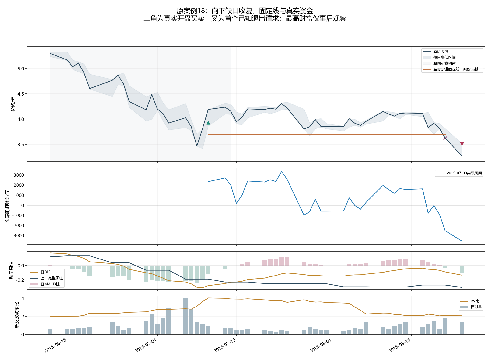
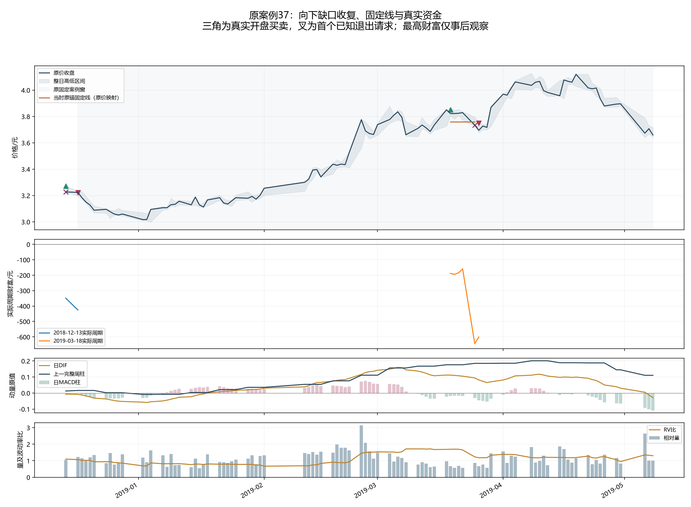
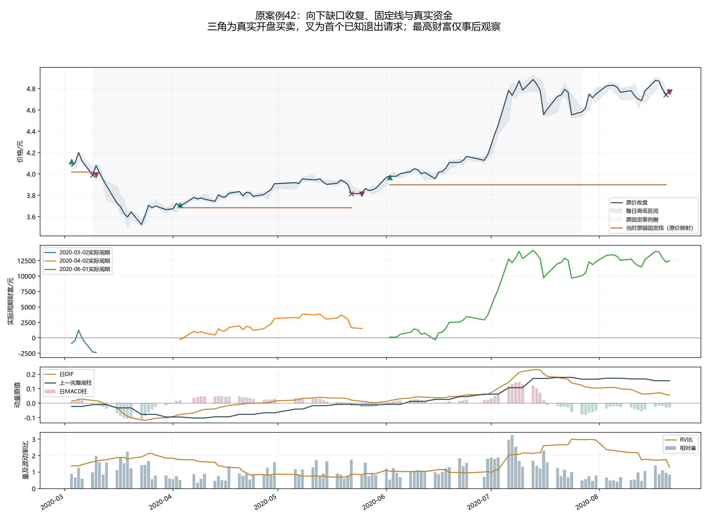
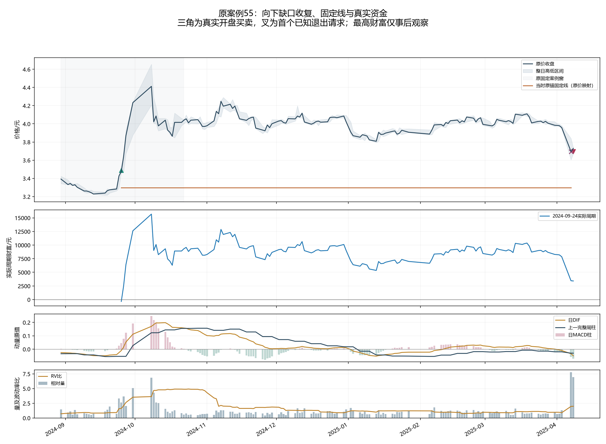

# 向下缺口收复：全体覆盖、固定失效与真实财富归因

TECH.R186只读R185保存结果，全60首次收复/120资格、102周期、2186持有原点和2286财富记录完成；100退出财富身份、全部失败/取消/2开放、原61/49段与四案例全部7个压力周期保留。0新账户/拟合/训练标签/采集。

## 具体上涨与失败路径

2024年9月24日放量收复先于DIF和上一完整周柱转正，真实9月25日进入；10月8日真实收盘账面最高15679.93元。固定线没有随着上涨上移，2025年4月7日出现新的完整向下缺口时，收盘周期账面仍3454.23元；4月8日实际出场净3412.85元（+5.65%）。它确实提供了启动阶段的已知修复点，但不能据此按事后10月最高点退出或断定存在稳定止盈。

2020年4月2日修复时量0.741倍，日柱正但DIF/上一周柱负；实际4月3日进入，5月22日新向下缺口触发已知失效，25日出场净1497.86元。6月1日另一缺口收复，2日进场后仍有短暂账面亏损；7月急涨时日周动量与量上升，7月13日持有收盘最高14168.65元，8月20日新向下缺口、21日出场净12483.58元。它保留了大部分已发生盈利；窗口前3月2日收复周期则曾账面+1239.29元最终亏2361.71元，必须一起解释。

2019年3月18日确认是春季趋势中回调收复而非1月启动。真实3月19日进、25日跌固定线、26日出；全部持有收盘中最好的财富仍−159.27元，最终−600.41元，无法用‘只因卖晚了回吐’解释。窗口前2018年12月周期亦保留，最高持有收盘−348.91元、最终−425.66元。

2015年7月9日收复时日周动量仍负、RV比3.620，真实10日进入；7月23日持有收盘曾+3336.32元。8月21日收盘跌固定线时已经账面−2543.58元，24日次开价差−989元、卖出摩擦46.46元，最终−3579.04元（−9.88%）。长周期下行中的局部修复可以很快浮盈，也可以再次失效。

## 全体资金和退出时钟

| 时期 | 费用 | 完成/开放 | 曾收盘盈利最终亏 | 从未收盘盈利最终亏 | 固定线/新缺口退出 | 最后开盘价差/元 | 最后卖出摩擦/元 | 完成净利润/元 |
|---|---|---:|---:|---:|---:|---:|---:|---:|
| 2015_2019 | BASE | 20/1 | 9 | 6 | 14/6 | 693.20 | 636.24 | -1372.40 |
| 2015_2019 | STRESS | 20/1 | 9 | 6 | 14/6 | 703.30 | 1228.06 | -3039.34 |
| 2020_2026 | BASE | 30/0 | 12 | 8 | 18/12 | 961.00 | 1846.41 | 29834.02 |
| 2020_2026 | STRESS | 30/0 | 11 | 9 | 18/12 | 972.20 | 3356.88 | 26203.67 |

压力50完成中20曾收盘盈利最终亏、15从未持有收盘盈利最终亏；另有1个持有收盘从未盈利但最终实际盈利的周期，原最后开盘成交可能超过此前持有收盘财富。不能将未浮盈等同于必亏。全部六组×四场景24格及空组质量未知保持，开放不混入完成组。

近期压力最大赢家是2020-06-01确认周期，净12483.58元，占全部正利润24.03%、完成净利润47.64%；早期净利润负，最大赢家/净利润占比未知。未删除最大赢家或重跑账户。

近期压力原最后次开价差+972.20元、卖出摩擦3356.88元，相对原最后卖出前收盘财富的净差2384.68元。对原A完成净利润差31643.82元；这一原账本时钟项只解释部分差额。没有计算改成收盘卖出的账户，也不是任意止盈策略的收益上界。

实际完成净利润−最终卖出前原点财富=该原点实际余量×(真实原开盘−原点原收盘)+后来该周期已发生股息应收−最终佣金−滑点。100退出身份最大残差<2e−11元，股息权利按原登记库存、逐次风险减仓和实际买卖现金还原。

## 上涨覆盖与全体案例

原49正式上涨中19段底峰之间没有首次收复、28段原5%确认至峰之间没有首次收复；全60收复43在原上涨分段中、17无分段匹配。原分段、未来底峰和最高财富均仅事后解释，不是交易输入。两区间同时报告，不选有利范围。

| 原案例 | 已知收复 | 真实进场 | 真实退出 | 最高持有收盘财富/元 | 最后退出原点财富/元 | 最后开盘价差/元 | 实际净利润/元 |
|---|---|---|---|---:|---:|---:|---:|
| 18 | 2015-07-09 | 2015-07-10 | 2015-08-24 | 3336.32 | -2543.58 | -989.00 | -3579.04 |
| 37 | 2018-12-13 | 2018-12-14 | 2018-12-17 | -348.91 | -348.91 | -40.80 | -425.66 |
| 37 | 2019-03-18 | 2019-03-19 | 2019-03-26 | -159.27 | -643.77 | 71.40 | -600.41 |
| 42 | 2020-03-02 | 2020-03-03 | 2020-03-10 | 1239.29 | -2301.31 | 33.60 | -2361.71 |
| 42 | 2020-04-02 | 2020-04-03 | 2020-05-25 | 3858.24 | 1634.24 | -48.00 | 1497.86 |
| 42 | 2020-06-01 | 2020-06-02 | 2020-08-21 | 14168.65 | 12263.05 | 309.60 | 12483.58 |
| 55 | 2024-09-24 | 2024-09-25 | 2025-04-08 | 15679.93 | 3454.23 | 50.10 | 3412.85 |

## 裁决、限制和下一步

接受全体覆盖、固定线和已知新缺口失效、真实库存/财富及最后时钟身份解释；R185固定完整金融用途拒绝不变。近期pB正和2024启动识别不代替原A比较或早期负结果。高浮盈回吐本身没有给出事前可靠退出规则，不根据本结果改固定线、MACD/量/RV、时期或混A营救。

首次纯归因脚本因日期设为索引后删除列、输出出生日期时读取缺失列而停止，尚未保存诊断表、0新账户。原代码/原冻结/首次开始标记和错误保存；隔离恢复仅保留与原索引同值日期列，并核对完全一致。原算法、分组、固定线、账户和收益未修改，46原冻结来源与6恢复绑定来源均核对。四图已查看。

全部历史DEVELOPMENT_CALIBRATION、first-vintage NOT_CERTIFIED、独立NOT_ESTABLISHED/global DSR/PBO NOT_COMPUTED，完整收益夏普/去过拟合目标未达。

本次全部收复归因完成，不再追加同一政策分组或退出搜索。下一先提出实质不同、当时可观察的日线信息及完整用途卡，说明它在具体上涨/失败段的机制、可知时钟、与已拒绝完整用途的区别以及全部反例；核旧实际结果后才决定金融准入。也可是真实新样本或来源/实现错误。保留原A优势、收复覆盖不足及浮盈回吐，不能把原最高财富、未来底峰、2024放量值或已见分组作为新交易过滤，不营救R185/R181/R177及其他冻结终态。

原A/POINT十二前瞻值和1008实际交易日计划保持，待跑新金融0。

- [全部102真实周期](results/全部102周期_原锚固定线失效及真实资金时钟.csv)
- [全部持有原点核对](results/全部持有原点_固定线新缺口及原决定核对.csv)
- [逐日实际财富](results/全部周期逐日库存现金股息及收盘财富.csv)
- [原61/49段两区间覆盖](results/原61分段及49上涨_两种原区间覆盖不筛选.csv)
- [全部60收复位置](results/全部60首次收复_原上涨位置仅事后对齐.csv)
- [六组×四场景](results/全部六组两时期两费用_最高财富与最终结果仅解释.csv)
- [冻结](protocol.json)、[全体结果](summary.json)、[日期恢复](repair_protocol.json)、[首次失败](initial_execution_failure.json)
- [下一准入边界](next_information_admission_boundary.json)
