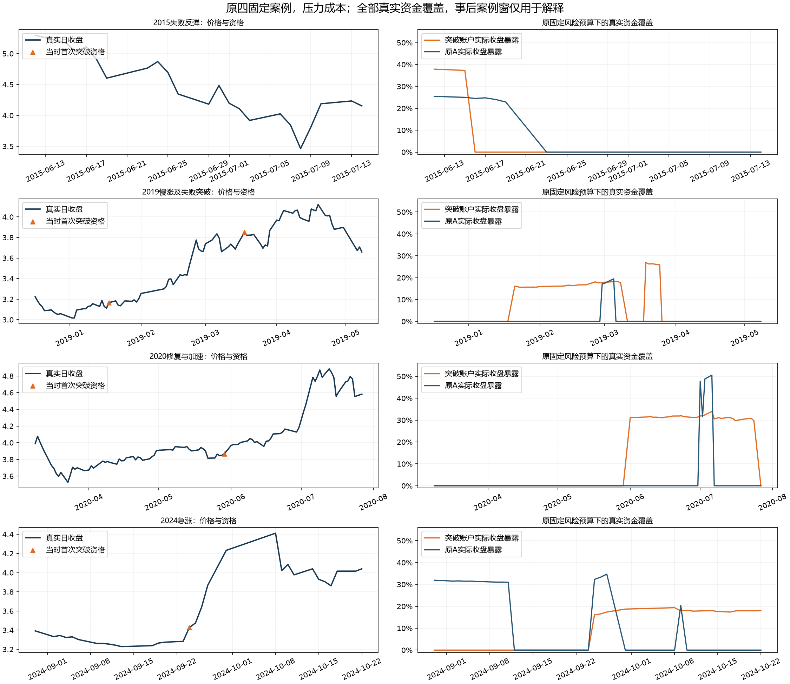

# 正交易期望为何没有转化为更高账户收益与夏普

本轮只解释R173已保存的全部信号、实际资金与订单。四场景交易质量为正的事实和完整账户拒绝保持；没有改策略、风险预算、费用或运行新账户。

132资格、128空仓原预算、1062持有决定及288买卖订单精确复算。106原周期（104完成/2开放）、所有次开取消/已有持仓保留。0新增账户/拟合/训练标签/行情采集；28入场、28减仓及12费用单元全部报告，空组不填收益。

## 入场资金受什么约束

初始意向50%，最终按原ES预算2.5%NAV、负10%跳空预算min(5%NAV,半剩余10%回撤余量)及平仓摩擦逐手减少。跳空预算随自身历史回撤而收缩，金额不能依据以后涨跌调整。约束可同时存在，表中保留全部失败项集合。

| 时期/成本 | 仓位绑定原点 | ES绑定原点 | 跳空绑定原点 | ES+跳空等多项绑定 |
|---|---:|---:|---:|---:|
| 2015_2019/BASE | 0 | 6 | 21 | 0 |
| 2015_2019/STRESS | 0 | 6 | 21 | 0 |
| 2020_2026/BASE | 0 | 3 | 34 | 0 |
| 2020_2026/STRESS | 0 | 3 | 34 | 0 |

| 固定突破信号 | 当时账户回撤 | 已知5日ES | 原计划份额 | 实际买入份额 | 入场实际金额/NAV | 原点全部绑定项 |
|---|---:|---:|---:|---:|---:|---|
| 2019-01-18 | 6.89% | 5.28% | 11100 | 10900 | 16.05% | 跳空 |
| 2019-03-18 | 4.67% | 5.15% | 15700 | 15500 | 27.13% | 跳空 |
| 2020-05-29 | 1.84% | 7.80% | 15900 | 15500 | 30.73% | ES |
| 2024-09-24 | 6.87% | 4.90% | 9400 | 9100 | 16.14% | 跳空 |

2019及2024点位的投入差异必须看各自当时NAV/峰值/回撤余量和ES；不把后来赢家统一放大，不把绑定类别事后变成入场过滤。原A库存与当时目标仍分开保留。

## 持有减仓和交易摩擦

所有持有原点的只上移确认低点和原风险份额已核对。价格上行或ES/回撤预算变化都可能要求减仓；已确认失效才是结构退出。只有实际风险减仓费用归入这一类，没有假设保留份额直到终点。

| 时期/成本 | 买入摩擦/元 | 风险减仓次数/摩擦元 | 结构退出摩擦/元 | 全部摩擦/元 |
|---|---:|---:|---:|---:|
| 2015_2019/BASE | 908.21 | 23/144.30 | 844.28 | 1896.79 |
| 2015_2019/STRESS | 1666.79 | 24/174.50 | 1544.34 | 3385.62 |
| 2020_2026/BASE | 1548.05 | 13/81.80 | 1547.87 | 3177.73 |
| 2020_2026/STRESS | 2569.90 | 18/118.50 | 2539.21 | 5227.61 |

风险减仓摩擦不是全部手续费。近期压力18次减仓合计118.50元，占全部5227.61元约2.27%；单看这些小额减仓的最低佣金，无法解释原A与突破账户的大幅收益差距。是否少减仓还涉及违反原风险预算和之后价格路径，本轮没有计算另一账户。

## 资金覆盖和利润缺口

下表全部来自原保存账本：毛损益采用实际发生份额和价格，并保留股息/期末持仓。将它和A净增额并列只判断手续费是否足以解释差额，不产生零费策略或零费夏普。

| 时期/成本 | 突破账户净增/元 | 实际份额毛增/元 | 原A净增/元 | 毛增−A净增/元 | 全日历暴露：突破/A | 持有日：突破/A |
|---|---:|---:|---:|---:|---:|---:|
| 2015_2019/BASE | 20857.41 | 22754.20 | 21532.35 | 1221.85 | 4.63%/12.05% | 211/435 |
| 2015_2019/STRESS | 18966.48 | 22352.10 | 18410.68 | 3941.42 | 4.46%/11.81% | 211/435 |
| 2020_2026/BASE | 4336.27 | 7514.00 | 61823.03 | -54309.03 | 5.71%/8.42% | 320/441 |
| 2020_2026/STRESS | 1465.99 | 6693.60 | 57847.49 | -51153.89 | 5.13%/8.46% | 320/441 |

近期实际份额毛盈利已经远小于原A净盈利，交易成本不能单独解释差距；资金覆盖、入场选择和整个持有路径也不同。现金日造成低暴露，但机械放大仓位会同时放大亏损和风险约束，不能从这张表推出更高夏普。R173已完成周期资金协方差恒等式保持，不把平均回报项包装成等额账户。

## 接受、拒绝及后续入口

接受全部原预算来源、真实份额和费用拆解事实。排除将R173近期不足简单归因为最低佣金小额减仓，或认为只要省手续费就可追平A的解释。入场资本受已知ES和剩余回撤约束的事实保留，但不因此放宽预算；本轮没有改善收益/夏普，最新金融结果仍R173。

R173固定完整政策、原A、R166/R167及全部旧波动配仓/半仓/自身盈利过滤终态保持。日成交均价偏离的有限旧核对也找到了ETF_CLOSE_VWAP同表达以及20/60滚动量加权、新低锚定的旧用途；不能把它们当作新字段直接重跑。此处只定位旧事实，不从源码冒称新的准入或当前收益。

下一入口须是实质不同的点位信息/完整用途、真实新样本，或真实来源/实现错误。当前没有已准入待跑新金融策略，不追加本失败规则的过滤/窗口/退出/成本/预算搜索。已登记真实A/POINT前瞻十二值及1008实际交易日口径保持，不能以历史复用或尚未到来的新日期代替独立验证。

全部历史DEVELOPMENT_CALIBRATION，first-vintage未认证，独立NOT_ESTABLISHED/global DSR/PBO NOT_COMPUTED，去过拟合与完整收益夏普目标未达，目标继续active。本轮是新的保存账本诊断证据，不能称策略晋升或全项目停止。

- [全部资格及原预算/真实执行](results/全部132资格_原预算开盘执行与真实资金.csv)
- [全部持有决定](results/全部持有原点_只上移失效及原风险减仓.csv)、[全部真实订单](results/全部真实买卖订单_份额费用及风险用途.csv)
- [全部原周期](results/全部106原周期_投入及风险减仓费用.csv)、[四场景原A覆盖和费用](results/四场景_原A资金覆盖及真实费用差距.csv)
- [28入场单元](results/入场原预算七集合_全部28单元.csv)、[28减仓单元](results/持有风险减仓七集合_全部28单元.csv)、[12费用单元](results/原买入风险减仓结构退出_全部12费用单元.csv)
- [固定分解定义](protocol.json)、[实际核对结果](summary.json)、[原R173完整金融结果](../510300_downtrend_break_study_v1/summary.json)
