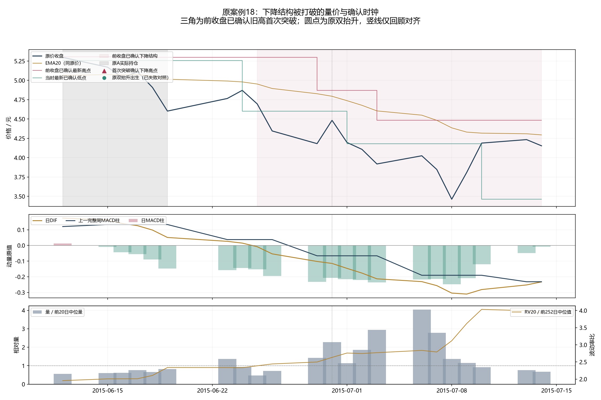
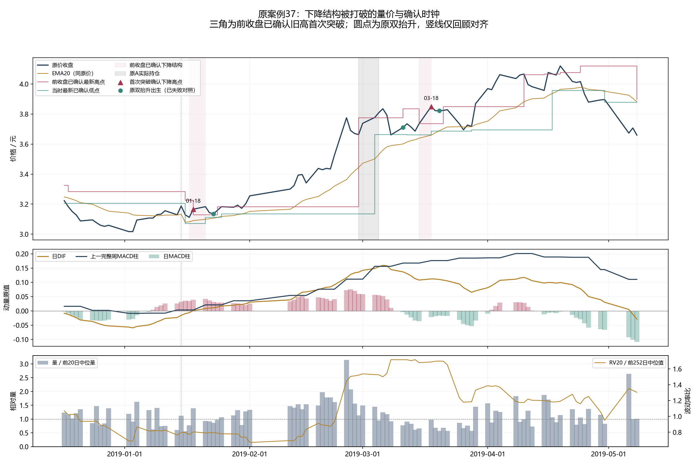
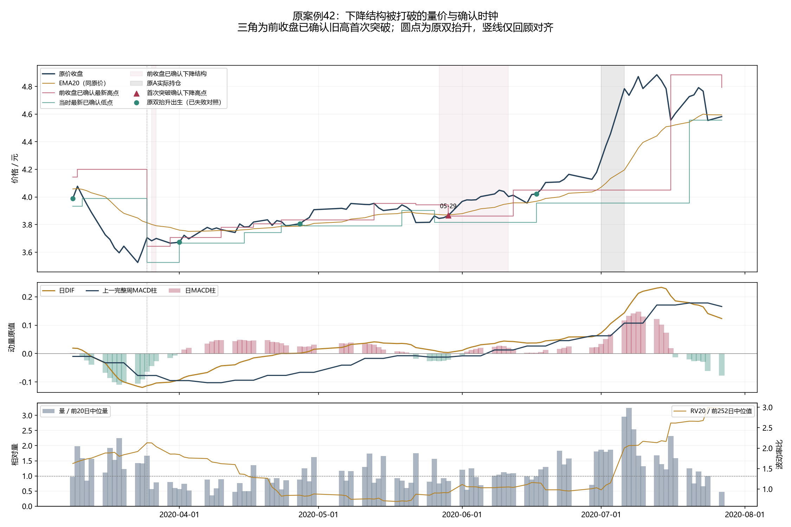
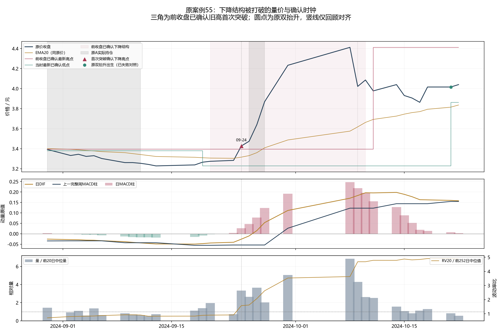

# 具体上涨解释、首次下降结构突破与完整账户结果

本轮按用户要求，先解释具体上涨段及失败反弹的量价、日/周MACD和波动率，再用当时已确认的下降结构反推出完整入出政策。实际结果有一项进展：两个时期、两档成本下，完成交易的胜率×实际盈亏比均>1且平均净收益为正；完整账户只有较早期STRESS一个场景通过经济门，近期明显不及原A，历史稳定门也未通过。这套固定政策拒绝并关闭，点位质量保留为开发事实。

## 四段具体路径与提前到达的信息

当时日线和上一完整周才可使用；图上的高低点从确认日开始显示，中心日期不回填。原事后低点/高点只供解释对齐，不能当作可执行进出。价格结构用已发生现金分红平移坐标，实际成交使用原始开盘。

| 原案例 | 当时量价和指标 | 可识别点位与真实压力成本结果 |
|---|---|---|
| 2019-01-02至04-19上涨39.13% | 01-18已突破上一确认下降高点；相对量1.391、量方向+0.218、日DIF+0.00088/柱+0.03881，上一完整周柱+0.00306，RV比0.804 | 01-18收盘形成信号，01-21开盘3.166入、03-11出，实际净+14.79%。03-18另一个突破同样合格，03-19入/03-26出却净−2.94%，完整保留。早于旧双抬升01-23的确认。 |
| 2020-03-23至07-13上涨38.54% | 05-29突破上一确认下降高点，相对量0.833、量方向+0.690、日DIF+0.00378但日柱−0.02134/上一完整周柱−0.01229，RV比0.910 | 05-29信号，06-01开盘3.898入、07-27出，实际净+17.36%。信号并非日周MACD全正，也不是统一早于旧04-01/04-27双抬升。 |
| 2024-09-13至10-08上涨36.68% | 09-24相对量3.338、量方向+1、日柱+0.02665但DIF−0.02602/上一完整周柱−0.05396，RV比1.574；突破08-26高点，该高点早在08-28确认 | 09-24信号，09-25开盘3.489入、10-31出，实际净+13.25%；旧双抬升到10-21才成立。A库存当时0，但A已知目标31.92%，所以不是原A完全未覆盖的信号。 |
| 2015-06-29至06-30反弹7.22%后失败 | 06-30相对量2.271，但日周MACD柱负、波动约基准2.7倍；反弹仍未突破当时已确认下降高点 | 整个固定案例窗没有新的合格首次突破，不能把一日放量反弹或事后低点称为本策略入场。 |

量价和MACD可以描述修复/加速的到达顺序，RV描述波动，不构成上涨因果证明。四例显示突破可以早于完整双抬升，但并非每段都更早，且突破自身也会失败。没有从赢家反选指标阈值。

## 反推出的唯一完整政策

上一原点已确认的两高、两低都下降，上一收盘<=同一个最后高点H2，当前收盘>H2；每个高点锚只承认第一次已知跨越。空仓次真实开尝试，若开盘现金平移价<=旧H2即取消，不延后追入。初始失效线就是被突破旧H2；持有后用新已确认低点只向上移动失效线，收盘<=线则次合法开退出。未知不强制退出，原风险只减，无加仓、A混合、固定2R或20日到期。

该完整用途在连接旧结果标签前固定。原严格日收盘2/2确认组件、20万元、252日年化、现金收益0、50%上限、ES/跳空/回撤预算、T+1、100份、.001价格刻度和原股息账户口径保持。BASE佣金/滑点为0.02%/0.05%，STRESS为0.04%/0.10%，最低佣金5元。

| 时期 | 费用 | 净年化 | 全日历净夏普 | 最大回撤 | 完成/开放 | 胜率 | 实际盈亏比B | p×B | pB−q | 完整年均次数 |
|---|---|---:|---:|---:|---:|---:|---:|---:|---:|---:|
| 2015_2019 | BASE | 2.0719% | 0.6580 | 6.73% | 20/1 | 25.00% | 4.5931 | 1.1483 | 0.3983 | 4.00 |
| 2015_2019 | STRESS | 1.8906% | 0.6102 | 7.06% | 20/1 | 25.00% | 4.2458 | 1.0614 | 0.3114 | 4.00 |
| 2020_2026 | BASE | 0.3309% | 0.1327 | 6.56% | 32/0 | 18.75% | 6.3168 | 1.1844 | 0.3719 | 4.67 |
| 2020_2026 | STRESS | 0.1126% | 0.0566 | 6.96% | 32/0 | 18.75% | 5.6459 | 1.0586 | 0.2461 | 4.67 |

B=实际盈利周期平均净收益率/实际亏损周期平均净损失率，p为完成周期胜率，q为实际亏损概率；以上均是交易完成后的点估计，不是预先目标止盈/止损比。较早仅5个赢家、近期6个赢家，优势的稳定性尚未成立。次数为软目标，2026不完整年度不纳入完整年均次数。

| 时期 | 费用 | 新规则净年化/夏普 | 原A净年化/夏普 | 纯价格净年化/夏普 | 四条件经济门 |
|---|---|---:|---:|---:|---|
| 2015_2019 | BASE | 2.0719%/0.6580 | 2.1363%/0.5006 | 0.7084%/0.2282 | 未通过 |
| 2015_2019 | STRESS | 1.8906%/0.6102 | 1.8371%/0.4380 | 0.4947%/0.1672 | 通过 |
| 2020_2026 | BASE | 0.3309%/0.1327 | 4.2362%/1.2899 | -1.0405%/-0.3297 | 未通过 |
| 2020_2026 | STRESS | 0.1126%/0.0566 | 3.9908%/1.2169 | -1.3027%/-0.4517 | 未通过 |

只有2015_2019/STRESS通过单场景经济门；早期BASE夏普改善但年化略低于A，近期两档费用均远低于A。因此不能说四个场景都各自失败，也不能把1/4场景通过说成完整准入。两比较、20/252日固定配对区块各2000次的全部区间保存，历史稳定门未通过；近期相对A的收益和夏普差值两尺度95%区间均为负。它们仍是开发描述，不是独立验证。

## 全部信号为什么没有转化为更高账户收益

66个合格原点：较早28、近期38。每档费用53个实际周期（52完成、1较早期末开放），11次开跌回初始失效线取消（早期6/近期5），另2个已有持仓不新建周期（2019-08-23、2023-04-17）。取消和已有持仓事件没有虚构成交收益；同锚重复跨越另有2次不产生新资格。两费用共132资格行、106真实周期行，104完成/2开放。

实际已完成净利润可以恒等拆成：Σ(Q×r)=ΣQ×平均r + Σ[(Q−平均Q)(r−平均r)]，Q是每周期实际买入支出，r是该周期实际净收益率。右边两个量共同还原已有账本，不能把均值项称为可执行等额账户。

| 时期 | 费用 | 完成周期均值项/元 | 资金与收益对应项/元 | 实际完成净利润/元 | 最大实际赢家原点及净利润 |
|---|---|---:|---:|---:|---|
| 2015_2019 | BASE | 9732.44 | 8703.13 | 18435.57 | 2015-02-12 / 21652.46元 |
| 2015_2019 | STRESS | 7688.01 | 9217.25 | 16905.27 | 2015-02-12 / 21495.81元 |
| 2020_2026 | BASE | 10179.62 | -5843.35 | 4336.27 | 2020-05-29 / 10606.34元 |
| 2020_2026 | STRESS | 6647.31 | -5181.32 | 1465.99 | 2020-05-29 / 10502.89元 |

近期压力成本，实际份额毛损益6693.60元，佣金1458.71元/滑点3768.90元，完成净利润1465.99元。账户平均投入约5.13%，所有现金日纳入夏普。盈利来自6周期、亏损来自26周期，最大的2020-05-29赢家10502.89元超过最终全部净利润，多数失败必须一起计入。

较早压力实际完成净利润16905.27元，账户净增18966.48元；差额来自期末开放周期，不能把开放利润提前填入完成交易胜率。较早最大赢家2015-02-12贡献21495.81元，超过全体完成净利润，单例盈利不等于稳定优势。两个账户均未触发回撤停机。

原61分段/49正式波段完整保留，49段中27段确认后至高点没有新首次突破。旧2846标签（2826成熟/20删失）与9尾部无新标签保持；66事件的旧20日描述pB约0.494不能替代本次动态失效的完成交易结果。

## 验证、数据限制和处置

四输入/四账户行为测试最终通过，四真实行情前缀一致，八原A/纯价格日账、订单和周期精确复现；四新主账户一次运行，保存指标与资金/库存/T+1核对通过。41解释来源、81金融来源冻结；初次两失败原源码、输出和原因全部保留：仅固定nullable字符串dtype及现金平移的浮点运算表示，未改变断言、触发/退出逻辑或根据金融结果调参，修复时新主账户结果尚未读取。

原量价、复权所需已发生分红及共同账户来源只用本地冻结文件；MACD/RV为过去行情派生，周线只到上一完整周。回执/文件哈希说明本次来源，不能认证历史first-vintage或真实当时取得全部来源。全段历史已经反复使用，角色DEVELOPMENT_CALIBRATION，first-vintage NOT_CERTIFIED，独立NOT_ESTABLISHED，global DSR/PBO NOT_COMPUTED；去过拟合与完整收益夏普改进目标均未实现。

接受：本确认时钟、四例的早晚区别、全部实际完成交易质量为正的开发事实。拒绝：R173固定完整政策作为收益/夏普改进，关闭并保留；R170双抬升及所有旧终态保持。不得据结果增加MACD/量/RV过滤、调整窗口/失效、混A或放宽风险预算营救。源/实现真实错误、实质新信息或真正新样本才可能另行独立重验，不把全项目停止等同本政策关闭。

下一具体实验是全部66信号的原资金预算与实际订单归因：先解释已知ES/跳空/DD约束、真实投入与持有期间减仓，区分原A库存和当时目标。四场景、所有取消/已有持仓/失败及开放周期保留。暂不登记另一账户策略，不把旧R166/R167预算机制重新说成未试；已准入待跑新候选0。真实原前瞻两登记与十二状态值保持，最早资格新收盘仍2026-10-08 15:05，按其原1008实际交易日协议执行。

## 可追溯文件

- [全部真实进出、当时量价/下降结构/资金](results/全部实际进出点位_已知下降结构量价及资金.csv)
- [全部合格点及成交、取消、已有持仓](results/全部首次突破资格_当时指标成交取消及A覆盖.csv)
- [四原案例相交的全部真实周期](results/四案例相交的全部实际周期_不筛收益.csv)
- [十二场景共同口径](results/完整账户共同口径比较.csv)、[逐年收益与完成次数](results/逐年净收益与实际周期次数.csv)
- [四场景资金恒等式](results/全部四场景完成周期_实际资金恒等式.csv)
- [R171解释](../510300_downtrend_break_explanation_v1/summary.json)、[R172冻结政策](protocol.json)、[R173结果与全部区间](summary.json)
- [八必要测试](tests_receipt.json)、[八原控制复现](control_preflight.json)、[保存账本核对](saved_result_verification.json)
- [下一全体资金归因提案](next_all_signal_budget_attribution_proposal.json)
