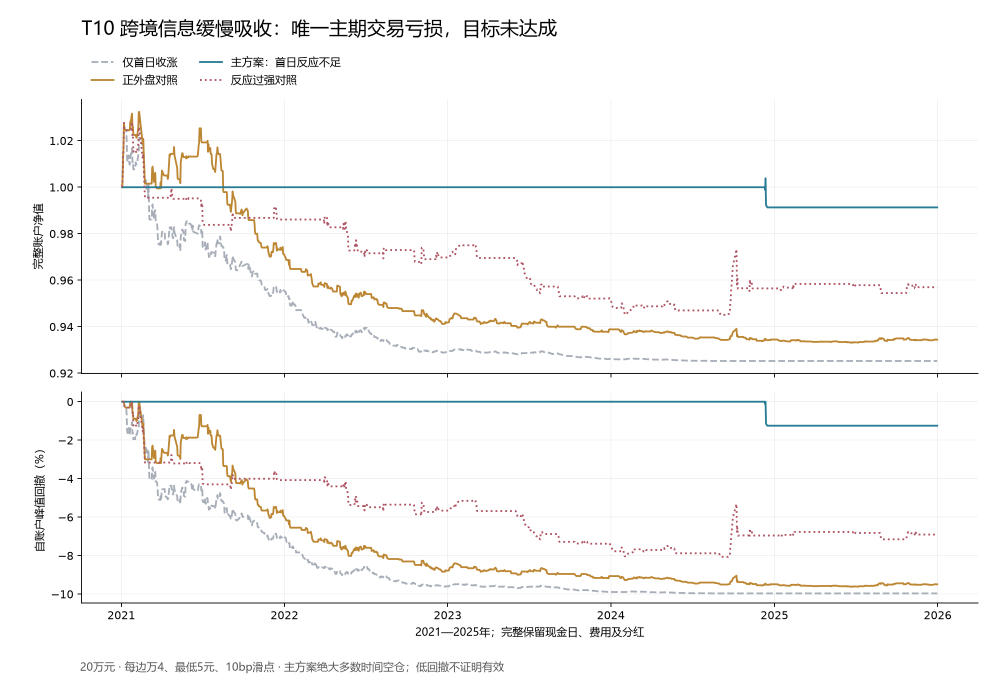

# T10跨境信息缓慢吸收：固定检验结果

**只操作510300、完整账户成本后夏普至少1.2的目标仍未实现。** T10在2021—2025年、20万元压力成本账户中，净夏普-0.306678，净年化-0.174%，最大回撤1.247%。只有一个完整交易周期，亏损1,735.75元。2万元账户夏普-0.311090，同样未达标。早期2017—2020年没有合格主信号，夏普未定义，不能记为0或通过。

候选库累计已完成T03、T05、T14、T02、T10共5个固定主问题，合格策略0。正式账户情景累计208个，另保留T02原实现的40个已否定账户，实际执行累计248个。情景数包含本金、费用、时期、对照与时钟敏感性，不是独立策略数；96项因子和18项草案仍不能说成已经全测。

## 这次测试的新增问题

旧美国中国ETF八规则研究在A股开盘前按外盘符号或分位决定全仓/现金，已固定失败；旧全球信息分类器也未达标。本轮先让A股完成一天反应，再在同一来源覆盖下比较：仅首日收涨、再要求正外盘、进一步要求反应不足，以及反应过强对照。主要增量FULL减POSITIVE，单独询问“反应不足”这项条件有没有增加信息。

选择ASHR是因为其投资目标对应沪深300，未先比较FXI、MCHI、KWEB绩效再选标的。[发行方招募说明书](https://etf.dws.com/en-us/AssetDownload/Inline/ce51b065-fc18-496f-9b88-8996a37d16b3/CHINA-1-Prospectus.pdf)

候选库因子卡J03写的是次日开盘/首段预测，策略卡T10却明确要求完整首日。冻结前已记录这一差别：本轮主回归标签取完整首日总收益，开盘预测另存为描述性列，不作为第二套入场择优。J06的负向外部冲击相对抗跌没有在此替代为正消息低反应，仍标记未检验。

## 固定模型、时钟与交易

每个A股日09:20，以截距、ASHR新完成时段总收益、人民币中间价变化、前一日510300总收益为解释量，用此前两自然年、至少252个完整已成熟首日记录拟合OLS。首日预测、系数和残差标准差在09:20固定。510300当前日及未来持有期收益不进入训练；每天重新估计，未搜索窗口、模型或阈值。

ASHR收益按原始收盘加当日现金分配形成总收益，再累计此前A股开盘前至当前开盘前新完成的美国时段。不使用后复权价，未新增美国交易时段的中国交易日记为缺失，不能填0。美国日线统一保守等至纽约17:00，夏令时由时区规则处理；中国长假累计多个已经结束的美国时段。纽约证券交易所常规交易时段截至16:00，额外一小时是本研究的可用时间假设。[NYSE交易时段](https://www.nyse.com/markets/hours-calendars)

人民币中间价采用官方原始响应，按工作日09:15发布、09:20可用。它只作为解释量，不视为可交易汇率收盘。相邻两个A股日均必须有当日公布值；缺失或迟到不倒填。[中国外汇交易中心中间价说明](https://www.chinamoney.com.cn/dqs/cm-s-notice-query/fileDownLoad.do?contentId=384571&mode=open&priority=0)

ASHR的日度区间仍可能包含前一A股交易日的变动，因此回归明确控制前一日A股回报；这不能证明残差已经纯化为新消息。ETF溢价、非同步成交、模型错设和本地信息更弱都能造成所谓“未充分反应”。

16:00观察完整首日。当且仅当模型可用、ASHR区间收益>0、510300首日总收益>0、实际首日收益<预测减1个训练残差标准差，下一交易日开盘才申请建仓。入场冻结首日财富最低价；收盘跌破该低点、持有5个开盘间隔或共同风险触发，下一合法开盘退出。持仓期不加仓。额外等待一日的版本须在等待后仍未收盘跌破首日低点，风险预算使用最新日数据。

## 账户结果

以下为2021—2025年、20万元、压力成本，全部1,212个交易日都进入账户指标。年化242日，现金及无风险基准为零。

|固定情景|净夏普|净年化|最大回撤|完整周期|
|---|---:|---:|---:|---:|
|仅首日收涨，同覆盖|-0.8179|-1.539%|9.964%|144|
|再要求海外上涨|-0.6796|-1.345%|9.617%|142|
|主方案：再要求反应不足|-0.3067|-0.174%|1.247%|1|
|竞争对照：反应过强|-0.4393|-0.874%|8.064%|46|

主方案期末198,264.25元；2万元账户期末19,829.00元，损益-171.00元。额外等待一日主方案夏普-0.313214，仍只有一个亏损周期，不晋升为主方案。

主期1,169天有可用模型，其中564天A股首日收涨、283天同时有正外盘，只有2024-12-10再满足低于预测1个标准差。当天ASHR区间对数收益6.621%，A股完整首日0.762%，预测1.935%，训练残差标准差1.089%，残差z=-1.077。次日2024-12-11开盘入场，2024-12-16开盘按退出规则结束。早期943天模型可用、281天正外盘且A股首日上涨，主信号0。

主方案相对正外盘对照的年化算术收益差1.162%；20日区块、4,000次已保存抽样的95%区间为[-0.676%, 2.955%]，包含0。该改善主要对应更长时间持有现金，不能据此断言识别了稳定收益。未对全历史多轮探索作选择偏差校正。

BASE每边万2、最低5元、5bp滑点；STRESS每边万4、最低5元、10bp滑点，按0.001元向不利方向取整。账本包含100份整手、T+1、方向涨跌停限制、分红登记/除息/付款及现金约束，末日仍持仓则提取压力退出费用准备。

沿用当前授权的20万元主账、2万元对照、50%最高目标仓位，以及两年成熟五日ES95每日更新、2.5%ES预算、10%跳空下5%损失预算、剩余回撤空间限制和10%回撤触发后不恢复。限价、T+1与跳空可能使退出延后，预算不保证实际最大回撤。

## 数据、验证与结论边界

3,056条ASHR原价记录与既有历史快照逐条一致，12次现金分配已显式计入；2,675条人民币中间价由55份官方原始响应复算。发行方身份、交易时钟与汇率发布依据随包保存。ASHR分配值来自后来取得的公开历史响应，未逐笔认证发行方公告首版；全部历史的首次可得版本也未认证。因而是历史探索检验，不是严格前向实盘证据。

9项冻结前测试通过。独立只读脚本从原始响应重新累乘海外收益、按截止时点找汇率，并用正规方程交叉复算研究代码SVD求解的2,332个逐日模型；复核48份账本、52,464个交易日行和2,990份成熟风险记录，费用、分红、止损、持有期及保存抽样均一致。源文件、冻结清单、前后候选进度、结果和验证回执完整保存。外部GPT审阅未进行，独立前向样本0，没有交易授权。

本轮不降低1sigma、不改正负方向、不缩短训练窗口或换退出去制造交易。T10固定版本保留为未达标。T01与旧突破回踩停止细调范围重叠，记为未运行且不改参数复活。T09的实际IF合约源可用，但当时已公告分红所对应的指数点数与历史权重版本尚未准入，保留来源门；不能用原始F/S-1替代扣持有成本基差。T04仍等待历史权重依据。

下一轮优先检查T07同指数ETF体系申赎，以及T06融资拥挤持仓削减层的既有来源和旧研究差别。T06是对既定基准的持仓覆盖层，不能当成独立入场策略；只有明确新增信息后才冻结检验。已失败5项不拼接有利年份、不靠重复参数试验继续计作新机制。
