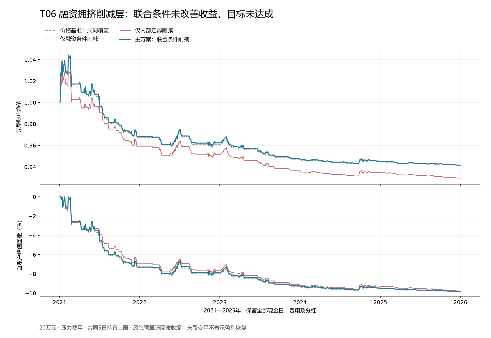

# T06融资拥挤持仓削减：固定检验结果

**只操作510300、完整账户成本后夏普至少1.2的目标仍未实现。** T06主方案在2021—2025年、20万元压力成本下净夏普-0.639362、净年化-1.194%、最大回撤9.830%，期末188,327.76元，累计损益-11,672.24元。联合条件实际触发7次削减，相对无削减对照的年化收益差接近零，95%区间包含零。2万元主方案夏普-0.718507，同样未达标。这是固定持仓削减层的失败记录，不是新独立入场策略。

本库累计完成T03、T05、T14、T02、T10、T06共6个固定主问题，包含5个入场候选和1个覆盖层，合格项0。正式账户情景累计264个，另保留T02原实现40个已否定情景，实际执行累计304个。各情景包含时期、本金、费用、对照和滞后版本，不能当作264个独立策略。其余12项尚未完成原定义绩效检验；96个因子也没有逐个获得独立收益验证。

## 固定问题与旧研究的区别

旧融资级联研究使用多项全A特征和分类器，固定失败结果保留。本轮只比较固定20日价格基准下的持仓管理：无削减、单独融资条件、单独成分走弱、两个条件共同触发。单条件均采用相同数据覆盖门，PRICE_ALL另用于显示缺失覆盖影响。没有从旧研究中更换阈值、ETF池或择取盈利年份。

20日基准只充当覆盖层的观察对象，不声称它已验证有效。T06草案明确max_hold_days=5；在计算新收益前，将其解释为所有对照臂共同最多持有5个开盘间隔。旧PRICE20_ONLY研究的60日持有、6%止损、8%追踪退出和重入等待未混入本轮。本次失败也不构成更换基准后继续试削减参数的许可。

## 规则、缺失与交易时钟

统计日s的融资余额五日变化F5须高于严格前252交易日的80分位，且510300含分红五日收益不为正，融资条件才成立。F5窗口连续六日必须完整，分位至少有120个有效历史观测，当前F5不进入自身阈值。该阈值并不另要求F5>0，不能把规则名称当成绝对融资增长限制；本轮主期7个实际触发的F5均为正。F05中的余额/匹配自由流通市值没有使用，仍属未检验部分。

内部走弱取s与s−5均为当时有效沪深300成员、且两端20日总收益都完整的同一批股票，至少294只，两端均须通过原四态数据门。比较这批成员在两端的20日总收益中位数，当前低于五日前才为真。官方确认停牌可保留零收益；未确认缺失、来源冲突或未解决公司行为不能填零。ETF20日收益减中位数的分歧另存描述列，未增设筛选阈值，也不用等权中位数冒充权重贡献。

主版本在下一A股交易日收盘判断s的融资、价格停滞和成分状态，再于随后开盘模拟执行；整个经济统计日一起滞后。额外一日延迟只作敏感性，不选出新主方案。源历史首版尚未认证，延迟是保守历史研究假设，不是已证明的实时可交易时钟。

价格财富指数高于20日均线，且共同数据门已知，才能下一开盘进入新基准周期。削减只管理已经存在的周期：先按最新ES与回撤预算收缩允许份额，再将其减半，向下取整100份。两个条件都明确为假且连续两日，才可恢复风险允许的原份额；未知重置清除计数并保留削减。单条件对照等待自身条件消失两日。原周期份额上限只能下调，不因盈利或价格上涨向上扩张。

价格基准跌回均线、五日到期或10%回撤停机，退出优先并持续请求至合法成交。因半仓整手取整成为0份，仍保持虚拟基准周期和削减状态，不能下一日误当新机会恢复原仓。所有交易均限制510300.SH和CASH_CNY，采用100份、0.001元、T+1、方向涨跌停、现金约束及分红权益/应收/付款。

共同风险沿用前两自然年、五日结果已成熟的相近状态ES95；每天更新，最高50%目标、2.5%ES预算、10%跳空下5%损失预算、剩余回撤空间折半。回撤达到10%后下一合法开盘退出且不恢复。风险预算不保证真实跳空、涨跌停或延迟退出的损失上限。

## 完整账户结果

以下为2021—2025年、20万元、压力成本，完整保留1,212个交易日。年化242日，现金及无风险基准按零计；252日诊断另存，不据此换口径。

|固定情景|净夏普|净年化|最大回撤|完整持仓周期|
|---|---:|---:|---:|---:|
|价格基准：全部覆盖|-0.638194|-1.185%|9.796%|137|
|价格基准：共同覆盖|-0.642308|-1.193%|9.829%|131|
|仅融资条件削减|-0.644115|-1.194%|9.833%|131|
|仅内部走弱削减|-0.847694|-1.447%|9.778%|131|
|主方案：联合条件削减|-0.639362|-1.194%|9.830%|131|

2万元主方案期末18,799.90元，损益-1,200.10元，净年化-1.228%、最大回撤9.668%。早期2017—2020年20万元压力主方案净夏普-0.404000、净年化-1.303%，同样未达标。额外一日延迟主期净夏普-0.628528、净年化-1.178%，保持敏感性身份。

主期共同数据可用1,137天，融资条件61天、内部走弱595天、联合条件36天；其中价格基准仍为真17天，结合真实持仓和退出优先级只触发7次削减。主期7次削减后均在满足两日恢复前先结束原基准周期，没有实际恢复。单条件和早期延迟情景确有恢复记录；冻结前测试也专门覆盖了恢复路径。覆盖状态保留到退出日产生的零份额记录，不全是“减半100份变零”的实例。

|削减执行日|对应统计日|F5|ETF五日收益|同成员中位收益变化|实际股数变化|
|---|---|---:|---:|---:|---:|
|2021-06-07|2021-06-03|1.509%|-1.590%|-0.357%|-6,500|
|2022-07-11|2022-07-07|1.187%|-0.887%|-3.473%|-3,500|
|2023-08-09|2023-08-07|0.841%|-0.514%|-0.566%|-1,600|
|2024-03-21|2024-03-19|1.745%|-0.474%|-9.871%|-900|
|2024-10-16|2024-10-14|10.278%|-4.559%|-2.772%|-800|
|2024-11-06|2024-11-04|2.151%|-0.346%|-26.141%|-700|
|2025-09-22|2025-09-18|2.680%|-1.416%|-5.483%|-300|

主期主方案共302次成交、131个完整持仓周期；佣金2,771.64元、滑点6,250.60元。平均账户风险暴露3.939%，743天收盘零份额。接近回撤限制后，风险预算持续缩小，净值末段变平不能解读为盈利能力恢复。BASE每边万2、最低5元、5bp滑点；STRESS每边万4、最低5元、10bp滑点，价格向不利方向取整，期末持仓另提压力退出成本准备。

同一主期逐日配对收益，使用冻结的20日循环区块和4,000次已保存抽样：

|比较|年化算术收益差（百分点）|95%区间（百分点）|
|---|---:|---:|
|主方案减价格基准：共同覆盖|-0.000078|[-0.082056, 0.105563]|
|主方案减仅融资条件削减|0.000883|[-0.060120, 0.078197]|
|主方案减仅内部走弱削减|0.259564|[-0.180833, 0.780631]|

全部区间包含0，未证明联合条件具有稳定增量；没有做全历史多轮选择偏差校正。各臂账户风险预算会随自身净值变化，配对差是整个动态削减政策的差别，不是固定相同份额下的局部因果效应。

## T07来源门

现有本地同指数份额源来自旧固定10只上海ETF的周度研究，其中沪深300子池仅3只。旧研究五条固定二元规则已经失败，不能改池、改阈值、改方向或改时钟复活。本库G03却要求当时动态同指数产品池，以前日NAV乘日份额增量、除以前日资产，再汇总五日；G04还要比较510300与整个体系的迁移差。这些定义不能由原固定池周度收盘价乘份额变化替代。

本轮仍缺当时全体系产品上市/退出、日频份额及拆分、匹配前日NAV和对应数值的历史发布时间依据。因此T07保留NOT_RUN_DAILY_SYSTEM_FLOW_SOURCE_GATE，收益为未计算，不计作第7个完成策略。既有份额发布时点闭环检查已保存2,220个历史响应；它们仅有统计日和数值等字段，下载时间不能充当首次公开时间，不无差别重扫这批响应。

交易所材料说明ETF申赎清单在开市前公布，但这不证明另一个规模查询表TOT_VOL的每个历史数值已在同一时点公开。[上交所ETF申赎说明](https://etf.sse.com.cn/fund/learning/download/c/10055613/files/32901abf70d54e999f46975b52ba46de.pdf) 以上为本地已找到来源的准入判断，不声称外部不存在可补齐的官方资料。

## 复算与停止条件

冻结前11项测试通过；独立只读脚本从分类源价格和公司行为复算1,330,832条交易收益，核对14,771条官方停牌零收益，以逐窗直接相乘交叉核对研究代码的滚动对数和，复算同成员比较、融资分位和滞后。56份账户共61,208行，逐行重放减半/恢复/到期、风险份额、费用、T+1及方向涨跌停；2,990份成熟风险记录的候选窗口、相近状态排序、已成熟标签和ES均一致。保存抽样只读复算，没有新随机搜索或新账户。

这证明固定输入到保存结果的算术一致，不认证原始历史首版、数据修订可得性或策略有效性。外部GPT审阅未进行，独立前向样本0；暂停的采集任务没有重启，没有真实交易。分类源上游证据和此前失败结果随旧完整交付包保存；本轮直接输入、冻结代码与结果在当前包内。

T06按固定定义结束，不改80分位、5日、20日、两日恢复或价格基准救援，也不将单条件对照晋升为赢家。下一轮优先核对T12实际回购新增披露与T13已知供给窗口，先判断来源时点和旧解禁研究的实质差别，再决定能否冻结；不能把计划回购当实际回购，不能把可解禁当实际卖出。T04、T09、T07继续保留各自数据门，T16等待已接受的基准，T17不能拼接失败分支，T18需额外解决成熟校准和重复搜索边界。
