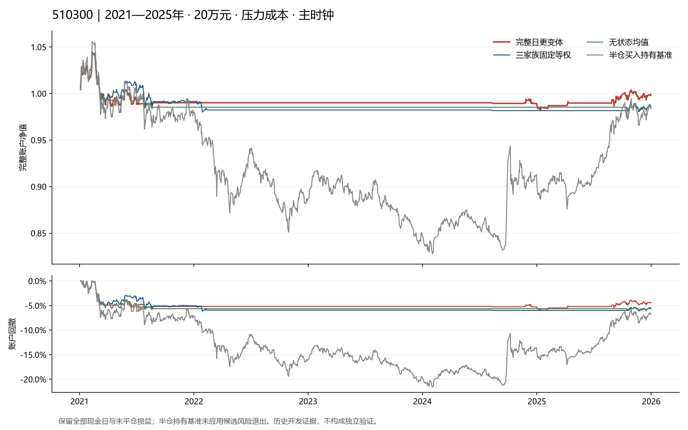

# 510300三家族日更成熟校准固定检验

**夏普1.2目标尚未实现。日更变体固定检验未达到目标。** 本轮完成112个完整账户情景，0次参数搜索。累计432正式账户情景、152否定实现情景，共584；原候选库7个问题及本轮1个授权日更变体，均无独立验证合格策略。原T18季度草案仍NOT_RUN。

## 为什么转向这项检验

发行目录与配股原文上一轮已完成交付，但完整事件链和历史自由流通分母仍未满足T13。本轮核查官方规则及接口说明，没有取得可准入的完整历史权重或分母序列；不声称这些数据绝对不存在，也不继续把更多公告数量当作已能回测。

价格路径效率、历史成员20日总回报广度和融资净变化已有来源。附件T18建议季度更新；用户2026-09-24明确要求“只用最近两年的数据训练，每天滚动更新”。本轮遵守现行授权，事前记录日更变体，与未运行的原季度草案分别登记。没有复活旧SELECTED_MIX、价格优化或后悔加权失败账户。

## 固定方法与账户

每日仅用当前之前两日历年、五日开盘收益已经成熟的样本，三个信息家族分别进行固定强度岭回归，再固定等权。内层校准使用固定五日相位的成熟预测；内层训练同样不能越过当前两年下限。平均预测误差按n/(n+60)收缩，分歧和有界CUSUM监测各自保留消融对照。

主方案把外部广度和融资统计多等一完整交易日，另有再等一日对照；价格特征取当日收盘，次开盘执行。净期望扣0.28%双边比例成本代理，随后映射0、12.5%、25%、37.5%、50%五档目标。实际账户另计最小佣金、滑点和价位，20万元与2万元分别模拟，没有把代理成本当作实际账户已付成本。

原有ES、缺口、回撤预算和50%上限继续；本周期价格下跌时不追加份额，开盘跳空跌破首次进入财富价也撤去新增请求。最长20日，无有效模型、目标为零或风险退出则下个合法开盘退出，T+1及涨跌停保守约束保留。回撤停机不因模型恢复而重启。所有空仓日、应收分红、未平仓损益及末日退出成本准备计入。

## 2021—2025年主期结果

以下均为20万元、压力成本、主时钟，未从对照中另挑胜者：

| 方案 | 净夏普 | 净年化 | 最大回撤 | 完整交易周期 |
|---|---:|---:|---:|---:|
| 无状态均值 | -0.123050 | -0.276% | 6.060% | 9 |
| 三家族固定等权 | -0.114755 | -0.301% | 6.155% | 24 |
| 成熟误差校准 | -0.015727 | -0.065% | 6.216% | 22 |
| 校准加分歧控制 | -0.007015 | -0.044% | 5.922% | 21 |
| 校准加失效监测 | -0.015727 | -0.065% | 6.216% | 22 |
| 完整日更变体 | -0.007015 | -0.044% | 5.922% | 21 |

主方案2万元对照：净夏普-0.187607，净年化-0.435%，最大回撤6.654%。20万元主方案在2017—2020年前期的净夏普-0.850270；主期再多等一日的净夏普-0.099204。全体112行结果在metrics.csv，逐年结果在annual_metrics.csv，不拼接有利时期。

主期20万元压力净收益的配对区块复算：

- 相对三家族固定等权：年化日均收益差0.257%，95%区间[-0.631%, 1.156%]。
- 相对无状态均值：年化日均收益差0.238%，95%区间[-0.341%, 0.837%]。

这些差值是日均收益差乘242，不是复合年化差。4000次20日循环区块的抽样索引已保存。普通95%区间不代表已消除本项目长期反复研究的选择偏差。

## 验证与边界

20项冻结前测试通过。只读核验从保存输入核对特征、每一内外层系数的训练时钟和充分统计量、五档目标及112套账本，逐日检查请求、成交、现金、份额、分红、退出和指标。归档后另作全新解压核验。图中半仓持有基准没有候选的风险退出；现金零息且夏普未定义。

主时钟有1911个有效模型判断日，延迟时钟有1910个。其余时点保持NO_VIEW，已有持仓依事前规则退出，账户现金日仍计入评价；NO_VIEW不被解释成当前市场看空。来源属于2026年回取历史，没有逐日首版发布快照。两段历史均已被此前研究观察，本轮不是独立样本外或前向验证。

固定规则结果保留，不按本轮收益修改窗口、岭强度、监测阈值、仓位或退出条件。下一步回到未满足的数据门及不同机制；不把失败账户择优拼接。独立前向样本0，external_review=NOT_PERFORMED，目标active。研究资产仅510300.SH与CASH_CNY，无下单授权，原PCF／IOPV任务暂停不变。
