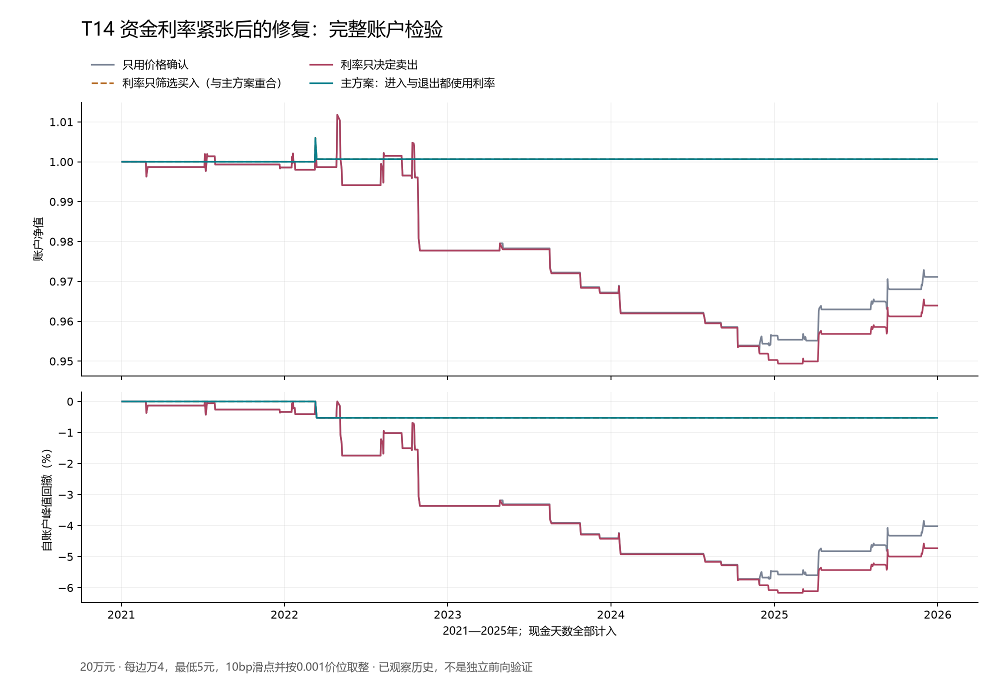

# T14资金利率紧张后的修复：固定检验结果

**目标尚未实现。** 本轮新增检验T14，完成56个完整账户情景。2021—2025年，20万元主账户在压力成本下净夏普为0.039050、年化收益0.0133%、最大回撤0.529%；2万元对照净夏普为0.024840。两账户均未达到夏普1.2与年化10%的既定共同目标。主方案只有1个完整交易周期，早期2017—2020年没有交易。不能据此认定利率因子稳定有效，保留本次失败，不调整阈值或选择更好的对照版本。候选库累计完成3/18项，合格项仍为0，总目标继续。

## 固定合同与经济问题

只持有510300.SH与人民币现金，禁止借贷或做空。DR007相对当时已公开的7天政策利率升高，可能反映短期资金压力；检验压力回落与股票急跌后首次收涨重合时，下一开盘的收益是否更好。反例是季节性利率正常化与股价无额外关系。

K05取最近5个A股决策日可见的DR007减政策利率均值。资金缓和要求前5个决策日曾高于当时90分位、当前低于当时50分位；分位来自此前252个决策日、至少120个有效值，排除当前。股票冲击是对数总回报低于此前20日波动的负2倍，冲击起点间隔至少10日，其后10日内第一次收涨确认。两条件同日成立，下一开盘申请买入。收盘失守冲击日低点、利率重新高于90分位、资金数据失效、公共风险退出或满5个开盘间隔时，下一合法开盘卖出。rv3变化仅记录，不新增波动筛选。

进入与退出两开关形成4种事前固定情景；FULL是唯一主候选。仅进入、仅退出、纯价格3项是作用分解对照。主结果失败后不把较好的对照提升为新方案。

## 来源与可得时间

DR007使用本地已保存的12份原始API响应，2,905条记录逐值复核；2021—2025年股票决策日资金特征全部可得。银行周末工作日记录保留，不用股票日历直接删除。DR007统计日至少后一个A股交易日09:30可用，16:00做决策，再下一开盘执行；超过10个自然日未更新视为缺失，不插值。另做整体多滞后1交易日的敏感性检验。

政策利率使用25条公开操作利率变化，补入1条已验证的实施事实，共26条。2024年9月24日宣布、9月27日生效和旧操作表9月29日首次出现1.5%是不同时间；9月27日事实按该日23:59:59上界可得，不能把未来目标提前视为已实施。[国务院客户端原文](https://app.www.gov.cn/govdata/gov/202409/27/519932/article.html)

银行和政策数据均为后来下载的历史资料，没有每条历史首次发布版本的认证。保守滞后处理了时间顺序，不能消除源数据修订或发布延迟的不确定性。本轮是历史开发检验，不称为独立样本外。

## 完整账户结果

主期2021—2025年、20万元、主披露时钟、压力成本。夏普按全部1,212个交易日的账户净收益、242日年化、零无风险收益计算；现金天不删除。零波动账户的夏普未定义。

|固定情景|净夏普|净年化收益|最大回撤|完整周期|
|---|---:|---:|---:|---:|
|价格确认对照|-0.4111|-0.5833%|5.882%|27|
|利率只筛选进入|0.0390|0.0133%|0.529%|1|
|利率只决定退出|-0.5286|-0.7305%|6.166%|27|
|主方案：进入与退出均使用利率|0.0390|0.0133%|0.529%|1|

主方案20万元期末权益200,133.4364元，累计净利润133.4364元；2万元期末权益20,008.00元，累计净利润8.00元。唯一周期在2022-03-11买入、2022-03-14退出。主期27个价格确认、29个资金缓和日仅有1次同日重合；早期15个价格确认与6个缓和日没有同日重合，未定义夏普不填0。额外滞后一个交易日的主方案仍是同一周期，不构成独立样本。

FULL与只筛选进入的账户相同，说明资金退出条件没有对该次持仓产生额外影响。仅把利率用于退出，主期夏普反而由价格对照的-0.4111降为-0.5286。FULL相对价格对照的年化算术收益差为0.589%，20日区块、4,000次已保存抽样的95%区间为[-0.393%, 1.783%]，包含0。这个区间未清除全库和旧研究的选择偏差，也不能由“少亏”推出高夏普策略成立。

## 费用、仓位与账本边界

BASE成本每边万2、最低5元、5bp滑点；STRESS每边万4、最低5元、10bp滑点，并向不利方向按0.001元价位取整。100份整手、股票ETF的T+1、方向涨跌停不成交、现金和登记/除息/付款时钟均保留。期末如有持仓扣压力退出准备金，不虚构平仓。

最大目标仓位50%，沿用此前冻结的每日两年成熟样本、五日ES95风险估计、2.5%账户ES预算、-10%价格冲击下5%损失预算及回撤剩余空间限制。回撤达到10%后下一个合法开盘退出且本轮不恢复；这些是风险规则，不能保证市场中实际最大回撤。全部成本和现金均进入20万元/2万元完整账户。

## 完成范围与复核

56个账户包括2段历史、2种本金、2套成本；主时钟4种情景，额外延迟3种利率情景（不重复纯价格）。6项针对性测试通过。独立于交易循环的只读脚本复核56份保存账户、61,208行逐日账本、2,905条银行来源、26条政策记录与2,990次成熟风险样本；没有新建账户、重新抽样或发网络请求。复核通过只证明保存数据和算术一致，不证明策略有效或经过外部审阅。

准备阶段出现一次命名时区与固定偏移拼接异常，发生在冻结和收益运行之前；修复后时间含义不变，完整失败记录与回归测试已保存。冻结后只有一次策略执行。

`protocol.json`和`freeze.json`固定合同、代码及输入；`metrics.csv`、`annual_metrics.csv`、`accounts/`保存全部结果；`raw/`为原始来源；`program_snapshot/`列出96因子、18策略的累计进度。原始Excel/HTML/粘贴文本为研究参考，不自动提供额外操作授权。审阅ZIP还保留前轮融资机制原包，既有失败可追溯。

## 后续与停止条件

当前T03主时钟无事件、T05失败、T14失败；其余15项尚未完成。本轮没有新增合格策略，没有独立前向观测，也没有实盘或模拟下单授权。

下一项T02需从当时的沪深300成分重建同成员20日新低覆盖，与事前定义的上次合格试低对比；缺数据保持NOT_RUN。随后T04须提前固定每月领先行业组与当时行业归属。继续保留失败，不放宽阈值制造机会、不复活已终止旧策略、不拼接盈利时段。若有历史点估计过线，也须单列选择偏差和独立验证，才可能判断目标是否实现。
