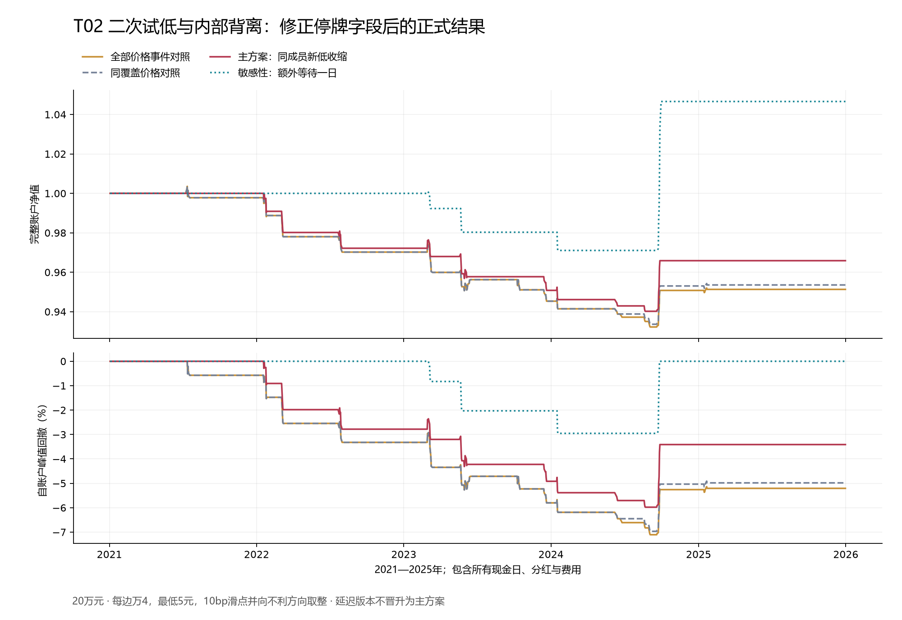

# T02二次试低与内部背离：正式修正结果

**只操作510300、完整账户成本后夏普1.2的目标仍未实现。** T02固定主方案在2021—2025年、20万元压力账户中的夏普为-0.616675，净年化-0.691%、最大回撤5.978%，11个完整周期；2万元账户夏普-0.704129，也未达标。内部背离相对同覆盖价格对照有小幅改善，但收益增益区间包含0，不能证明稳定有效。额外延迟一日的主方案夏普0.540980仍不达标，不因数字更好替换主时钟。候选库累计完成T03、T05、T14、T02共4项，0项合格。

## 实现修正与哪些结果可以使用

正式结果位于`510300_factor96_internal_reclaim_v1_0_1`。原V1已有40个账户，在独立复算阶段发现：14,771条官方全日停牌记录的当日未复权收盘为空，已知前收盘有效；V1错误排除了这些记录的低价窗口。V1账户和冻结文件全部保留，但不作为经济结论。原V1主期20万元主方案夏普-1.358776已被否定为不符合原定停牌处理规则的结果。

修正只对“官方确认全日停牌、无公司行为、前收盘有效、原四态可用”的记录，以前收盘作为当日平值；普通缺失不填零。两版本的全部直接来源哈希完全相同，策略阈值、事件、持有期、费用、覆盖门与风控不变。8项测试通过，新版本另行冻结。`source_evidence/implementation_diff.patch`给出完整代码差异，修复回执与旧失败同包保留。修复发生在已经看到旧结果之后，必须保留这项开发历史，不能当作新的独立验证。

本轮实际计算80个账户：40个已否定实现账户和40个正式修正账户；全候选库累计实际计算200个，其中160个作为当前固定候选结果，40个保留为实现失败。40个情景不是40个独立策略。

## 固定问题和规则

问题是：指数再次接近旧低点时，跌破各自20日低点的成分股减少，是否表明内部卖压衰减、随后修复更可持续。反例是少数权重股继续恶化，等权新低减少也挡不住指数下跌。

首次低点a必须严格跌破此前20日财富低点；后两天低价都高于a，等a+2收盘才确认。二次试低发生在a+3至a+10，a仍为前20日最低，二测低价距a严格小于0.5ATR[a-1]。每个首次低点只认领一次二测，不重叠追认。二测b冻结前20日低点L0；当天或随后10日内第一次财富收盘>L0时完成收复。未收复和到期事件保留，不从母集删除。

成分新低使用原始最低价、可解释的现金分红与股数转换重建财富低价。连续21日低价与收益必须可用，当前最低价与前20日比较。a、b两日取共同属于指数且两边价格窗口都完整的同一批股票；至少294/300名可比，两日自身覆盖也至少98%。同分母下二测的新低数量严格低于首次测试，才称内部背离。内部值在b固定，收复时不重新挑有利日期。B02成交额、回报和收盘位置只记录，不追加过滤。

主方案同时要求收复、覆盖合格、内部新低减少。PRICE_COMMON删除背离条件但保留同覆盖，PRICE_ALL只用价格事件。主要增量为FULL减PRICE_COMMON，从而把信息作用与缺数据筛选分开。收盘失守L0-0.5ATR[b-1]、五个开盘间隔到期或公共风险触发，则下一合法开盘卖出。

## 可得时间和来源

当日成分日线统一按18:00可得，ETF买单从下一开盘开始；股票日线原始接口说明其不复权且停牌期间无数据，因此不能凭日线缺行就认定零收益。[Tushare日线字段说明](https://tushare.pro/document/2?doc_id=27)

成员使用官方调样重放，明确“收盘后生效”的调整在下一交易日切换。包内补充65份成员调整原文、附件和2015历史锚点；没有用当前成员回填。股价原始表、公司行为四态记录和官方停牌证据分开保存，没有把供应商复权因子当成原始价格。总计668个历史成员身份参与数据准备。

2021—2025年新低覆盖可用1,200/1,212日，2017—2020年808/974日；早期覆盖较差，不把缺数据少交易当成稳健。18个主期价格确认中17个满足同覆盖、11个存在背离。早期7个价格确认中3个同覆盖、2个背离。全价格历史记录42次二测，其中40次收复、2次过期未收复；这一全历史计数不等于评价区间交易次数。

所有来源均为后来重建的历史记录，不证明当年存在可持续、准时的实时采集。原始版本认证和独立前向样本仍不足。

## 账户与对照

下表为2021—2025年、20万元、压力成本；年化242日，现金与无风险收益为零，完整保留全部1,212个交易日。

|固定情景|净夏普|净年化|最大回撤|完整周期|
|---|---:|---:|---:|---:|
|全部价格事件|-0.9080|-0.991%|7.106%|18|
|同覆盖价格对照|-0.8572|-0.945%|6.967%|17|
|主方案：内部新低收缩|-0.6167|-0.691%|5.978%|11|
|额外一日：同覆盖价格对照|0.6044|1.122%|2.567%|7|
|额外一日：主方案：内部新低收缩|0.5410|0.913%|2.953%|4|

20万元主方案期末193,175.31元，净损益-6,824.69元；2万元期末19,252.90元，净损益-747.10元。早期20万元主方案夏普-0.279878、年化-0.120%、2个完整周期。不能用某段亏损较小或延迟版本转正替换整体结论。

主方案相对同覆盖价格对照的年化算术收益差0.256%；20日区块、4,000次已保存抽样的95%区间为[-0.232%, 0.766%]，包括0。没有进行全候选库选择偏差调整，已观察历史也不算独立样本外。

BASE每边万2、最低5元、5bp滑点；STRESS每边万4、最低5元、10bp滑点并按0.001元向不利方向取整。100份整手、股票ETF T+1、方向涨跌停不成交、登记/除息/付款和现金约束均进入账本。[上交所股票ETF交易制度说明](https://www.sse.com.cn/assortment/fund/etf/question/c/c_20240118_5734755.shtml)

最大目标仓位50%，复用此前冻结的两年成熟样本、每日五日ES95风险估计，沿用2.5%ES预算、-10%冲击下5%损失预算及回撤剩余空间限制。10%回撤触发后下一个可成交开盘清仓且不重启；不是实际最大回撤保证。

## 验证与下一步

8项针对性测试覆盖除权、真实停牌字段、缺失窗口重建、两日确认、未来数据不改变过去、失败事件留存、同成员分母和交易时钟。只读复核从每个21日窗口重新起算，不沿用研究代码跨缺口的计算坐标；并复算40份保存账户、全部事件、费用分红与抽样增益。通过只表示保存结果一致，外部审阅未进行，独立前向0，没有交易授权。

保持T02固定失败，不改0.5ATR、10日窗口、98%覆盖、5日退出或延迟时钟以救结果。T04需要当时行业与可核验历史权重；当前成员准入不等于权重准入，后者已有来源门缺口，应先解决再检验固定领先组。并行推进不依赖该缺口的其他独立机制，避免反复改造这些失败组合。
