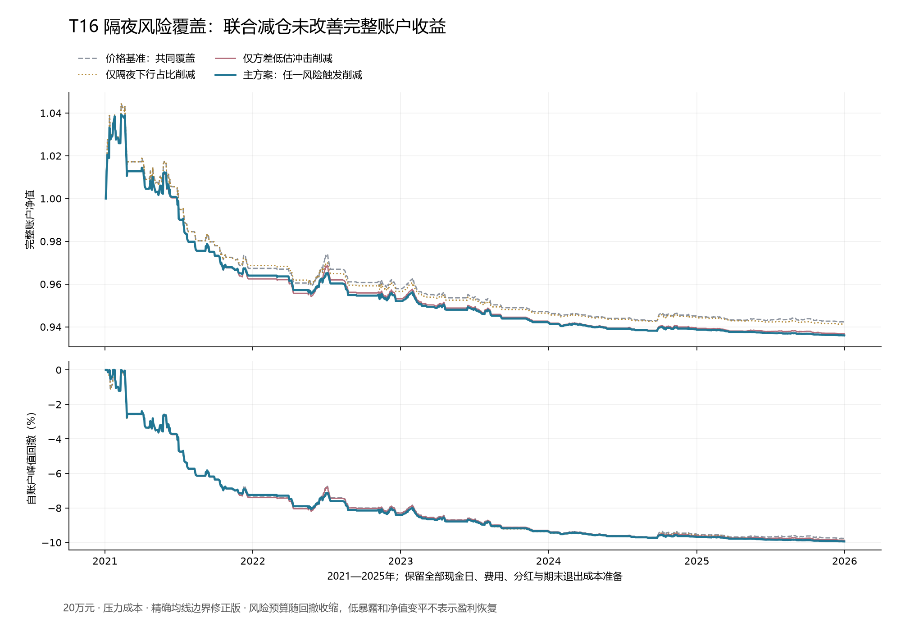

# T16隔夜风险覆盖、精确边界修正与T13版本台账

**只操作510300、完整账户成本后夏普至少1.2的目标仍未实现。** T16主方案在2021—2025年、20万元压力成本下净夏普-0.781987、净年化-1.312%、最大回撤9.939%，期末187,199.37元，累计损益-12,800.63元。固定联合风险层触发35次减半、3次恢复，相对同覆盖价格基准的年化收益差为−0.136581个百分点，95%区间跨零。2万元账户同样失败。本轮也修正了会产生一次错误入场的均线浮点边界，T06重算后仍失败；T13只完成32份候选公告的角色和明确版本关系，未计算策略收益。

本库累计完成7个固定研究问题：5个入场候选T03、T05、T14、T02、T10，以及2个持仓覆盖层T06、T16，合格项0。正式账户情景320个，因实现问题退出准入的历史情景152个，累计实际执行472个。其余11项未完成原定义绩效检验。情景数不能当独立策略数，96个因子也未逐项取得独立收益验证。

## 本轮固定问题和基准解释

T16检验的是同一份既有510300持仓在隔夜下行风险占比或方差低估冲击偏高时减半，两个变量同时回落后恢复。D06采用最近60日隔夜负收益平方占两时段平方收益的比例；P02采用当天总收益平方除以此前信息形成的预测方差。它们作为风险覆盖层使用，没有新增独立入场。

附件的“已验证基准”在冻结前明确解释为T06同一MA20、最多5个开盘间隔、完整账本可核对的观察基准；该基准没有通过盈利目标，不能称作已验证的盈利策略。因此本轮能否定这一具体基准上的固定覆盖定义，不能声称完成了在合格盈利基准上的部署验证。没有从旧高夏普账户中换入一个基准，也没有组合失败分支来追求目标。

MA20判断采用包含分红的财富口径。原始报价按0.001元网格转为有理数，判断20倍当日相对财富是否严格大于最近20日相对财富之和；相等时不进入。浮点财富仍保留给图表和风险状态，不决定严格边界的入场。

## 规则、时钟与账户

隔夜收益为(开盘价+当日每份分红)/前收盘价−1，日内收益为(收盘价+分红)/(开盘价+分红)−1，两者复合得到持有日总收益。分红在经济归属日形成应收，付款前不当可交易现金。D06另存60日内最差3个隔夜收益的均值供描述，不增设尾部筛选。

P02方差预测先用严格此前60个完整收益平方的均值初始化，随后按0.94乘前次预测加0.06乘前日收益平方更新。当天平方收益不进入当天分母；中断后重新积累完整60日种子。0.94是计算收益前固定的参数，没有按本轮结果优化。

两变量各自用严格此前252日、至少120个有效值计算90分位和70分位。任一变量严格超过其90分位时，下个合法开盘对旧周期的风险限制后原份额减半，向下取整100份；两个变量都严格低于各自70分位连续两日才恢复风险允许的原份额。中间区间保留削减，未知重置恢复计数并保留削减。单变量对照遵循相应单变量的高低阈值；基准退出始终优先。

主版本在当日收盘计算风险变量，下个开盘仅调整已有周期；首次入场由价格基准和共同可知门决定，不用风险层新开仓。额外滞后一日只是预先固定的敏感性对照。两个主期风险变量全程可知，因此PRICE_ALL和PRICE_COMMON在本轮一致。最多5个开盘间隔的期限适用于全部对照；原周期份额上限只能随风险收缩，不因盈利提高。半仓整手取整到零仍保留旧周期及削减状态，直到原基准退出。

账户仅模拟510300.SH与CASH_CNY，20万元为主、2万元作小资金对照。保留100份整手、0.001元价位、T+1、方向涨跌停、现金限制、分红登记/应收/付款、最低佣金和期末压力退出成本准备。[上交所ETF基础交易说明](https://www.sse.com.cn/assortment/fund/etf/question/)提供股票ETF次日卖出、100份及最小价格变动的交易规则依据；本轮所设滑点与历史成本场景仍属研究假设。

BASE每边万2佣金、最低5元、5bp滑点；STRESS每边万4、最低5元、10bp滑点，成交价向不利方向取整。风险沿用前两自然年、已成熟五日标签的相近状态ES95，每天重估，最高50%名义仓位、2.5% ES预算、−10%跳空下5%损失预算、已有回撤剩余空间折半。达到10%回撤后下一合法开盘退出且不重启。历史最大回撤小于10%不代表真实跳空和延迟卖出时可以保证该上限。

## 完整账户结果和增量

下表均为2021—2025年20万元、压力成本，完整保留1,212个交易日；收益与波动按242日年化，现金和无风险利率按零。252日诊断已另存，没有按结果切换口径。

|固定情景|净夏普|净年化|最大回撤|削减/恢复次数|
|---|---:|---:|---:|---:|
|价格基准：全部覆盖|-0.635189|-1.180%|9.771%|0/0|
|价格基准：共同覆盖|-0.635189|-1.180%|9.771%|0/0|
|仅隔夜下行占比削减|-0.660556|-1.202%|9.869%|21/1|
|仅方差低估冲击削减|-0.759111|-1.297%|9.870%|17/2|
|主方案：任一风险触发削减|-0.781987|-1.312%|9.939%|35/3|

同一主方案在本金与费用下的完整比较：

|初始本金（元）|成本|净夏普|净年化|最大回撤|累计损益（元）|
|---:|---|---:|---:|---:|---:|
|200,000|BASE|-0.656565|-1.169%|9.590%|-11,442.34|
|200,000|STRESS|-0.781987|-1.312%|9.939%|-12,800.63|
|20,000|BASE|-0.822629|-1.294%|9.662%|-1,262.90|
|20,000|STRESS|-0.860024|-1.328%|9.634%|-1,295.30|

主期主方案共342次成交、136个已关闭周期，另有期末未关闭持仓，已计提5.50元退出成本准备。佣金2,869.03元、滑点5,976.90元；平均风险暴露3.306%，713天收盘零份额。35次削减和3次恢复的全部决策另存CSV。主期有304个统计日满足任一高风险条件，但不一定存在旧持仓或满足持有期限，不能把这304天当304次交易。

2017—2020年20万元压力主方案净夏普-0.644333、净年化-1.812%、最大回撤7.421%。主期额外延迟一日的20万元压力主方案净夏普-0.808093、净年化-1.296%，也未达标；不把敏感性版本晋升为主方案。

使用冻结20日循环区块、4,000次已保存抽样，逐日配对比较完整账户收益：

|比较|年化算术收益差（百分点）|95%区间（百分点）|
|---|---:|---:|
|主方案减价格基准：共同覆盖|-0.136581|[-0.428539, 0.118002]|
|主方案减仅隔夜下行占比削减|-0.113567|[-0.353834, 0.097493]|
|主方案减仅方差低估冲击削减|-0.015746|[-0.191856, 0.116206]|

三个区间均包含零，未证明固定联合削减层具有稳定正增量。这些区间未做整个历史研究家族的选择偏差校正；风险预算随各臂净值改变，配对差反映整套动态政策，不是保持完全相同份额的局部因果效应。接近回撤限制后，风险预算逐步收缩，净值变平不代表恢复盈利能力。

## 数值边界纠正与历史版本保留

独立复算发现2025年5月29日财富指数恰等于20日均值。原浮点值分别为1.8376028501380928和1.8376028501380925，微小正差导致次日多开一次仓位；原始价格与分红的有理数计算证明严格相等。修正前后全样本只改变这一天的价格多头判断，其余共同特征逐值一致，全部直接输入哈希一致，协议仅增加精确比较说明并更新版本号和时间。经济窗口、90/70分位、0.94、恢复规则、成本与风险未变。

T16最初V1因冻结代码路径检查笔误在生成特征和账户前退出，账户数为0；V1.0.1的56个浮点边界账户已否定并原样保留；当前正式版本为V1.0.2。T06原56个账户也退出正式准入，原报告、原ZIP和冻结文件不覆盖，新增V1.0.1仅修复同一严格比较。修正前后112组配对指标及每个账户交易变化均随包保存。这是实现修正，旧策略失败没有撤回，也没有重新搜索经济参数。

T06修正版主期20万元压力净夏普-0.636625、净年化-1.189%、最大回撤9.807%，亏损11,625.14元；2万元压力净夏普-0.718507。主期仍为7次削减、0次恢复，联合层相对共同价格基准的增量区间跨零，失败结论保持。

账户数清楚分开：原正式264，移出旧T06的56，再纳入修正T06的56和新增T16的56，正式累计320；本轮实际新执行168，累计472；另存152个否定实现情景，包括原T02的40、原T06的56、原T16的56。零账户启动失败和T13来源台账不计收益检验。

## T13公告角色和供给日期版本

上一轮取得固定范围内2,191份PDF、2,190份可检索文本，形成1,177条明确日期数量候选。当前未新增网络采集、收益检验或账户；从已有原文处理32份标题候选，并引用7份相关原始公告。角色分为17份“暂缓授予股份”的本次解禁公告、4份辅助意见、6份发行人更正、3份日期延期、2份补充。标题中的“暂缓授予”不应直接理解为本次解禁日期延期。

原文支持10条明确引用关系，仍未声称全部事件都已去重。海航基础同一批2,249,297,094股的三阶段记录分别指向2020-01-26、2021-01-26，最后变为待承诺事项完成、没有确定新日期。最终未知日期保留为OPEN_ENDED_CONTINGENT_NOT_ZERO_SUPPLY；不能因日期消失，把原潜在供给归零或后填成已知日期。6个按当时可见时间的查询分别保留NO_VIEW、当时计划日或开放式延期，未知不冒充零。

同一公司同一上市日也不保证同一事件：广联达2023-02-08的两份公告分别涉及2020年计划第二期名义233,400股和2021年计划第一期名义88,000股，不能按公司加日期合并；名义解除限售数不能替代实际可上市数量。该反例没有手工回填上轮冻结自动字段。

本轮逐页显示检查了海航延期第1页和两份广联达公告第1页，检查范围和图像另存。保守可用时钟仍是历史研究假设，不证明首次HTTP公开时间；完整本次批次身份、更正冲突、M06全部发行/缴款/上市日历及自由流通市值分母均未齐，T13保持NOT_RUN。T12实际回购用途与自由流通市值门、T04点时权重、T07日频动态体系申赎及T09套息/分红点数门均未因此消失。

## 验证边界、停止条件与后续

T16冻结前19项测试通过；T06精确修正版16项、T13版本台账7项通过，其中精确价格辅助函数的5项测试在T16和T06回执中重复包含，不能简单相加为42项独立测试。独立复核用与生产代码相反方向的有理数递推重算均线比较，分别核对T16和T06各56份账户、61,208行账本和2,990份成熟风险记录。T16另重算时段收益、事前方差、严格历史分位和状态恢复；T06另复算1,330,832条分类交易收益和14,771条官方停牌记录。T13复核覆盖39份原文身份、32角色、10引用、3个日期版本和6个时点查询。

以上属于固定输入到保存结果的算术及逻辑复核，独立前向观察仍为0，外部GPT审阅未进行，未证明历史首版数据在当时已可获得。本轮没有新模型搜索、订单或真实成交，当前市场判断仍为NO_VIEW。交付包结构验证与科学有效性分开，完整冻结与失败记录均保留。

T16这一定义按失败结束，不调整60日、252日、0.94、90/70分位、两日恢复或价格基准，也不把单因子对照晋升为赢家；T06不因精度修正重启参数研究。总目标保持active，后续优先推进可明确区分的T13完整事件身份与M06来源门、T12实际回购披露用途和分母；来源缺口未齐则不计算对应交易特征。T17没有已接受组件，T18仍需成熟校准及重复搜索边界，不拼接历史表现好的局部时段。
