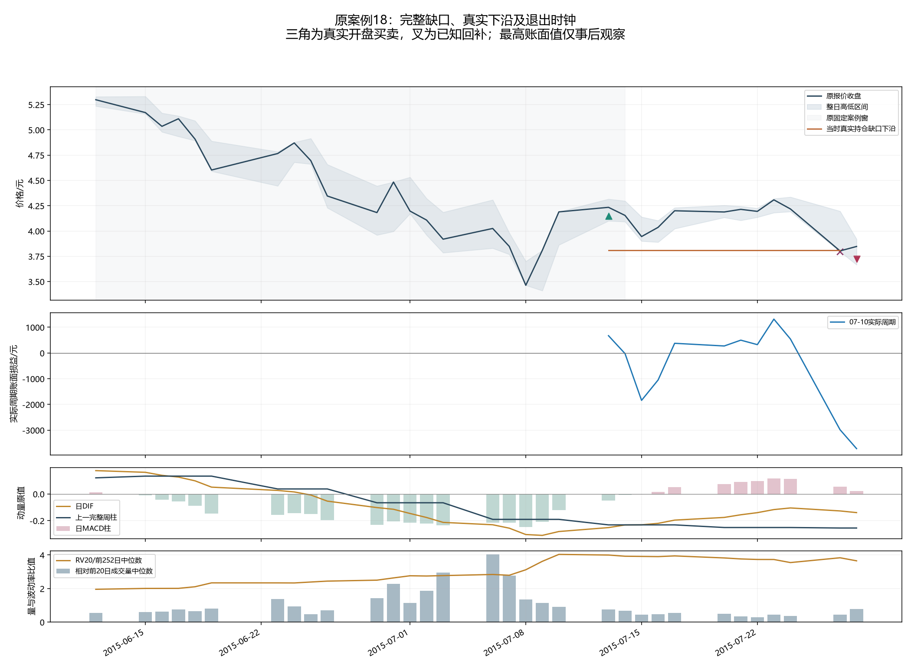
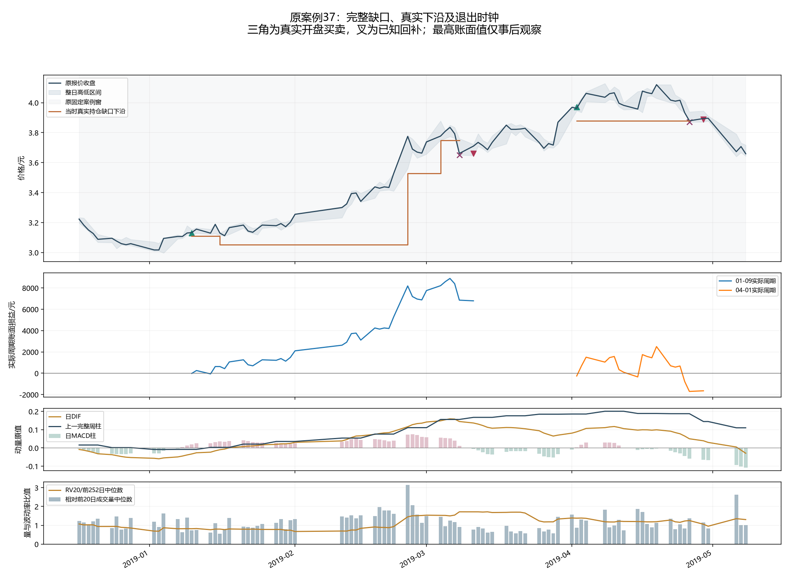
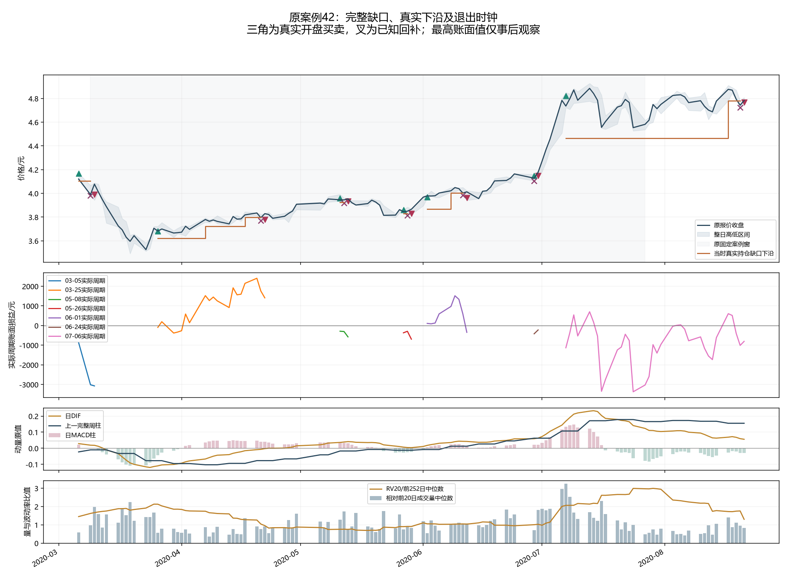
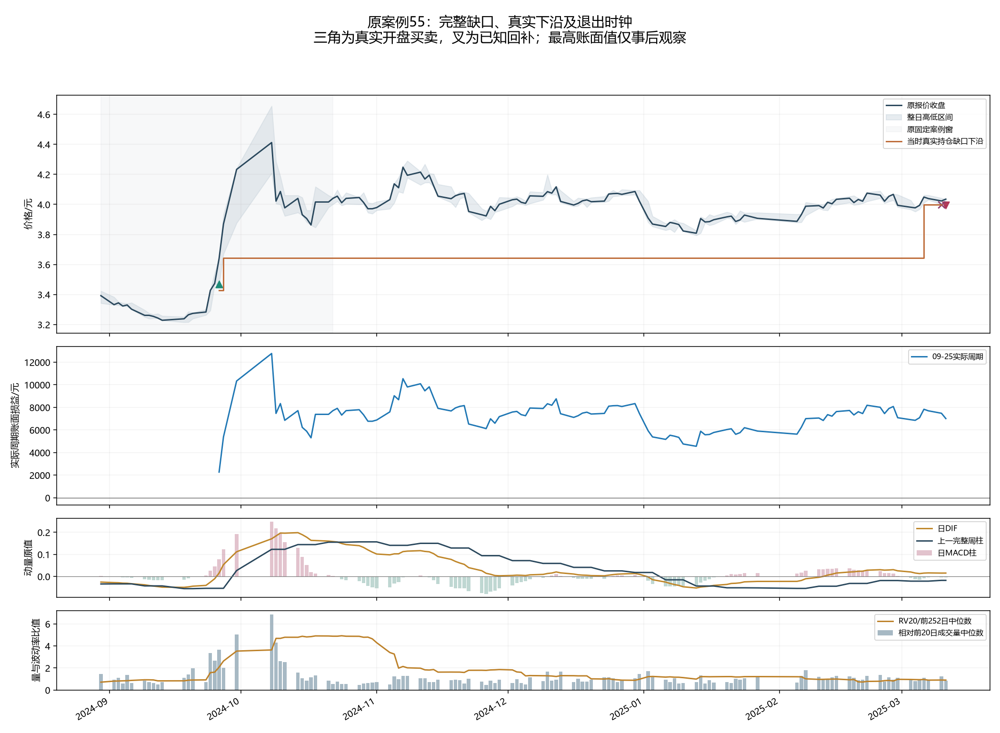

# 全部完整缺口生命周期、真实资金和退出时钟

R178只读取R177四个保存账户，完成97出生、194资格所对应的130实际周期、1560持有决定和128完成退出的真实财富身份；没有新增金融账户、拟合、训练标签或采集。所有失败、已有持仓、取消及2开放周期保持。最高账面损益及原波段位置均为事后解释，不能作为当前交易输入。

## 具体上涨和失败的顺序

2019-01-09缺口在原事后上涨段底后5个交易日出现、距峰66日，时间位置约7.04%；初始下沿3.110元（当时原报价）。1月16日除息后原现金平移下沿换回原价为3.051元，经济下沿没有下降。2月25日和3月4日两个新缺口提高下沿，3月8日日低点回补，3月11日真实开盘卖出。真实持仓最高收盘账面盈利8889.04元，最终净6789.32元。4月1日另一缺口已在原同段底后58日、距峰13日，曾真实收盘盈利2500.42元，最终−1645.50元。时序说明两次信号处于不同位置，底峰位置仍然是事后标签。

2020-03-25缺口在原段底后2日、距峰72日出现，3月26日入场，4月7日/17日抬下沿，4月21日回补、22日退出，最终+1409.67元。6月1日缺口已在同段底后46日，6月8日新缺口将下沿提高，6月11日回补；该原点真实库存账面仍+591.17元，6月12日开盘价差−824.10元、卖出佣金31.82/滑点80.40元，最终−345.16元。回补时收盘仍在下沿上不等于未失效，也不保证下一开盘仍盈利。7月6日缺口在原段底后69日、距峰仅5日，次开追入后最高真实收盘账面仅+701.96元，8月20日才回补抬高后的线，21日出场−804.30元。不能把后来原波段38.54%总涨幅算给各次入点。

2024-09-25完整缺口到达后，09-26入场，09-27新缺口抬下沿；10月8日最高真实收盘账面+12765.11元，之后较长时间没有更高新完整缺口，下沿维持当时3.643元，允许价格回撤但未触线。2025年3月6日新缺口才再次抬高下沿至3.999元，3月10日回补、11日出场，最终+7004.21元。原9月25日日柱已正而DIF/上一周柱负，后续动量、量和波动先扩张再退潮可解释路径，但没有证明可事前识别10月8日就是最高资金日。

2015-07-10缺口实际属于原第19段的底后2日，而第18段06-29/30短反弹没有此信号。它与第18段固定案例窗相交所以仍展示，不混称同一上涨段。真实07-13买入后曾收盘+1316.64元，07-27回补初始线、28日卖出−3718.20元，未出现抬线。当天仍属于高波动修复，不能以出现缺口或曾盈利为稳定点位证明。

## 七个具体周期的真实时钟

| 出生原点 | 入场 | 回补确认 | 实际退出 | 抬线次数 | 最高真实收盘账面/元 | 退出前原点账面/元 | 次开价差/元 | 最终净利润/元 | 最终净收益率 |
|---|---|---|---|---:|---:|---:|---:|---:|---:|
| 2015-07-10 | 2015-07-13 | 2015-07-27 | 2015-07-28 | 0 | 1316.64 | -2983.06 | -688.50 | -3718.20 | -10.28% |
| 2019-01-09 | 2019-01-10 | 2019-03-08 | 2019-03-11 | 2 | 8889.04 | 6853.24 | 0.00 | 6789.32 | 18.51% |
| 2019-04-01 | 2019-04-02 | 2019-04-26 | 2019-04-29 | 0 | 2500.42 | -1704.08 | 153.00 | -1645.50 | -2.35% |
| 2020-03-25 | 2020-03-26 | 2020-04-21 | 2020-04-22 | 2 | 2406.13 | 1758.13 | -259.20 | 1409.67 | 2.25% |
| 2020-06-01 | 2020-06-02 | 2020-06-11 | 2020-06-12 | 1 | 1515.77 | 591.17 | -824.10 | -345.16 | -0.43% |
| 2020-07-06 | 2020-07-07 | 2020-08-20 | 2020-08-21 | 1 | 701.96 | -1009.44 | 288.00 | -804.30 | -1.35% |
| 2024-09-25 | 2024-09-26 | 2025-03-10 | 2025-03-11 | 2 | 12765.11 | 7474.71 | -394.40 | 7004.21 | 14.83% |

最高账面值使用真实逐日剩余份额、已实现卖出净现金、原买入支出和当时已发生股息应收，已经包含当时买入/减仓摩擦。它不是日内最高价成交、初始份额一直不减仓、等额资金或新增退出账户。各周期最高账面出现在不同日期，不能将其拼为策略收益或夏普。

## 全体归因

压力64已完成周期中，18个最后盈利、46个最后亏损。38个曾在真实持有收盘盈利，其中20个最后亏损；另外26个在持有收盘从未盈利，全部最后亏损。早期是8赢家/9曾盈利最终输/12未盈利输，近期10/11/14。BASE对应曾盈利最终输为10/11个，不只挑压力结果；六事后组×四场景共24单元均报告，空组均值未知。这个分组依赖后来实际结果，不能直接做入场/退出过滤。

| 时期 | 费用 | 完成/开放 | 曾收盘盈利最终亏损 | 只有抬高线触及，初始线未触及 | 完成周期有抬线 | 最终次开价差/元 | 最终卖出摩擦/元 | 全部完成净利润/元 |
|---|---|---:|---:|---:|---:|---:|---:|---:|
| 2015_2019 | BASE | 29/1 | 10 | 6 | 7 | -1760.70 | 1324.89 | 758.89 |
| 2015_2019 | STRESS | 29/1 | 9 | 6 | 7 | -1695.10 | 2444.01 | -2006.35 |
| 2020_2026 | BASE | 35/0 | 11 | 13 | 13 | -3355.00 | 1899.08 | 15748.84 |
| 2020_2026 | STRESS | 35/0 | 11 | 13 | 13 | -3219.10 | 3400.12 | 11674.60 |

128完成周期的真实身份逐项核对：最终实际净利润−最终卖出前原点周期账面损益 = 原点剩余份额×(卖出日原开盘−原点收盘)+其后该周期已发生股息应收−最后卖出佣金−滑点。最大逐笔残差小于2e−11元，本次后续股息项均为0；股息资格由原登记日库存还原，未省略或事后回填。

近期STRESS最终开盘价差合计−3219.10元、最终卖出摩擦3400.12元，合计时钟差6619.22元；原A完成净利润57847.49元与缺口账户11674.60元差46172.90元。仅原最后一次卖出的这些项目不能单独说明全部对A差距。这是已有真实数量的财富差额，不是允许在回补当天收盘卖出的账户，不是任意新退出策略的收益上界；换规则会同时改变后续资金、入点和风险，不能据此声称能提高夏普。

全部97出生与原61段底至峰对齐有87匹配、10不在任何原上升段，未知保留。原49正式上涨段不变；未挑最有利波段。位置比例是底至峰的交易日时间比例，不是已捕获涨幅，也不代表当时能知道未来峰。原四图用真实下沿及实际周期资金，图窗扩展到相交周期自身观察末日，原固定案例窗仍标出；11压力周期、所有失败同时展示。

## 裁决与下一步

接受全体已知下沿/回补/库存/现金/股息身份及具体早晚和退出差额解释。排除‘曾盈利就能稳定获利’、‘最高账面可当可成交退出’和‘原最终卖出的价差/摩擦解释全部对A差距’。这不证明任何新退出信号，也不证明量/MACD/RV可以区分赢家。R177固定完整政策拒绝、R173和全部旧终态不变；没有新的收益/夏普提升。

本固定生命周期归因一次完成，不继续将同一结果切分成新过滤或阈值搜索。下一先提出实质不同、当时可观察的信息及完整用途卡，明确对象、可知时钟、与旧字段/旧用途差别、全体失败验证方法；核旧实际结果后才决定准入。真实新独立样本或真实来源/实现错误也是入口。当前无已准入待跑金融候选，不能把事后峰值、分段位置或已知赢家变成模型输入。原A/POINT真实前瞻十二状态和1008实际交易日口径保持。

全部历史DEVELOPMENT_CALIBRATION，first-vintage NOT_CERTIFIED，独立NOT_ESTABLISHED，global DSR/PBO NOT_COMPUTED，去过拟合及提高完整收益夏普目标未达，目标active。最新技术解释R178、实际金融R177/登记R176、预测R158/原退出R145保持，其他分支不改。44冻结来源、0新必要测试/账户/拟合/训练标签/采集；本核对为解释所需的保存账本身份，不宣称新回测或外部评审。

## 文件

- [全部130真实周期及退出身份](results/全部130周期_已知抬线回补及真实资金时钟.csv)
- [全部1560持有原点的抬线与原决定核对](results/全部持有原点_下沿更新回补与原决定精确核对.csv)
- [逐日真实库存、现金流、股息应收与财富](results/全部周期逐日真实库存现金应收及收盘财富.csv)
- [全部97出生与原波段的事后位置](results/全部97出生_原上涨段位置仅事后对齐.csv)
- [六事后组全部24单元](results/全部六组两时期两费用_最高账面与最终结果仅解释.csv)
- [四原案例全部11压力周期](results/四原案例全部相交压力周期_真实时钟与资金.csv)
- [固定归因口径](protocol.json)、[全部结果](summary.json)、[下一信息准入边界](next_information_admission_boundary.json)
- [原R177完整金融结果](../510300_full_daily_gap_study_v1/研究结果与下一步.md)

