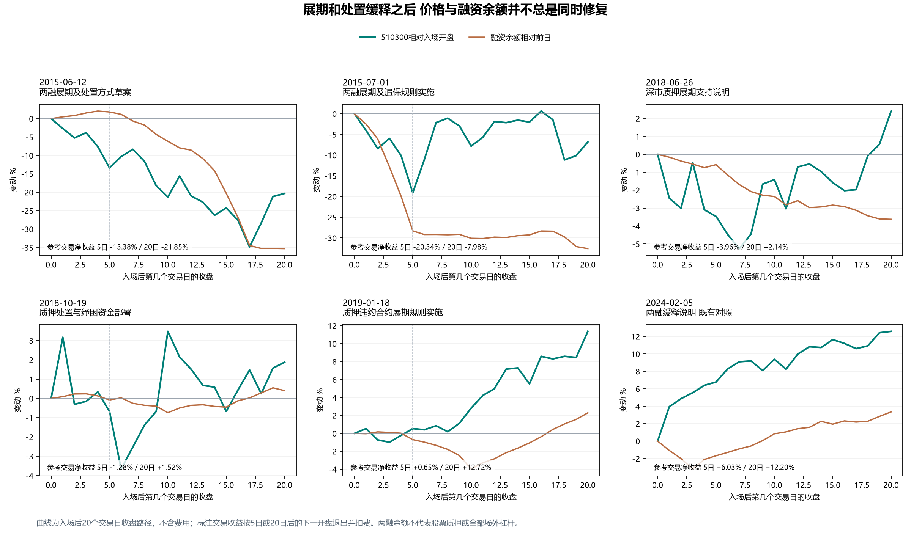

# 历史展期与追保缓释后的价格和融资变化

本轮比较2015年两融规则变化、2018年股票质押纾困及2019年后续规则，检验约束缓释能否形成公开后可成交的修复收益。结论是：支持公告本身不足以形成买入依据；融资买入恢复、净流出缩小也不保证随后五日获利。2024年的成功案例需要进一步解释其条件，不能直接复制为普遍规则。

五个节点按原文和前轮研究问题确定，收益期限统一为5日、20日；保留全部节点和亏损，不选择最好的起点或期限。2015年的草案与实施、2018年至2019年的质押纾困属于两条政策链，五个节点不是五次独立试验。历史行情此前已被研究，这是一轮机制发现，不是独立验证。

**先看实际改变了什么。** 股票下跌使担保资产相对债务减少，账户可能需要追加担保或偿还债务。展期缓解到期压力，延长追保时间缓解处置紧迫性，扩大担保物则改变能够提供何种资产。这些安排可以改变交易约束，但没有自动消除债务、恢复借款人的偿付能力，也没有使所有参与者停止卖出。

2015年6月12日已经公开拟允许展期和优化违约处置，7月1日正式发布。7月1日早于原定7月11日征求意见截止，提前落地仍有信息增量；不能把整个方向当作首次出现，也不能认为实施完全没有新信息。同日6月12日发布会还加强场外配资外部接入监管，因此合法两融的灵活性与场外渠道约束可以同时存在。[草案说明](https://www.csrc.gov.cn/csrc/c100028/c1001933/content.shtml)、[正式发布说明](https://www.csrc.gov.cn/csrc/c100028/c1001916/content.shtml)、[同日发布会](https://www.csrc.gov.cn/csrc/c100029/c1000237/content.shtml)。

已取得的2015年上交所细则原附件，第十八条允许每次不超过6个月的展期，第四十三条仍保留130%最低比例，允许协商追保期限和追加后的比例，并扩大补充担保方式。2019年8月才公布取消130%的统一最低限制，转由券商和客户自主约定。两次制度变化应分开记录。[2015年原附件](https://www.sse.com.cn/aboutus/mediacenter/hotandd/c/10058402/files/741bc6a39a244725be269865a9cef34c.docx)、[2019年规则说明](https://www.csrc.gov.cn/csrc/c100028/c1000931/content.shtml)。

2018年6月深交所的说明针对经营正常但暂时资金困难的融资人，要求继续提供必要展期支持，并披露此前一周深市质押实际日均违约处置约3000万元。10月19日银行业监管要求质权人综合评估后稳妥处置，并允许保险专项产品参与纾困；10月21日交易所部署完善处置及融资工具。它们没有宣布全市场禁止平仓，也不等于资金已经到达股票买方账户。[6月质押说明](https://www.szse.cn/aboutus/trends/news/t20180626_552064.html)、[10月19日答记者问](https://www.sse.com.cn/aboutus/mediacenter/hotandd/c/c_20181019_4658804.shtml)、[10月21日工作部署](https://www.sse.com.cn/aboutus/mediacenter/hotandd/c/c_20181021_4659845.shtml)。

2018年纾困的后续正式规则在2019年1月18日公布：符合条件的违约合约经双方同意，可延长至累计超过3年；新增融资全部用于偿还旧违约合约时，适用部分集中度和质押率等规则豁免。借新还旧首先改变债务期限和债权关系，不能将贷款金额直接计作股票净购买。这个节点按实际公布日期纳入，没有回填到2018年。[正式通知](https://www.sse.com.cn/lawandrules/sselawsrules/trade/specific/repo/c/c_20210128_5312116.shtml)。

**公开后的剩余收益存在明显差异。** 统一在来源日期结束后的下一交易日开盘进入，5个或20个完整交易日后开盘退出。10月19日至21日信息合并，入场为10月22日。参考预算10万元，单边佣金万分之四、最低5元，单边滑点千分之一，按0.001元报价不利取整，100份整手。本轮这些窗口没有登记分红权益。

| 公布信息 | 参考入场 | 5日费用后 | 20日费用后 | 20日持有途中最低收盘回报 |
| --- | --- | ---: | ---: | ---: |
| 2015-06-12 两融展期及处置方式草案 | 2015-06-15 | -13.38% | -21.85% | -34.82% |
| 2015-07-01 两融展期及追保规则实施 | 2015-07-02 | -20.34% | -7.98% | -19.09% |
| 2018-06-26 深市质押展期支持说明 | 2018-06-27 | -3.96% | +2.14% | -5.26% |
| 2018-10-19 质押处置与纾困资金部署 | 2018-10-22 | -1.28% | +1.52% | -3.66% |
| 2019-01-18 质押违约合约展期规则实施 | 2019-01-21 | +0.65% | +12.72% | -0.98% |
| 2024-02-05 两融缓释说明 已有对照 | 2024-02-06 | +6.03% | +12.20% | 未在本轮重算 |

最低收盘回报以入场开盘为起点，不是完整账户最大回撤，也不包括盘中更低价格。价格曲线按每天收盘显示，交易收益按下一开盘退出，所以二者端点可能不同。参考交易按开盘预算换算份额，未模拟预提交订单、开盘盘口和完整风险预算，不是可直接执行的账户方案。

**融资变化进一步否定了几种简单解释。** 下表在每个参考入场日前后各取5个完整交易日，金额为日均亿元。偿还额按融资买入减余额变化反推，包含现金还款、卖券还款、强平及其他统计调整，不能命名为实际卖股金额。后五日是事后观察，不能作为同次入场信息。它也不覆盖股票质押和全部场外杠杆。

| 信息节点 | 日均买入 前 → 后 | 日均反推偿还 前 → 后 | 日均净变化 前 → 后 |
| --- | ---: | ---: | ---: |
| 2015-06-12 | 2229.34 → 1736.15 | 2109.47 → 1655.38 | +119.87 → +80.77 |
| 2015-07-01 | 1629.92 → 1074.34 | 1981.98 → 2223.31 | -352.06 → -1148.97 |
| 2018-06-26 | 236.26 → 253.37 | 275.57 → 263.91 | -39.31 → -10.54 |
| 2018-10-19 | 177.43 → 268.19 | 233.86 → 269.46 | -56.42 → -1.27 |
| 2019-01-18 | 220.84 → 211.95 | 234.90 → 222.17 | -14.06 → -10.22 |
| 2024-02-05 对照 | 467.13 → 655.34 | 681.73 → 702.88 | -214.60 → -47.55 |

2015年6月草案后，首五日融资余额仍净增加403.83亿元，而五日期限参考交易亏损13.38%。余额仍增长与价格下跌可以同时发生，不能等到融资余额收缩后才认定所有压力开始。

2015年7月正式实施后，日均买入较此前五日减少555.58亿元，偿还增加241.33亿元，五日融资余额合计减少5744.85亿元。正式放宽处置并未阻止这一窗口的融资收缩与亏损，不能据此计算政策的独立因果效果。

2018年10月的反例更接近上一轮2024年的表面特征：日均融资买入增加90.75亿元，偿还也增加35.60亿元，净流出明显收窄，但五日参考收益仍为-1.28%。入场前，从10月18日收盘到10月22日开盘，价格已经变化+4.64%；这段不是本次可交易收益，也不能全部归因于其中某项公告。由此不能把“买入恢复且净流出收窄”单独升级成入场条件。

2019年1月正式展期节点的二十日收益为+12.72%，同时首五日融资余额仍减少51.11亿元。持有期间存在其他市场信息，本轮没有把全部上涨归于展期通知，也没有据此改用二十日作为胜出的期限。

**再向上追查质押风险来源，约束不止平仓线。** 2019年1月公布的2018年度报告解释了另一条路径：高比例质押降低股东追加担保能力；减持限制降低债权人在违约后卖出股票变现的能力；如果贷款时给出的质押率未充分反映流动性下降，股价下跌更容易暴露信用缺口。因此，实际卖出少既可能包含风险得到协调，也可能包含资产无法及时处置，不能仅凭卖出少认定偿付风险消失。

报告中的年末低于保障比例的质押市值2990亿元、全年特定控股股东违约申报482亿元、二级市场处置114亿元，统计对象与时间口径不同，不能相减得到被拯救的金额。沪深300中高比例质押的26家仅为成员数量，不是8.7%的指数权重。该报告只用于事后解释，绝不成为2018年信号。[2018年度质押风险分析](https://www.szse.cn/aboutus/trends/news/t20190118_564239.html)。

沪深融资数据复用既有本地数据：沪市官方，深市历史批量源为金十并有既有官方抽样及缺口修复，未声称全序列逐日官方核对。公告依据目前官网保存的历史原文重建，未认证最早网页版本。本轮按固定日期保留309条日线，完成日期覆盖、余额恒等式、源文条款与往返费用核算；没有扩展参数搜索或重新拟合旧失败。

本轮没有证明某项政策的因果收益，也未量化公告相对当时共识的精确预期差。实用结论是：公告应当说明谁的哪项约束被改变；随后还要区分真实承接、价格已经发生的反应和从可成交价格起的收益。单独使用公告或融资改善，当前这些案例不足以支持直接进入完整账户。

下一项历史问题聚焦2018年10月与2024年2月：同样出现买入恢复和净流出收窄，ETF净值与溢价、份额及权重行业承接是否不同，完成观察后还剩多少收益。先检查已有研究再补缺口，不按后来涨跌选择解释，不将事后观察前移。完整账户费用后夏普1.2仍未达到。
