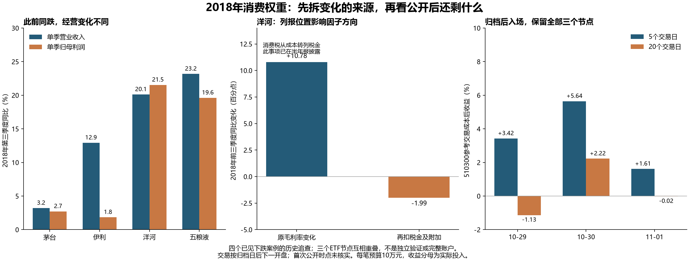

# 历史发现：2018年消费权重同跌，却不能套用同一盈利因子

本轮只做历史原因追查和固定期限的收益计算。四家公司来自上一轮已经知道跌幅的消费权重案例，不能视为事前选出的独立样本。目标仍是20万元完整账户成本后夏普不低于1.2；本轮没有达标账户，也没有改动旧策略。

最有用的新发现是：同样叫‘盈利增长’、‘毛利率’或‘经营现金流’，背后分别可能是高基数、成本费用挤压、税费核算迁移、票据结算和金融子公司的资金往来。先查清哪条机制在变，因子的方向才有经济含义。

## 一、此前同跌，三季报给出的经营变化不同

|公司|10月19至26日已见收益|第三季度营业收入同比|第三季度归母利润同比|
|---|---:|---:|---:|
|五粮液|-8.72%|+23.17%|+19.61%|
|洋河股份|-17.21%|+20.11%|+21.53%|
|贵州茅台|-8.94%|+3.20%|+2.71%|
|伊利股份|-9.01%|+12.92%|+1.83%|

四家公司采用上一轮固定的9月末权重，合计6.995%，对该段指数篮子回报的贡献约−0.685个百分点。该贡献只定位价格变化发生在哪里，没有证明哪份报告造成了下跌。

## 二、往上游追一层，哪些结论可以保留

**茅台：增长放缓、高基数和合并现金口径需要同时看。** 半年收入同比+38.06%、归母利润同比+40.12%；第三季度分别只增+3.20%和+2.71%。但2017年同季收入曾增+115.88%、归母利润曾增+138.41%。高基数解释比较尺度，不能据此否认减速，也不能证明终端消费下降。

将累计表减去半年表，第三季度销售商品收现同比仍增+10.89%，合并经营现金流却下降33.85%；预收款余额较6月末增加12.27亿元。财务公司吸收存款、利息以及银行存放资金影响合并现金流，因此不能用合并现金流增速直接给白酒动销打分。本轮把金融列单独加总并与剩余列相加核回原表；剩余列仍含共同税费等，不能冒称白酒分部现金流。

具体分解为：单季经营现金流同比减少53.65亿元，其中存款、贷款、银行存放及利息相关列合计减少66.23亿元，剩余表内项目合计增加12.57亿元。这里有可复算的金额恒等关系；它解释现金流指标的构成，不证明白酒终端需求一定改善。

**伊利：收入增长没有同幅转成利润。** 第三季度毛利率由37.45%降至35.80%，下降1.65个百分点；销售费用率由22.12%升至24.29%。这是利润转换受压的直接证据。原奶、包装材料、促销竞争或产品组合各占多少，本轮原文还不足以判断；不把合理猜测写成原因已证实。

**洋河：表面毛利率改善，存在税费核算迁移。** 前三季度原毛利率上升10.78个百分点；将税金及附加也扣除后，收入剩余比例反而下降1.99个百分点。公司已在半年报解释，2017年9月由委托加工改为自行生产，消费税从生产成本改列税金及附加；最低计税价格规则也曾改变。将成本与税金合看可以减少列报位置干扰，但不能完全剔除真实税负、品类结构等变化。

更关键的是，这项核算变化早已公开；半年报还预计2018年前三季度归母利润增长20%—30%，实际增长26.10%，处于公司原预告范围内。因此不能把‘利润同比增长降低’直接认定为相对公司预告的负面意外。公司预告不是市场一致预期，本轮没有测得市场预期差。

**五粮液：现金流下降并不等于销售收现下降。** 前三季度销售收现同比+20.41%，经营现金流净额却同比-36.37%，金额减少22.16亿元。税费现金支出增加43.39亿元，采购和职工支出也增加。公司还说明承兑汇票结算增加。结算工具变化和支付节奏必须单独分析，但真实税费支出不能从账户或估值中凭空删去。

## 三、保留信息时点，再看已经实现的剩余收益

四份季报归档日期均晚于前述10月19至26日观察窗。文件落款日期不代表首次公开日期，本轮未核实交易所精确首次发布时间。下面严格执行计算前固定的保守口径：归档日结束后，下一个交易日开盘买入510300，5或20个交易日后开盘卖出。它回答‘按此归档时点取得文件还剩多少’，不能冒充首次公告的全部可交易反应。

|相关报告|归档后参考入场|5日成本后收益|20日成本后收益|
|---|---|---:|---:|
|洋河股份|2018-10-29|+3.42%|-1.13%|
|贵州茅台、五粮液|2018-10-30|+5.64%|+2.22%|
|伊利股份|2018-11-01|+1.61%|-0.02%|

每笔示例预算10万元，佣金单边万四且最低5元、滑点单边0.1%、千分之一元价位向不利方向取整、100份整手；分红按登记日权益计算。收益分母为实际投入，不是20万元全账户。相同入场日的两家公司合并成一个节点，三个节点仍处于同一时期且大量重叠，不能当作三次独立检验，也不计算有误导性的事件夏普。

## 四、这轮改变了什么判断

- 不保留‘食品饮料跌了，所以全行业收入利润都恶化’的统一叙事；四家公司的变化来源不同。
- 不把洋河原始毛利率上升直接解释为竞争力提升；需合看成本与税金，也需识别此前已公开的信息。
- 不把合并现金流下降直接替代终端需求下降；先拆金融子公司、票据与税费支付。
- 预期差先找当时的比较基准。增长低于前一季度不等于低于公司预告，更不等于低于市场一致预期。
- 宏观或政策作用到指数时，要经过权重公司、风险溢价及库存承接等渠道；本轮未估计每个渠道的因果效应，不能用三组正负收益反推筛选条件。

2024年持有人资料沿用已完成研究：季末增持与单日现金买盘不能互换，实际持有人身份及数额公开晚于2月的价格变化；原有披露策略未达标，不重新拟合。

最值得继续的历史问题是：在原始公告时点已知的预告、经营解释与渠道资料中，哪些信息已经消化、哪些确实修正了盈利预期。优先补清2018年伊利成本费用增加的上游原因和茅台量价/渠道结算的可识别部分，不因三次ETF收益临时增加交易规则。

本轮核对53条原表数列，复算分季恒等关系、经营现金流加总和六条交易收益；未运行新的完整账户、参数搜索或前瞻任务。夏普1.2目标仍未实现。

## 原文与可复算资料

- [贵州茅台：maotai_q3](https://static.cninfo.com.cn/finalpage/2018-10-29/1205549057.PDF)；本地原件 `raw/maotai_q3.pdf`。
- [伊利股份：yili_q3](https://static.cninfo.com.cn/finalpage/2018-10-31/1205561719.PDF)；本地原件 `raw/yili_q3.pdf`。
- [洋河股份：yanghe_q3](https://static.cninfo.com.cn/finalpage/2018-10-27/1205543056.PDF)；本地原件 `raw/yanghe_q3.pdf`。
- [五粮液：wuliangye_q3](https://static.cninfo.com.cn/finalpage/2018-10-29/1205545060.PDF)；本地原件 `raw/wuliangye_q3.pdf`。
- [贵州茅台：maotai_h1](https://static.cninfo.com.cn/finalpage/2018-08-02/1205249471.PDF)；本地原件 `raw/maotai_h1.pdf`。
- [贵州茅台：maotai_2017q3](https://static.cninfo.com.cn/finalpage/2017-10-26/1204071279.PDF)；本地原件 `raw/maotai_2017q3.pdf`。
- [洋河股份：yanghe_h1](https://pdf.dfcfw.com/pdf/H2_AN201808291184493630_1.pdf)；本地原件 `raw/yanghe_h1.pdf`。

计算脚本：`research/historical_consumer_earnings_transmission_v1.py analyze`。原表列、物理页码与原值保存在`财报原值及页码.json`；现金分解和限制保存在`经营利润现金与预告分解.json`；各交易的开盘价、股数、费用及退出日保存在`三个归档节点510300剩余收益.json`。

报告是历史机制发现，不是独立收益验证。已见样本、未核实的首次公开时间、缺少同期市场一致预期，以及未识别的终端需求与渠道库存，是结论的实际边界。
