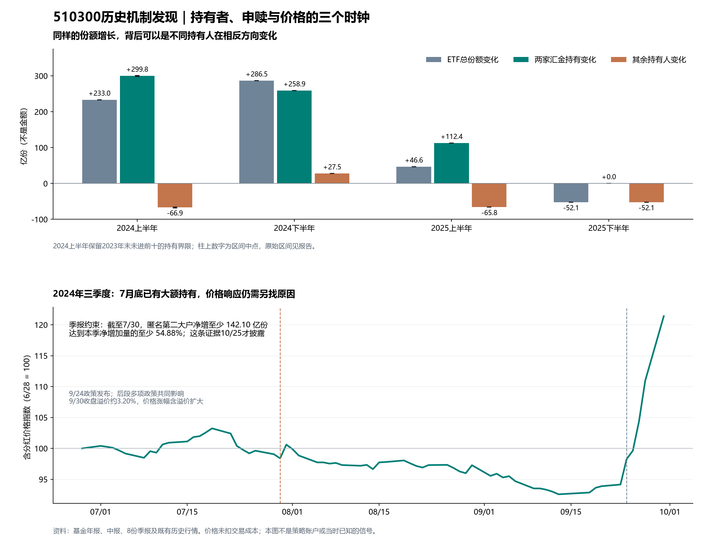

# 510300历史发现：谁在增持、谁在减少持有，以及价格何时响应

本轮按用户要求只做历史检验与发现。新增的是持有结构、季度发生期与价格响应的分解，没有新建前瞻任务，也没有把旧公告策略改参数重跑。

**最有区分力的发现：2024年三季报的第二大匿名机构，7月30日已达到20%持有比例。由当日总份额推得，它相对季初至少净增 142.10 亿份，至少占本季净增加量的 54.88%。大额持有增加早于9月24日政策发布；其后的价格表现不能只用季度末增持量解释。**

用期末数量恒等式分清：ETF总份额变化 = 两家汇金直接实名持有变化 + 其余持有人变化。下表单位均为亿份，不是资金金额。

| 固定日历期 | ETF总份额变化 | 两家汇金持有变化 | 其余持有人变化 | 期末汇金占比 | 同期含分红价格回报 |
| --- | ---: | ---: | ---: | ---: | ---: |
| 2024H1 | +232.96 | +298.28 至 +301.35 | -68.40 至 -65.32 | 59.90% | +1.76% |
| 2024H2 | +286.47 | +258.93 | +27.54 | 69.67% | +15.34% |
| 2025H1 | +46.56 | +112.37 | -65.81 | 78.17% | +1.24% |
| 2025H2 | -52.13 | +0.00 | -52.13 | 82.76% | +19.36% |

2023年末汇金资管不在前十名，旧实名表只支持0至3.07567448亿份的范围，未直接填零。2024年年报匿名大户表给出某行期初为零，与后续实名数量吻合；由于身份仍由数量匹配推断，本表继续使用保守界限。2025年下半年总份额减少而两家持有不变，是既有研究已确认的事实，本轮补充完整四期分解，不把它重复记成新发现。

2025年上半年，总份额增加46.557亿份由两股相反变化合成：两家汇金增加112.37146630亿份，其余持有人减少65.81446630亿份。进一步拆开，其余机构减少35.66480828亿份，个人直接持有减少31.11738814亿份，联接基金增加0.96773012亿份。这里的‘个人’仅指直接登记个人账户；不能推及个人通过其他机构产品的全部权益暴露。

这说明持有结构向特定大户集中，不能据此把当时的总份额上升描述成普遍风险偏好回升。也不能直接断言汇金接走了哪一批卖单：大户在二级市场买入、其他人赎回、大户申购、非交易转移等路线，都可能产生相近的期末数量。

把半年拆到全部八个季度，能看到持有增加发生的阶段。匿名大户表只披露曾达到20%的投资者，2024年前两个季度各一户，其余季度各两户；其余变化按当季已披露集合求剩余，集合并不固定。

| 季度 | 全基金总申购 | 全基金总赎回 | 净份额变化 | 披露大户持有净变化 | 其余持有净变化 | 同期含分红价格回报 |
| --- | ---: | ---: | ---: | ---: | ---: | ---: |
| 2024Q1 | 257.85 | 79.00 | +178.85 | +263.56 | -84.71 | +2.90% |
| 2024Q2 | 101.30 | 47.19 | +54.11 | +30.51 | +23.60 | -1.11% |
| 2024Q3 | 376.46 | 14.63 | +361.83 | +258.93 | +102.89 | +21.39% |
| 2024Q4 | 128.48 | 203.84 | -75.36 | +0.00 | -75.36 | -4.98% |
| 2025Q1 | 69.03 | 112.29 | -43.26 | +3.63 | -46.89 | -0.94% |
| 2025Q2 | 181.58 | 91.76 | +89.82 | +108.74 | -18.92 | +2.20% |
| 2025Q3 | 67.08 | 110.34 | -43.26 | +0.00 | -43.26 | +19.06% |
| 2025Q4 | 91.18 | 100.04 | -8.86 | +0.00 | -8.86 | +0.25% |

2024年三季度第二行期初7.280415亿份、期末266.21328344亿份，分别与当年中报和年报汇金资管实名数量吻合，这是身份推断而非季报明示姓名。2025年二季度机构序号发生交换，本轮按数量衔接，未把序号当作固定账户。二季度新增108.74146830亿份占2025上半年两家净增量约96.77%，但季度表不能把这一数量全部归到4月7日单日公告。

2024年一季度尤其暴露口径问题：全基金总申购为 257.85 亿份，单个机构持有变化表的‘申购’却为 263.55945058 亿份，后者大 5.70945058 亿份。已逐页核对第12、13页；不是把两个表误拼造成。它至少否定‘该持有人栏全部等于同口径一级申购’的读法，不能进一步把差额直接叫作已识别的二级净买入或资金流入。

7月30日约束使用的历史总份额约为746.91亿份，20%约为149.38亿份，再减季初7.280415亿份，得到约142.10亿份净增下界。日份额源有精度差，不把计算余位当精确下界。总份额来自后来回补的数据；匿名比例区间在10月25日季报才公开，不能把这个下界提前当作7月交易信号。

| 固定时间段 | 含分红价格回报 |
| --- | ---: |
| 2024-06-28收盘至2024-07-30收盘 | -1.61% |
| 2024-07-30收盘至2024-09-23收盘 | -4.31% |
| 2024-06-28收盘至2024-09-23收盘 | -5.85% |
| 2024-09-23收盘至2024-09-30收盘 | +28.94% |

后段还需要拆价格与净值：9月23日至30日基金单位净值从3.2821升至4.1017，增长24.97%；收盘溢价从0.027%扩大至3.201%，所以成交价格增长28.94%。价格收益高于净值收益约3.97个百分点，包含溢价变化及乘法交互，不能全部解释成底层股票上涨。本段没有分红，乘法恒等式已对齐；净值复用既有东方财富与新浪双源表。

以上时间段由报告区间和9月24日政策日期确定，没有搜索最佳转折日。它们用于描述先后，不是可交易信号收益。9月24日政策组合及其后9月26日政治局会议共同构成竞争解释，不能将后段涨幅全部归给某个工具或某类买盘。[9月24日国新办发布会原文](https://www.csrc.gov.cn/csrc/c106311/c7508374/content.shtml)。

机制链条应当写成：压力与政策目标影响特定主体的购买；基金总份额只显示申赎净额，持有人之间还有转移；其他持有人可能继续减少持有；价格同时反映卖方约束、政策信息与盈利预期。历史证据支持把这些环节分开，但没有识别‘若没有汇金购买，价格本会是多少’的反事实，也没有查明每个减持者的动机。

已公开的汇金说明将市场稳定作为目标，并列出自有资金、分红、市场融资及央行流动性支持等资金来源。因此存在逆周期购买、与其他持有者意愿相反的机制基础；不能把持有量直接等同于盈利预期上调。[2025年4月8日汇金答记者问](https://www.huijin-inv.cn/huijin-inv/SC20252/2025-04/1002847.shtml)。

交易层仍复用原有公告账户的结果。该研究从2015年初至2026年9月24日保留2852个交易日、20万元完整账户与原风险约束；这些长区间指标只是既有证据，本轮没有要求因子再做十年检验。压力成本下：

| 既有冻结规则 | 净夏普 | 年化收益 | 最大回撤 | 完整周期 |
| --- | ---: | ---: | ---: | ---: |
| 公告触发 | -0.0627 | -0.0587% | -3.54% | 4 |
| 公告后价格确认 | -0.1171 | -0.1066% | -3.15% | 3 |

本轮的实用结论是：大户增持可以是市场压力下的承接行为，持有占比上升也可能来自其余持有人退出；它们与价格立即上涨没有固定对应。使用因子前要问谁改变了持有、是新增购买还是分母变化、变化何时发生、价格之后为何仍走弱或转强。旧公告规则尚无费用后优势，不能靠本次事后分解改名为有效策略。

目标仍未达到：新账户0、参数搜索0、前瞻预测0。本轮只核对分项恒等式及关键原页，不添加无关审计。下一环追查历史卖方的融资约束与被动减仓原因，先查已有证据，避免继续围绕同一个份额因子换表达反复测试。

来源、全部原值及公开日期分别保存在`source_index.json`、`期末实名持有及公开日期.json`、`八份季报匿名大户原列.json`；脚本为`research/historical_huijin_ownership_transmission_v1.py`。所有原报告与既有失败结果保持原样。

| 原报告 | 相关页 |
| --- | --- |
| [2023-12-31](https://www.sse.com.cn/disclosure/fund/announcement/c/new/2024-03-30/510300_20240330_437H.pdf) | 100 |
| [2024-06-30](https://www.sse.com.cn/disclosure/fund/announcement/c/new/2024-08-31/510300_20240831_CHUN.pdf) | 62 |
| [2024-12-31](https://www.sse.com.cn/disclosure/fund/announcement/c/new/2025-03-31/510300_20250331_07Z1.pdf) | 71 |
| [2025-06-30](https://www.sse.com.cn/disclosure/fund/announcement/c/new/2025-08-30/510300_20250830_9SZQ.pdf) | 58 |
| [2025-12-31](https://www.sse.com.cn/disclosure/fund/announcement/c/new/2026-03-31/510300_20260331_W6CZ.pdf) | 75 |
| [2024Q1](https://www.sse.com.cn/disclosure/fund/announcement/c/new/2024-04-22/510300_20240422_FKAE.pdf) | 12, 13 |
| [2024Q2](https://www.sse.com.cn/disclosure/fund/announcement/c/new/2024-07-19/510300_20240719_8IJ3.pdf) | 12, 13 |
| [2024Q3](https://www.sse.com.cn/disclosure/fund/announcement/c/new/2024-10-25/510300_20241025_VBWZ.pdf) | 12, 13 |
| [2024Q4](https://www.sse.com.cn/disclosure/fund/announcement/c/new/2025-01-22/510300_20250122_TVL5.pdf) | 12, 13 |
| [2025Q1](https://www.sse.com.cn/disclosure/fund/announcement/c/new/2025-04-22/510300_20250422_Y2W8.pdf) | 12, 13 |
| [2025Q2](https://www.sse.com.cn/disclosure/fund/announcement/c/new/2025-07-21/510300_20250721_P6RU.pdf) | 12, 13 |
| [2025Q3](https://www.sse.com.cn/disclosure/fund/announcement/c/new/2025-10-28/510300_20251028_LQSR.pdf) | 12, 13 |
| [2025Q4](https://www.sse.com.cn/disclosure/fund/announcement/c/new/2026-01-22/510300_20260122_ZDUH.pdf) | 12, 13 |
