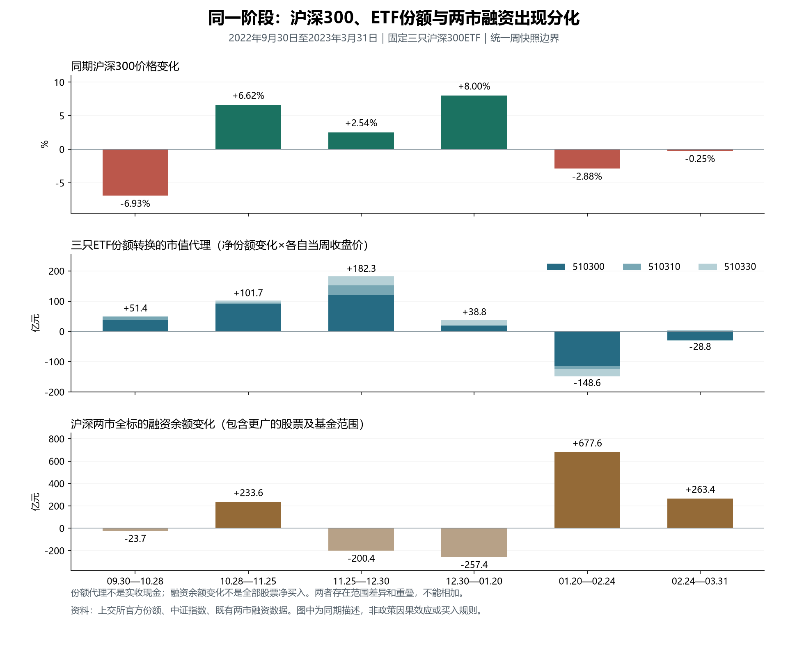

# 历史发现：指数份额转换与融资需求

本轮有新的机制证据，没有形成夏普1.2的交易方案。固定比较2022Q4至2023Q1的六个区间、24个周区间及三个融资制度节点。沪深300整体仍是研究对象；510300和另外两只同指数ETF只是观察需求渠道，其他资产没有交易授权。

**核心发现：融资供给更便利、全市场融资余额增加、沪深300ETF份额增加，分属不同环节，不能合并为一个“流动性利好”信号。**

| 实际区间 | 沪深300同期价格 | 三只ETF份额代理/亿元 | 两市融资余额变化/亿元 | 510300融资余额变化/亿元 | 保守时钟后20日净收益 |
|---|---:|---:|---:|---:|---:|
| 2022-09-30→2022-10-28 | -6.93% | +51.36 | -23.75 | +1.52 | +6.07% |
| 2022-10-28→2022-11-25 | +6.62% | +101.68 | +233.62 | -3.16 | +3.01% |
| 2022-11-25→2022-12-30 | +2.54% | +182.31 | -200.40 | -1.88 | +4.95% |
| 2022-12-30→2023-01-20 | +8.00% | +38.84 | -257.38 | -2.51 | -3.90% |
| 2023-01-20→2023-02-24 | -2.88% | -148.60 | +677.63 | -0.34 | -1.58% |
| 2023-02-24→2023-03-31 | -0.25% | -28.81 | +263.37 | +0.00 | -1.89% |

三只基金为原研究固定的510300、510310、510330，未新增或更换池子，也不代表全部沪深300ETF。份额代理为各周净份额变化乘以该基金当周未复权收盘价，再求和；不是实收现金。月标签实际采用上月末次与本月末次官方周快照之间的区间，因此1月终点是春节前1月20日，不能写成整个自然月。所有资金和同期价格采用同一起止日期。

右列为统计日后第一交易日收盘假定可用、第二交易日开盘进入510300的固定20交易日比较；原始首次发布时间未证明，属于保守日期假设下的历史计算。下一开盘日期及5日结果均保存在明细。成本为双边佣金万4、最低5元、每边千1滑点，按0.001元报价、100份整手和T+1执行，分红按权益日处理。各窗用10万元名义资金算已投入资金净收益，存在重叠，不是20万元连续全账户，不相加、不年化夏普。

2022年12月30日至2023年1月20日，沪深300上涨8.00%，三只ETF份额代理增加38.84亿元，两市融资余额却减少257.38亿元。随后1月20日至2月24日，两市融资余额增加677.63亿元，沪深300下跌2.88%，三只ETF份额代理减少148.60亿元。前一区间说明上涨可以与全市场去融资同时发生；后一区间说明全市场加融资也不必对应沪深300走强。这些是该阶段的事实，尚不能推断交易者动机或因果贡献。

融资余额是存量结果，要先拆到借入和归还。下表把交易天数不同造成的总量差异换成日均值：

| 区间标签（边界同上） | 两市日均融资买入/亿元 | 两市日均隐含偿还/亿元 | 510300融资买入占本ETF成交额 |
|---|---:|---:|---:|
| 2022-10 | 494.86 | 496.45 | 7.56% |
| 2022-11 | 665.30 | 653.62 | 6.41% |
| 2022-12 | 547.92 | 555.94 | 6.37% |
| 2023-01 | 530.38 | 548.76 | 4.81% |
| 2023-02 | 711.35 | 677.47 | 5.15% |
| 2023-03 | 718.55 | 708.02 | 5.27% |

这里“两市隐含偿还”只是融资买入减余额变化所得的代数量。交易所说明偿还包含直接还款、卖券还款、强平以及权益调整，不能把它全部看成主动卖出或被迫抛售。510300融资额属于ETF二级市场交易，既包含于两市两融，也与ETF其他交易环节可能重叠；它们不能累加成“总流入”。510300融资买入占自身成交额约4.8%—7.6%，只能说明可观测的这一种下单方式，不能将剩余成交额判为机构或无杠杆资金。

上游原因中，能核实的是融资供给条件的变化：

- 2022年10月20日，中国证券报当日报道中证金融将转融资费率下调40个基点，并转述其依据资金市场利率调整的说明。这降低的是证券公司的一个筹资渠道报价；没有客户实际融资利率、额度使用和对冲头寸，不能假定投资者融资需求同比例上升。[当日报道](https://www.cs.com.cn/xwzx/hg/202210/t20221020_6303475.html)
- 10月21日，两交易所公告扩围，10月24日实施。沪市主板从800只增至1000只，深市注册制股票以外从800只增至1200只；深市新增400只中，七成以上流通市值低于100亿元。后续融资余额的变化同时可能受融资范围和需求影响，不能单独代表沪深300风险偏好。此次研究没有逐项分离新标的贡献。[上交所](https://www.sse.com.cn/aboutus/mediacenter/hotandd/c/c_20221021_5710381.shtml)、[深交所](https://www.szse.cn/aboutus/trends/news/t20221021_596641.html)
- 2023年2月21日市场化转融资试点上线，改善期限与竞价安排。试点启动、系统上线、证券公司实际借钱、客户买入是四件事；聚合数据无法将它们归并成确定的资金传导金额。[当日报道](https://m.yicai.com/news/101681395.html)

| 制度节点 | 公告后下一开盘 | 5日净收益 | 20日净收益 |
|---|---|---:|---:|
| 2022-10-20 转融资成本调整与市场化试点启动公告 | 2022-10-21 | -4.45% | +0.88% |
| 2022-10-21 两市融资融券标的扩围公告 | 2022-10-24 | -6.04% | +0.71% |
| 2023-02-21 市场化转融资试点上线 | 2023-02-22 | -1.68% | -3.64% |

三个节点按事前选定的融资成本、标的范围、系统上线分类，不是全部政策事件样本。10月两窗高度重叠，同时还有其他宏观和市场信息；不能当作三次独立实验，也不能将窗口收益归因于该政策。三个5日净收益均负，两个10月事件的20日净收益为小幅正，2月上线后的20日为负，说明“约束放松后马上买指数”在这些节点并非确定性。

ETF份额变动还需要往前追一层：谁交付了什么？2022年招募说明书规定，申购对价可以包含组合证券、现金替代和现金差额；深市成分采用退补现金替代，沪市存在实物及不同现金替代安排。交易所还列出了买入股票申购ETF后卖出ETF的套利过程。因此，新增份额可能来自新的风险需求，也可能来自已有股票的转换和套利配套，净份额表不能识别现金与实物的实际占比、最终持有人、对冲，或尚未完成的买单。[基金原说明书副本](https://pdf.dfcfw.com/pdf/H2_AN202206111571368639_1.pdf)、[交易所机制说明](https://etf.sse.com.cn/fund/learning/strategy/c/5704303.shtml)

这不意味着ETF申购没有价格影响，而是本轮数据不足以计量哪类申购、何时产生了多少价格影响。应把“参与渠道变化”与“新增预期差”分开。前三个区间末次快照后的20日净收益为正，后三个为负；1月区间份额代理仍为正，后20日却为-3.90%。此前份额及溢价规则已有冻结失败，本轮不据这六个结果改方向、择时点或拼接参数。

有一处影响解释的数据差额需保留：2022年12月14日，510300融资余额由6,931,055,515元变为6,952,381,844元，融资买入180,510,959元，原报偿还181,026,968元。余额变化与买入减偿还相差21,842,338元。两日上交所原始明细与本地值逐项一致，因此不是本轮导入问题；差额的业务原因仍未识别，不能硬归于直接还款或强平。九个差额日期及原报、隐含值均保留。两市偿还是按余额推算，不宣称取得了独立完整的偿还分类。

本轮只做必要核对：固定三只基金周份额代理与原保存结果逐点一致，24周和6区间没有补行，18个事件窗口通过原成交与分红恒等式。官方份额的历史首次发布时间仍未知；本轮没有重开已关闭的时钟搜寻，也没有新增长周期参数检验。基金说明书本机已保存；深交所公告和第一财经报道由网页工具读到，原生抓取失败分别保留，未把转述升级为官网原件。

接下来的可检验问题是：同一阶段更广市场的融资扩张，是否对应沪深300以外的指数风格变化。它需要指数之间的范围比较。尚未计算出新的完整账户，净夏普、CAGR和独立有效性均未取得新结果，目标继续保持未达成。

可复核文件：`monthly_comparison.csv`、`weekly_comparison.csv`、`daily_participation.parquet`、`event_returns.json`、`margin_source_difference.json`。完整来源如下：

- [sse_margin_definition：现行字段说明，不作为2022年政策事件或历史时钟证明](https://www.sse.com.cn/market/othersdata/margin/sum/)。CONTENT_REVIEWED。
- [sse_expansion：上交所原公告](https://www.sse.com.cn/aboutus/mediacenter/hotandd/c/c_20221021_5710381.shtml)。CONTENT_REVIEWED。
- [szse_expansion：深交所原公告](https://www.szse.cn/aboutus/trends/news/t20221021_596641.html)。WEB_TEXT_REVIEWED_NATIVE_FETCH_FAILED。
- [sse_etf_arbitrage：上交所投资者教育，只证明机制可能性](https://etf.sse.com.cn/fund/learning/strategy/c/5704303.shtml)。CONTENT_REVIEWED。
- [fund_prospectus_2022：华泰柏瑞基金原始说明书，东方财富承载副本](https://pdf.dfcfw.com/pdf/H2_AN202206111571368639_1.pdf)。CONTENT_REVIEWED。
- [csf_rate_cut_relay：中国证券报当日报道，转述中证金融，非官网原件](https://www.cs.com.cn/xwzx/hg/202210/t20221020_6303475.html)。CONTENT_REVIEWED。
- [csf_pilot_relay：第一财经当日报道，转述中证金融，非官网原件](https://m.yicai.com/news/101681395.html)。WEB_TEXT_REVIEWED_NATIVE_FETCH_FAILED。
