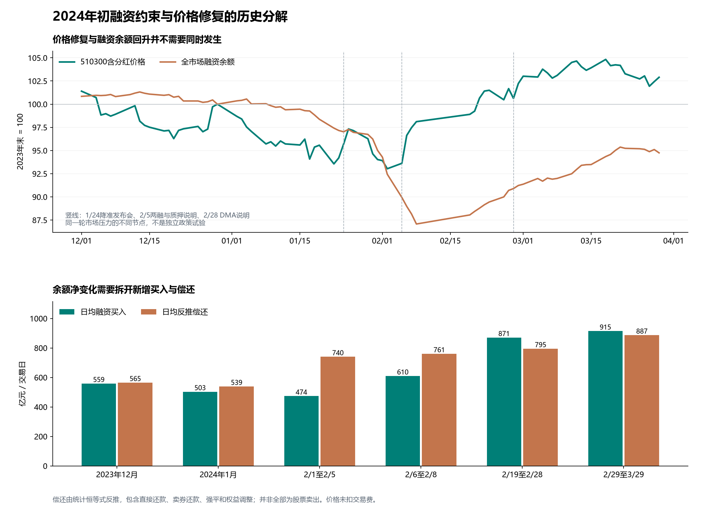

# 2024年初融资约束和卖方行为的历史发现

本轮追查2024年初融资余额下降的构成，以及两融、股票质押和DMA的不同约束。新增发现是：1月净收缩加快主要来自融资买入额下降；2月初偿还额上升成为更大的变化来源；2月6日后净流出缩小来自买入恢复，偿还并没有下降。相同的余额因子，在不同阶段由不同分项主导。尚未形成达到夏普1.2的策略。

样本保留2023年12月至2024年3月的全部日线，并按预先列明的日历月和公告日期分段。政策是在市场压力下发生的，分段对照不是政策效果的随机试验。

**先拆融资余额。** 上交所统计定义为：余额变化等于融资买入减融资偿还；偿还又包含直接还款、卖券还款、强平及权益调整。因此，本轮以余额和买入反推的偿还量不能叫作实际卖股金额。沪市原始官方数据与深市已存批量数据均复用，深市历史批量源是金十并有既有官方抽样核对；没有将它写成全部逐日原始官方凭证。[上交所统计说明](https://www.sse.com.cn/market/othersdata/margin/sum/)。

| 固定历史段 | 交易日 | 日均融资买入 亿元 | 日均反推偿还 亿元 | 日均净变化 亿元 | 期间余额变化 亿元 | 同期含分红价格回报 |
| --- | ---: | ---: | ---: | ---: | ---: | ---: |
| 2023年12月基线 | 21 | 558.85 | 565.24 | -6.40 | -134.30 | -1.77% |
| 2024年1月 | 22 | 503.34 | 539.13 | -35.79 | -787.31 | -5.97% |
| 2月初至缓释说明 | 3 | 473.77 | 740.45 | -266.68 | -800.03 | -0.43% |
| 说明后春节前 | 3 | 609.87 | 760.69 | -150.81 | -452.44 | +4.80% |
| 春节后至DMA说明 | 8 | 870.62 | 795.24 | +75.39 | +603.09 | +2.56% |
| DMA说明后至3月末 | 22 | 914.79 | 887.16 | +27.63 | +607.85 | +2.26% |

2月6日至8日，融资余额继续减少452.44亿元，但510300相对2月5日收盘的含分红价格回报为+4.80%。‘余额转正才算压力缓解’会把融资库存与股票价格强行绑定；这里并未识别谁接走了卖单，价格反弹也不能反过来证明融资卖压已经结束。

与2月1日至5日相比，这三天的日均净流出缩小115.86亿元，来自融资买入增加136.11亿元，减去偿还增加20.24亿元。由此能排除‘净流出缩小必然是偿还活动减弱’的解释；也不能因此认定全部新增承接来自融资账户。

进一步将相邻阶段的日均净变化拆成买入变化减偿还变化，保留每一段，不选择最有利解释：

| 阶段转变 | 日均净变化的变化 亿元 | 买入变化贡献 亿元 | 偿还变化贡献 亿元 |
| --- | ---: | ---: | ---: |
| 2023年12月基线 → 2024年1月 | -29.39 | -55.51 | +26.12 |
| 2024年1月 → 2月初至缓释说明 | -230.89 | -29.57 | -201.32 |
| 2月初至缓释说明 → 说明后春节前 | +115.86 | +136.11 | -20.24 |
| 说明后春节前 → 春节后至DMA说明 | +226.20 | +260.75 | -34.55 |
| 春节后至DMA说明 → DMA说明后至3月末 | -47.76 | +44.16 | -91.92 |

第二、三列相加等于第一列。它们是统计来源，不等于投资者动机：买入降低可能涉及预期、风险预算或融资约束；偿还升高可能涉及现金还款、卖出或其他调整。这些是名义金额，也受价格、整体成交和标的结构影响，不能把买入额下降直接等同于意愿减弱。没有逐户记录时，不填入具体动机的比例。

**再看实际被披露的约束。** 2月5日证监会披露，1月以来两融累计平仓约9亿元、平均维持担保比例226%，并明确主动卖股还款也会使余额下降；随后提出延长追保时间、动态下调平仓线。若落实，首先改变的是部分账户的时间与处置约束，原文没有给出各券商实施清单，也没有保证股票价值或价格。[两融融资业务说明](https://www.csrc.gov.cn/csrc/c100028/c7461992/content.shtml)。

既有余额数据中，2023年末至2月2日融资余额净减少1192.93亿元，至2月5日净减少1587.34亿元。它们与约9亿元实际平仓量级明显不同，不能把净收缩全部命名为强平。净余额和累计流量的口径不同，9亿元的精确统计截止日也未明，本轮没有计算‘强平贡献率’。统计未覆盖所有场外杠杆，也不能据此否定强平前已发生的防御性减仓。

同日股票质押说明公布的违约强平为2740.32万元；106单补充质押公告对应的是预警后的担保补充，不能等同于106次强平。两融与质押数字分开保存，不相加成全市场强制卖出总额。[股票质押说明](https://www.csrc.gov.cn/csrc/c100028/c7461718/content.shtml)。

2月28日DMA说明则确认另一条路径：私募持有股票组合并以股指期货套保，在净值回撤后降杠杆、降规模。春节后日均成交占比约3%，只是成交占比，无法推出剩余库存或未来待卖数量。缩减这种组合可能同时卖股票、买回期货空头，其指数净风险变化还取决于持仓和对冲；原文没有提供这些逐日数据。‘正在降杠杆’也不等于‘降杠杆已经结束’。[DMA业务说明](https://www.csrc.gov.cn/csrc/c100028/c7465086/content.shtml)。

**最后检查信息公开后的剩余收益。** 四个时点均保守在来源日结束后，取下一交易日开盘；分别持有5、20个交易日后开盘退出。参考交易金额10万元，单边佣金万分之四、最低5元，单边滑点千分之一并按0.001元不利方向取整。收益分母为实际买入成本，含期间登记分红权益；这是事件交易参考，未形成完整账户或风险预算。

| 信息时点 | 次日可用开盘 | 5日费用后收益 | 20日费用后收益 |
| --- | --- | ---: | ---: |
| 2024-01-24 降准发布会 | 2024-01-25 | -2.46% | +6.73% |
| 2024-02-05 两融与质押缓释说明 | 2024-02-06 | +6.03% | +12.20% |
| 2024-02-06 融券措施及汇金增持 | 2024-02-07 | +3.81% | +7.22% |
| 2024-02-28 DMA降杠杆说明 | 2024-02-29 | +2.62% | +1.17% |

1月24日用新华社同日现场报道确认日末前已公开，次日政府网保存的央行通知只用于核对政策内容，没有提前把次日转载当时钟。2月5日两份说明合并为一个节点；2月6日融券措施和汇金购买同日发生，不能把后续收益单独归给任一项。[新华社现场报道](https://www.cnfin.com/yw-lb/detail/20240124/4004763_1.html)、[央行通知政府网存档](https://app.www.gov.cn/govdata/gov/202401/25/511522/article.html)、[2月6日融券说明](https://www.csrc.gov.cn/csrc/c100028/c7462169/content.shtml)、[汇金公告](https://www.huijin-inv.cn/huijin-inv/c100077/2024-02/1002262.shtml)。

四个时点处于同一轮市场压力，持有区间有重叠，后面的信息还会进入前面交易的持有期；不计算独立胜率或把收益拼接成账户。5日和20日均保留，不事后挑较好的期限，也没有测得这几次消息相对市场共识的精确预期差。

能够支持的机制是：价格下跌与净值回撤可能触发担保、止损或杠杆约束；投资者可以在正式强平前主动减仓；延长追保或补充购买力量可能改变卖压与承接的相对强弱。这里的‘主动’描述执行方式，不表示完全不受约束。未来是否继续卖出不能由一次余额下降单独确定。

旧融资级联模型、IF强制资金流模型和逐日流动性修复账户保持原状态。IF那一项在事件数量门结束，收益未运行，本轮没有把未运行当成收益失败。新模型0、参数搜索0、完整账户0，夏普1.2仍未达到。

下一项历史检验应围绕同类融资处置约束的改变，寻找其他已发生且有原始公告的案例，并保留政策出现后仍继续下跌的反例。只有从公开后可成交价格形成可重复优势，再检验完整账户。

分项原值、来源日期、四个参考交易及所用旧结果保存在同目录JSON中；图表和本文由研究脚本生成。
