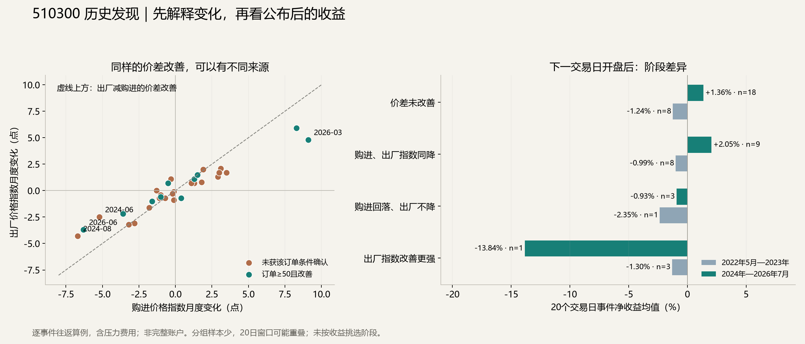

**研究已切换为历史检验与发现。此次计算了51个已结束的月度事件：2024年1月至2026年7月为主段，共31次；2022年5月至2023年12月为相邻阶段，共20次。没有等待未来发布，也没有新增前瞻判断。**

得到的实际发现是：出厂价格指数减购进价格指数的差额改善，有时来自售价扩散走强，有时来自采购扩散更快回落；后者还可能同时伴随需求不足。将这些变化都命名为“利润改善”，会误解因子。即使分清构成，也仍需区分原事件的作用与持有期间新政策、新冲击的作用。

**第一项历史检验：相同价差改善，是否对应相同的收益？**

按原公布日日末才知道数据，取下一实际交易日开盘，分别计算5日与20日后的开盘退出。以下是主段20日结果，全部分组保留：

| 当次相对上次的变化 | 次数 | 平均事件净收益 | 中位数 | 正收益占比 | 去掉最好一次后的均值 |
|---|---:|---:|---:|---:|---:|
| 出厂指数改善更强，购进指数没有回落 | 1 | −13.84% | −13.84% | 0.0% | 无法计算 |
| 购进指数回落，出厂指数不降 | 3 | −0.93% | +0.09% | 66.7% | −1.46% |
| 两个指数都回落，购进回落更快 | 9 | +2.05% | −0.80% | 44.4% | −0.98% |
| 价差没有改善 | 18 | +1.36% | +0.79% | 61.1% | +0.89% |
| 全部月份 | 31 | +0.85% | +0.09% | 54.8% | 约0.00% |

这是历史描述，不能根据最后一组较好就反过来规定“价差越差越买”。每个组覆盖的市场环境不同，稀少组尤其不能据此估计稳定概率。相邻较早阶段中，“两个指数都回落”8次的均值为−0.99%，中位数−1.84%；主段均值转正也未伴随大多数案例盈利。

原设想中，“新订单不低于50且比上月改善”可能区分有需求支持的情况。但在主段的两个价格指数同降组内，满足这一条件的4次，20日平均净收益为−3.06%；其余5次为+6.15%，后者包含2024年9月的大涨。**这批结果没有支持将该订单二值条件直接变成买入规则，也不能据此宣称弱需求必然利多。**

**第二项发现：指数回落，不等于实际成本金额下降。**

PMI分项是扩散指数，记录上涨、持平等回答的比例，不能直接提供价格涨跌幅或企业利润率。[国家统计局编制方法](https://www.stats.gov.cn/zs/tjws/zytjzbqs/cgzlzs/202501/t20250121_1958396.html)

2024年6月，购进指数下降5.2点至51.7，出厂指数下降2.5点至47.9，差额因此改善2.7点；新订单49.5，比上月低0.1点。购进指数仍高于50，出厂指数已低于50。官方当月解读同时提到部分商品价格下降和有效需求不足，相关行业并不一致。因此，差额改善既没有证明采购成本普遍下降，也没有证明售价或销量改善。该月公布后7月1日至7月29日的20日事件净收益为−0.80%。[当月官方解读](https://www.stats.gov.cn/sj/sjjd/202406/t20240630_1955253.html)

2026年6月同样出现差额改善2.6点，新订单51.2且上升1.3点；但购进指数仍为54.2，出厂指数为48.2。随后7月1日至7月29日事件净收益为−7.97%。这一反例保留：量的扩散改善与价格压力可以并存，不能仅凭订单和差额两个读数确认真实利润。该月股市变化的完整上游原因，本轮没有独立识别，不能用已知跌幅倒推。

**第三项发现：最好一次的利润主要发生在后来重大政策公布之后，原始因子不能独占解释。**

2024年8月，购进指数43.2、出厂指数42.0，分别回落6.7与4.3点，差额改善2.4点；新订单48.9且回落0.4点。官方解释涉及需求不足及原油、煤炭、铁矿石等商品价格变化。这更接近需求与价格同时偏弱的背景，不能直接理解成企业利润扩张。[当月官方解读](https://www.stats.gov.cn/xxgk/jd/sjjd2020/202408/t20240831_1956159.html)

该事件9月2日开盘进入、10月9日开盘退出，20个交易日事件净收益为+26.34%，是上表同降组最大的盈利。保持原事件不删、不改，进一步查看其历史路径：

| 历史区间 | 价格路径收益，不含费用 |
|---|---:|
| 9月2日开盘3.381元 → 9月23日收盘3.283元 | −2.90% |
| 9月23日收盘3.283元 → 10月9日开盘4.285元 | +30.52% |
| 整段持有 | +26.74% |

9月24日公布的金融支持安排包含降准降息、住房金融支持及支持股票市场的新工具，改变的约束与月初PMI价格分项并不相同。[9月24日发布会官方实录](https://www.csrc.gov.cn/csrc/c106311/c7508374/content.shtml)

上表只定位了上涨发生的时间，不识别政策对全部涨幅的因果份额。该笔盈利仍属于原事件真实发生的结果，不能删除；但“价差改善产生了稳定利润修复优势”这一解释无法由它单独证明。若要研究“弱经济提高政策转向可能性”，需要另行比较历史中能观察到政策变化与没有政策变化的案例，并从政策实际公开后的价格衡量收益。

**第四项发现：价差恶化也可能与需求恢复同时发生。**

2026年3月，购进指数上升9.1点，出厂指数上升4.8点，差额恶化4.3点；新订单上升3.0点至51.6。官方资料同时报告复工后的采购需求恢复，以及地缘冲突、能源与运输成本压力。这是需求与成本冲击的混合，不能只用差额方向推断股市方向。该月公布后4月1日至4月30日的20日事件净收益为+6.54%；这同样不能证明成本上涨利多股票。[当月官方解读](https://www.stats.gov.cn/sj/sjjd/202603/t20260331_1962890.html)

**对当前历史研究的用途。**

本轮没有找到可独立使用的“价差改善就买入”规律。找到的是需要保留的条件区别：构成来源、指数所处水平、订单状态，以及持有期间政策和其他驱动是否改变。接下来的历史研究应把政策变化作为独立事件，比较初次公开前后的价格与剩余收益；2024年9月只能作为一个案例，不能单独承担结论。

此项研究包含压力费用：佣金单边万四、最低5元，单边滑点0.1%，按0.001元向不利方向取整，100份整手，独立事件预算10万元，并计入持有登记日形成的现金分红权利。收益分母是该次买入实际支付金额，不是20万元完整账户；没有运行每日仓位、五日ES或账户回撤约束，因此没有计算新账户夏普，也没有宣称达标。

两段历史全部是已被其他研究使用过的数据，保存的当期网页不能证明不可变首版。51个事件中有15对相邻20日窗口重叠，不能视为51个完全独立的试验。去掉最好一次只是集中度描述，原样本及盈利完整保留。以上限制不要求新增前瞻观察；后续仍在历史数据内检验。

完整数据见[全部历史事件](全部历史事件.csv)、[阶段与构成汇总](阶段与构成汇总.csv)、[订单条件交叉汇总](订单条件交叉汇总.csv)。规则见[本轮历史检验设定](protocol.json)，范围变化见[用户指令与研究范围更新](authority_update.json)。
