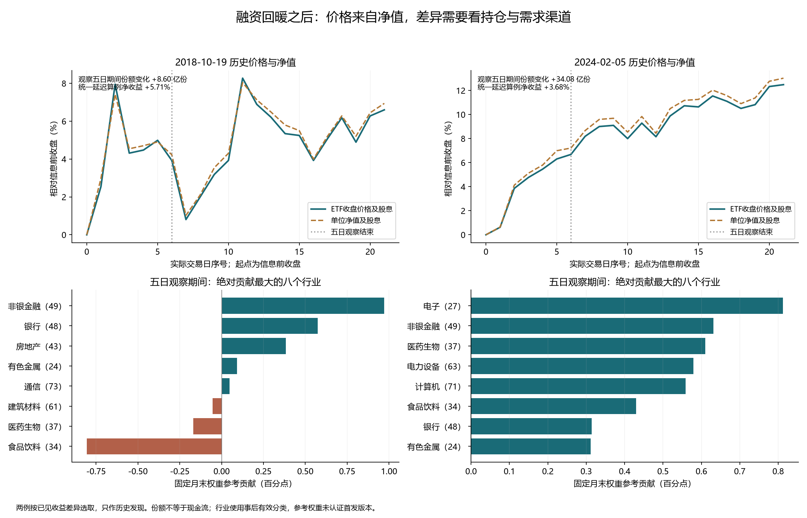

# 历史发现：缓释以后，谁在买、哪些权重仍在跌

本轮只研究已经发生的六个节点。2018年10月与2024年2月都出现融资买入恢复、净偿还收窄，但篮子内部、同步需求事件和入场价格不同。价格与净值分解能定位差异，尚未识别单一政策的因果效应，也未产生完整账户夏普1.2的结果。

2018年10月的金融、地产贡献为正，食品饮料却明显拖累；2024年2月上涨扩散到固定300只中的297只。两个时期都增加ETF份额，且2018年的相对增幅更大，所以不能用“份额增加”单独解释收益差异。2015年7月的份额大增与价格大跌同时出现，构成同一观察集内的反例。

| 同一口径的五日观察 | 2018年10月 | 2024年2月 |
|---|---:|---:|
| 观察区间（收盘至收盘） | 2018-10-19—2018-10-26 | 2024-02-05—2024-02-20 |
| ETF收盘价格变化 | +1.35% | +6.02% |
| 净值变化贡献 | +1.228个百分点 | +6.502个百分点 |
| 价格与净值差额的贡献 | +0.122个百分点 | -0.486个百分点 |
| ETF份额变化 | +8.604亿份 / +8.94% | +34.083亿份 / +6.90% |
| 固定300只中上涨数量 | 219只 | 297只 |
| 个股回报中位数 | +2.71% | +7.82% |
| 非银金融参考贡献 | +0.972个百分点 | +0.632个百分点 |
| 银行参考贡献 | +0.573个百分点 | +0.314个百分点 |
| 食品饮料参考贡献 | -0.805个百分点 | +0.430个百分点 |

净值贡献与价差贡献采用相同的期初ETF价格作分母，二者精确相加等于收盘价格回报。它们是价格恒等式，不能解释为某项政策的因果贡献。两段价格的主要变化来自底层净值，2024年价格相对净值的变化反而抵消约0.486个百分点涨幅，不支持把该段收益说成溢价扩张。

行业贡献用锚日前月末的固定权重计算，2018年为2018-09-28，2024年为2024-01-31；不是基金实际逐日持仓，也不是官方指数归因。两例五日均有完整300只有效回报。2018年后续阶段有4只回报缺失，未补零、未重新放大剩余权重，有效权重约99.183%。

2018年五日最大负贡献个股包括600519、600887、002304及000858。这里已经回答“跌在哪些权重”，但仅凭价格还不能回答“盈利预期为何变化”；后续查公司披露时必须按公布日期解释，不能拿五日观察结束之后的财报回填此前下跌原因。

2024年2月6日还出现独立的需求渠道信息：证监会就汇金增持ETF公告表态支持，并表示推动机构入市。这是两融债务缓释以外的同期竞争解释。[证监会原文](https://www.csrc.gov.cn/csrc/c100028/c7462111/content.shtml)只给出当日日期，本轮不将该文视为2月6日开盘前已知信息，也不把全部510300份额增加认定为汇金购买。

ETF一级市场申购可以交付证券篮子、现金替代及差额，因此份额数量变化不等于新增现金买股；二级市场买入也不必然增加基金份额。[上交所ETF问答](https://www.sse.com.cn/assortment/fund/etf/question/)解释了这些交易与申赎机制。份额上升表示基金份额数量扩大，但不能单独识别买方身份、资金是否新入市或价格冲击方向。

| 既有节点 | 五日收盘价格变化 | 净值贡献（百分点） | 价差贡献（百分点） | 五日份额变化 |
|---|---:|---:|---:|---:|
| 2015-06-12 | -13.12% | -12.597 | -0.521 | +7.05% |
| 2015-07-01 | -17.49% | -13.667 | -3.822 | +131.27% |
| 2018-06-26 | -3.38% | -3.307 | -0.073 | +3.84% |
| 2018-10-19 | +1.35% | +1.228 | +0.122 | +8.94% |
| 2019-01-18 | +0.54% | +0.518 | +0.019 | +0.57% |
| 2024-02-05 | +6.02% | +6.502 | -0.486 | +6.90% |

2015年7月价差变化更明显；但本轮未取得同刻可执行股票篮子报价，收盘净值不能当作盘中可成交价格。这段分解不能升级为折价套利策略。

为什么2018年观察期收盘上涨，原来的五日算例仍亏损？观察起点是10月19日收盘，算例买入是10月22日开盘，买入前跳空已经消耗一部分上涨；第五日后按10月29日开盘卖出，还经历一次隔夜变化。下面将这些时点逐一接起来，避免混用收盘归因和开盘成交收益。

| 节点 | 原入场开盘相对前收盘 | 入场开盘至第五日收盘 | 下一开盘相对第五日收盘 | 原五日费用后参考收益 |
|---|---:|---:|---:|---:|
| 2018-10-19 | +2.04% | -0.68% | -0.28% | -1.28% |
| 2024-02-05 | -0.72% | +6.78% | -0.38% | +6.03% |

为观察“看清五日之后还剩多少”，本轮在计算前固定了一个日历算例：观察原入场日起五个完整交易日，再留一个完整交易日，在第七个交易日开盘买入，仍于原入场索引加20日的开盘退出。所有六个节点统一执行，不根据融资、份额或行业表现挑选。它只衡量等待的机会成本，不是一套已经可用的信号。

| 信息节点 | 原买入日 | 原20日净收益 | 统一延迟买入日 | 固定原退出日 | 延迟后净收益 |
|---|---|---:|---|---|---:|
| 2015-06-12 两融展期及处置方式草案 | 2015-06-15 | -21.85% | 2015-06-24 | 2015-07-14 | -13.31% |
| 2015-07-01 两融展期及追保规则实施 | 2015-07-02 | -7.98% | 2015-07-10 | 2015-07-30 | +0.22% |
| 2018-06-26 深市质押展期支持说明 | 2018-06-27 | +2.14% | 2018-07-05 | 2018-07-25 | +6.89% |
| 2018-10-19 质押处置与纾困资金部署 | 2018-10-22 | +1.52% | 2018-10-30 | 2018-11-19 | +5.71% |
| 2019-01-18 质押违约合约展期规则实施 | 2019-01-21 | +12.72% | 2019-01-29 | 2019-02-25 | +12.50% |
| 2024-02-05 两融及质押缓释说明（既有对照） | 2024-02-06 | +12.20% | 2024-02-22 | 2024-03-13 | +3.68% |

等待不是统一改善：2018年10月延迟算例收益较高，是因为同一日历规则恰好跨过后续下跌后买入；2024年2月等待则错过部分上涨，参考收益由12.20%降至3.68%。2015年6月延迟后仍亏13.31%。不能据此事后选择“2018年晚买、2024年早买”，也不能把六例拼成年化夏普。每例仅按10万元参考预算、0.04%单边佣金且最低5元、0.1%单边滑点、0.001元最小价位和100份整数手测算；20万元完整账户、空仓期、风险预算与重叠事件尚未模拟。

实用上，这组历史把三个层次分开了：债权条款改变影响被迫卖出约束；投资者实际购买渠道影响承接；权重公司的经营与估值变化仍能抵消政策方向。这是下一步解释个股盈利披露与买方行为的依据，而不是“看到纾困或份额上升就买”的结论。

本轮复用了既有价格、净值、份额和成分数据，只做必要核对。原六节点20日净收益得到逐项复现，价格拆分与行业加总恒等式通过。原始份额、NAV的历史首次发布时钟没有因此补齐。行业按官方变更表的生效区间事后映射，2018年有177只、2024年有158只对应记录更新晚于锚日，不充当当时交易输入；2021代码表只用于名称展示，跨版本口径不完全相同。已有折价、份额发布和宽度策略失败结果保持不变。

本轮设置见[protocol.json](protocol.json)，逐事件结果见[六节点分段价格与延迟收益.json](六节点分段价格与延迟收益.json)，行业明细见[固定行业贡献.json](固定行业贡献.json)，全部可复算数据路径见[source_index.json](source_index.json)。没有新增参数拟合、完整策略账户、未来判断或交易授权。目标状态仍为未达到。

