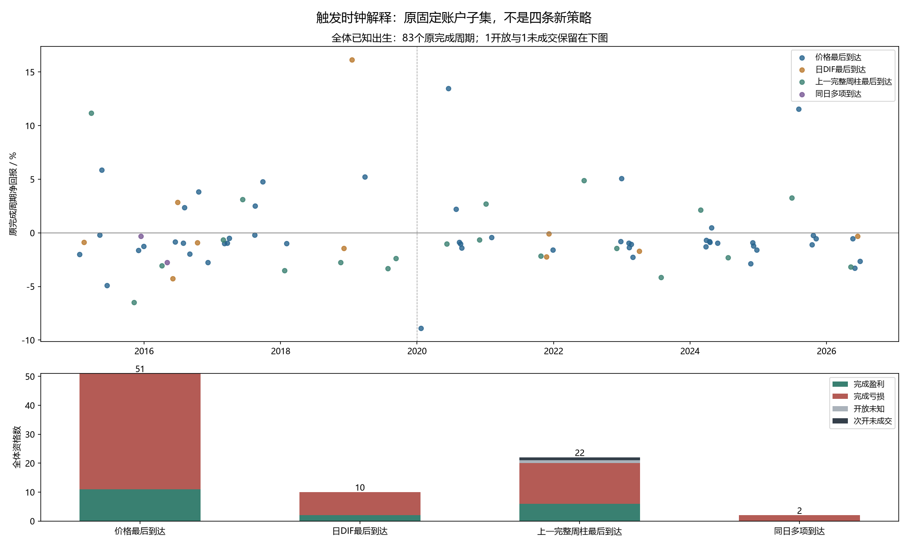

# 全体联合出生的触发时钟：实际结果与资金权重

本轮完成TECH.R166固定解释，**没有接受新策略，也没有提高账户收益或夏普**。目的是判断R165失败是否可归结为某种确认时钟，并检查“点位p×B好”与实际财富是否一致。全部85原资格、84原实际周期（83完成/1开放）、1次开限价未成交，两费用和原三个时期均保留，未将较好分组过滤后重跑。

## 当前和前一已知原点决定分类

只看原点价格从均线下到上、日DIF从非正到正、上一完整周MACD柱从非正到正，哪一项最后使原三条件同时成立。多个条件同日到达则独立归为同日多项；未知不伪造出生，周柱新增必须对应新的完整周来源。3488原点先分类，再连接原账户结果。

原85出生中，价格最后51、日DIF最后10、上一完整周最后22、同日多项2。三测试、三真实前缀及原3488出生标记核对通过，101项来源冻结后仅一次解释。新增账户/拟合/训练标签/行情采集均0。

## 全部压力成本分组结果

|最后到达项|原资格 / 完成|完成盈利数|实际净胜率|实际p×B|等权平均周期净回报|原完成周期合计净损益|
|---|---:|---:|---:|---:|---:|---:|
|价格重新站上均线|51 / 51|11|21.57%|0.746|−0.0581%|−5,872.85元|
|日DIF转正|10 / 10|2|20.00%|1.288|+0.7192%|−1,413.96元|
|上一完整周柱转正|22 / 20|6|30.00%|0.514|−0.4915%|−1,460.23元|
|同日多项|2 / 2|0|0.00%|未定义|−1.5275%|−1,003.00元|

周线组另1开放、1限价未成交，两者不填未来收益；同日多项全部亏损，没有平均盈利可用于B，保留未定义。上表合并两个分别重置20万元的原账户周期用于解释，**不是四条独立策略、合并账户年化或夏普**。实际资金份额、路径和退出均原样，不计算分组重配资本的收益。

日DIF组的较早6笔中2笔盈利，平均+1.9163%、pB1.691；2020—2023三笔全部亏损，平均−1.3341%；2024—2026一笔亏损−0.3041%。两个赢家都在较早期，不能按全体pB>1晋升，也不能选择较早时期。两费用、ALL及三个原时期共32单元已完整保存。

具体案例的时钟不是同一种：2019-01-18为日DIF最后，2020-06-08为周线最后，2020-06-16为价格最后，2024-09-30为周线最后并限价未成交。2015-06-17价格再确认仍迅速失败。原赢家和反例都在图中。

## 为什么p×B超过1却仍亏钱

R166完成后，额外做了**全体已发生资金的代数解释**，不是事前假设、新模型或等额仓位反事实账户。所有四原时期账户及32子集共36单元均报告，未挑日DIF组单独重算。

令Q为原周期含费用买入投入，r为原已完成周期净回报：

**原合计损益 = Σ(Q×r) = ΣQ×平均r + Σ[(Q−平均Q)×(r−平均r)]。**

日DIF组实际投入合计422,162.52元，等权平均回报+0.7192%；两项资金恒等式分别为+3,036.06元和−4,450.02元，合计−1,413.96元。按实际投入金额加权的周期平均回报是**−0.3349%**。这说明有利的等权回报与原资金分配不一致，不能把+3,036.06元称作另一个可执行等额账户的利润。

全体较早37完成周期：等权平均+0.1348%，实际投入加权+0.0139%，完成净损益191.38元；期末账户净352.31元的差额来自保留的开放周期财富，不把它算作完成胜负。近期46完成：等权平均−0.2966%，实际投入加权−0.3920%，完成净损益−9,941.42元。近期信号本身等权就弱，不能只改仓位解释为全部问题。

36个资金恒等式最大误差小于1e-7元。点位pB、投入加权周期回报和全日历账户夏普是不同量，必须同时验，不能互相替代。

## 对下一研究的影响

不接受“只选日DIF最后”或其他时钟作为R165新过滤；固定金融政策保持关闭，最新金融仍R165，原实际预测R158、原退出R145分别保留。

已接续TECH.R167还原全部事前预算来源及真实开盘份额，解释负的资金协方差来自哪些原风险约束；预算本身不修改。旧第41轮波动率/半仓、第50轮波动价格上限、旧自身盈利过滤均有实际失败及禁止细调的记录，已再次核对，不因此重试。

下一不同技术信息提案为“已确认日线高低点连续抬升”，先核对旧完整用途并解释具体上涨/全部失败，未登记金融政策。它不使用R166赢家分组，也不修改当前MACD、费用或预算。详情见[预算归因报告及下一提案](../510300_joint_onset_budget_attribution_v1/研究结果与下一步.md)。

全部历史仍为DEVELOPMENT_CALIBRATION，历史首版未认证；独立验证、去过拟合和提高收益夏普目标尚未成立，全局DSR/PBO未计算。原前瞻登记保持，目标active。

直接证据：[固定协议](protocol.json)、[实际摘要](summary.json)、[全32单元](results/四时钟原实际分组_全部32单元.csv)、[全部资格及原周期](results/全部85资格及原实际周期_触发时钟与A覆盖.csv)、[四例关键时钟](results/四原案例关键出生_事前时钟与真实结果.csv)、[全36资金恒等式](results/原投入金额与周期回报_全部资金恒等式.csv)、[事后资金解释来源与核对](allocation_identity_summary.json)。
