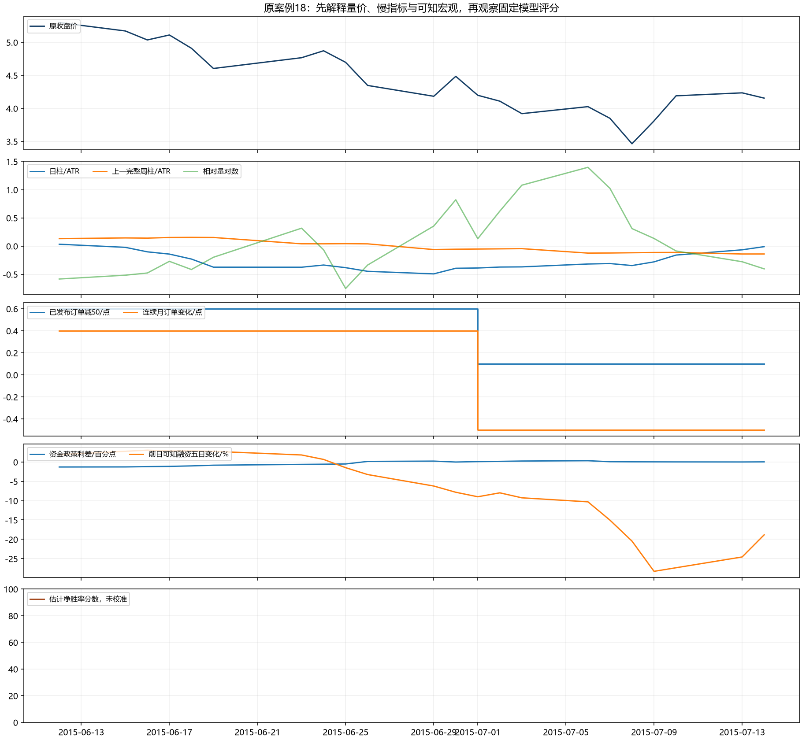
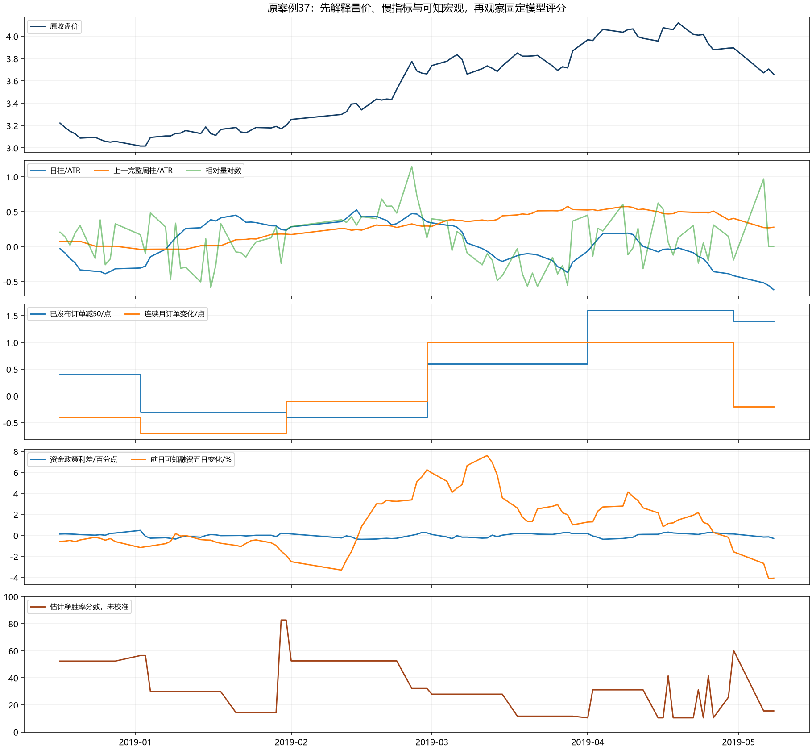
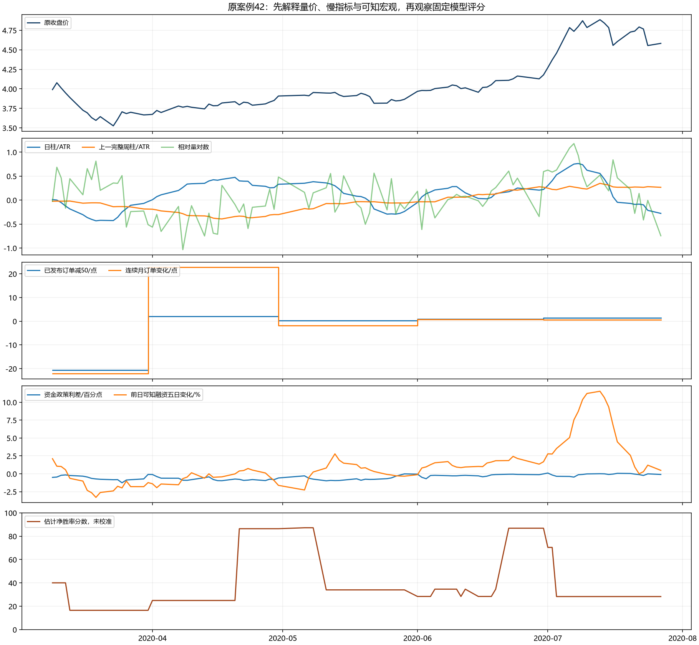
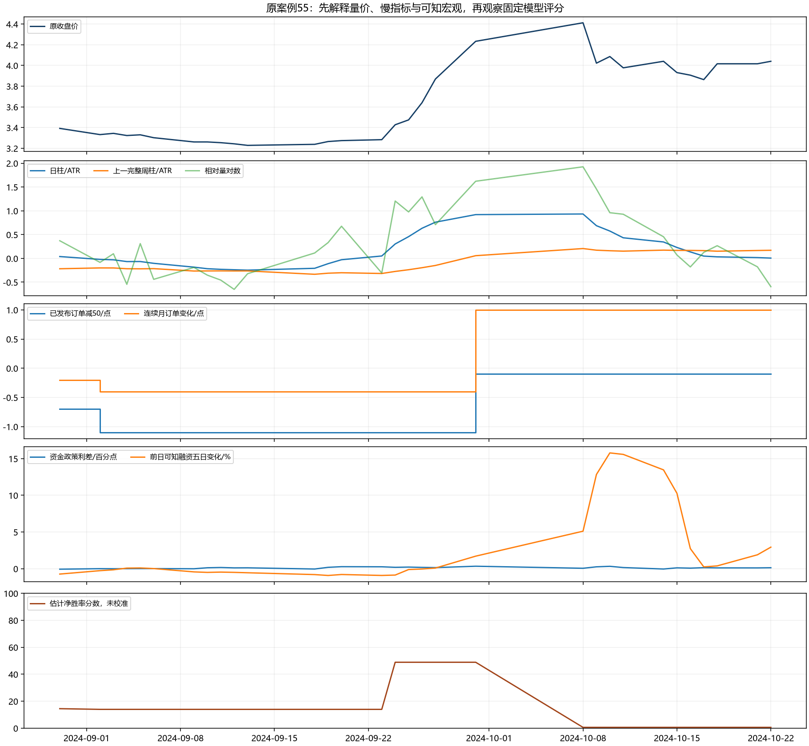

# 多信息源评分：具体上涨、资金源可用性与完整账户结论

TECH.R195—R196完成资金源语义核对；TECH.R197登记唯一金融用途；TECH.R198完成一次完整检验。宏观信息已进入模型并改变判断，但当前联合用途未改善完整账户收益与夏普，拒绝并关闭该配置。原TECH.R192结果和所有冻结策略保持。

## 已实际接入哪些信息

技术八项为日MACD柱/ATR、上一完整周柱/ATR、均线距离/ATR、五日动量、相对量对数、五日上涨成交量占比、实现波动率比对数、K线实体效率。宏观六项为已发布制造业PMI新订单相对50及连续月变化、前日DR007减统计日政策利率及其五日变化、前日可知融资余额五日变化、融资买入五日/六十日活动比。六字段来自三类宏观来源，相邻字段有相关性，不能算六份独立证据。

采用相同成熟训练池的两棵固定浅树比较：八技术，与八技术加六宏观。分数为100×估计净胜率，未证明概率校准；入场须估计pB>1且估计净期望正，再执行原风险与交易约束。计划2ATR/1ATR不等于实际盈亏比。实际完成周期的p、B、pB及标准期望分别核对，不用分数代替实际成绩。

## 源可用、指标支持、模型支持分别判断

旧fund_known还要求旧K05分位数统计成熟，将资金字段可用与旧信号支持混在一起。原账户按旧冻结规则正确执行，本轮改变的是输入合同。在相同3307行缓存中，有128个时点原字段已满足源钟/源龄/有限原值，却旧分位支持不足。修正后联合完整原点2534→2608，新增74个（按年{2015: 70, 2020: 4}）；142个月度训练合同有77个变化，最后在2023年3月。源值、政策统计日配对和五日连续六槽规则均不变。

源字段已经公布、六宏观特征能够计算、共同成熟样本足够拟合、分数通过入场门，是四个不同条件。2015年6月24日资金差实际为−0.5694个百分点，已可观察；仍无模型支持，不能把来源已知写成可以买入。R196原status文字与保存的数值相冲突，已另存文字更正，保留原件及哈希；77变化合同不是0变化。

## 四个原案例：先解释同钟现象，再看事前点位

2015年6月反弹：24日相对量0.935，日柱仍负，上一完整周柱正；当时新订单50.6、月差+0.4点，资金差−0.5694个百分点，融资五日变化+0.666%。随后融资变化到30日约−7.829%、日柱仍负。资金宽松和订单略扩张不能单独抵消价格与融资恶化；本例无模型观点，不给事后涨跌加分。

2019年1月：8日日MACD柱先正，14日上一完整周柱已正，18日DIF转正；8日最新订单49.7、月差−0.7点，资金差−0.2692个百分点、融资五日约−0.558%。量价修复与偏弱慢宏观同时存在。联合模型8日估计胜率29.79%、pB0.2895，无入场；模型仍未识别该上涨启动。

2020年修复：4月1日可看到3月订单52.0及月差+22.7点，扩散指数点差不是金额增长率。5月28/29日订单50.2、月差−1.8点；日DIF虽正而日柱/上一完整周柱仍负，融资五日约−0.318%/−0.337%。两模型这两日预测相同，估计pB约0.3819，均不入场。实际4月22日至5月6日压力净+1.639%，5月7日至25日−2.984%；全部赢亏保留，不用7月峰值倒推退出。

2024年9月：24日相对量3.338、日柱正，而DIF及上一完整周柱负；最新订单仍8月48.9、月差−0.4点，资金差+0.185个百分点、融资五日约−0.871%。价格可以先于慢统计修复，本文不据此证明政策因果。24日技术估计pB0.8269、联合0.6839，均未过原门；联合2024年无新周期。遗漏不能全部归因于新增宏观。原政策公告接入裁决R194仍保持，预告目标、实际资金状态与事前预期不能混写。

## 实际完整账户

20万元完整现金账户，原风险预算、T+1、100份、分红、费用、两时期及配对控制均不变；2026未知输入和空仓日仍计入账户日历。BASE和STRESS全部12账户在CSV，下面显示压力费用。年均完成次数使用完整自然年，2015—2019为5年、2020—2025为6年，未完成2026不用于年均次数。

|    period | cost   | policy           |   net_cagr |   net_sharpe |   max_drawdown |   completed_cycles |   win_rate |     payoff |   p_times_b |   standard_expectancy_loss_units |   ending_equity |   average_full_year_cycles |
|----------:|:-------|:-----------------|-----------:|-------------:|---------------:|-------------------:|-----------:|-----------:|------------:|---------------------------------:|----------------:|---------------------------:|
| 2015_2019 | STRESS | A_SAVED_WEIGHT   |   0.018371 |     0.438043 |       0.067462 |                 22 |   0.500000 |   1.221874 |    0.610937 |                         0.110937 |   218410.684280 |                   4.400000 |
| 2015_2019 | STRESS | TECH_COMMON_TREE |   0.006376 |     1.030754 |       0.003745 |                  3 |   1.000000 | nan        |  nan        |                       nan        |   206244.712600 |                   0.600000 |
| 2015_2019 | STRESS | MACRO_TECH_TREE  |   0.004132 |     0.790400 |       0.004307 |                  2 |   1.000000 | nan        |  nan        |                       nan        |   204029.371680 |                   0.400000 |
| 2020_2026 | STRESS | A_SAVED_WEIGHT   |   0.039908 |     1.216910 |       0.027486 |                 32 |   0.625000 |   1.716643 |    1.072902 |                         0.697902 |   257847.492960 |                   4.166667 |
| 2020_2026 | STRESS | TECH_COMMON_TREE |   0.000959 |     0.060630 |       0.054872 |                 13 |   0.538462 |   1.034204 |    0.556879 |                         0.095341 |   201248.207280 |                   2.166667 |
| 2020_2026 | STRESS | MACRO_TECH_TREE  |  -0.007964 |    -0.628975 |       0.075665 |                 17 |   0.235294 |   1.090851 |    0.256671 |                        -0.508035 |   189882.289160 |                   2.833333 |

早期联合两笔全赢，没有亏损样本，B和pB不可估，不能记为无限盈亏比；收益0.4132%低于原A1.8371%。近期联合17完成4胜13负，胜率23.53%、B1.09085、pB0.25667，标准期望−0.50803；净年化−0.79645%、夏普−0.62898、回撤7.5665%。频率2→2.833次/完整年，但仍低于A4.1667。BASE近期同样为负。四经济门0/4、全部配对历史稳定门失败；拒绝此完整用途，不选择较早单项夏普作为成功。

## 为什么次数增加而收益更低

下表是两版全体周期身份比较中的全部新增近期压力周期，不用于筛选下一策略。原点资金字段增加后，训练成员、唯一性权重和类内净收益估计改变；2022年1月及7月的原估计pB跨过固定入场门，五笔新增真实周期均亏损。其余共同周期也因原净值风险预算出现投入数量差异，因此不能只相加新增收益代替完整账户。

| entry_origin        | entry_date          | exit_date_V2        |   net_pnl_V2 |   net_return_V2 |   predicted_p_times_b_V2 | macro_features_on_path_V2   |
|:--------------------|:--------------------|:--------------------|-------------:|----------------:|-------------------------:|:----------------------------|
| 2022-01-10 00:00:00 | 2022-01-11 00:00:00 | 2022-01-14 00:00:00 | -1046.117000 |       -0.020254 |                 1.075907 | financing_net_change5       |
| 2022-01-14 00:00:00 | 2022-01-17 00:00:00 | 2022-01-28 00:00:00 |  -966.822520 |       -0.020744 |                 1.075907 | financing_net_change5       |
| 2022-01-28 00:00:00 | 2022-02-07 00:00:00 | 2022-02-15 00:00:00 |  -825.726280 |       -0.019590 |                 1.075907 | financing_net_change5       |
| 2022-07-13 00:00:00 | 2022-07-14 00:00:00 | 2022-07-26 00:00:00 |  -645.731360 |       -0.020851 |                 1.154992 | pmi_orders_level            |
| 2022-07-26 00:00:00 | 2022-07-27 00:00:00 | 2022-08-01 00:00:00 |  -633.089600 |       -0.022668 |                 1.154992 | pmi_orders_level            |

五笔新增净损益合计-4117.48676元，共同周期实际差合计-70.51256元，与期末净值差-4187.99932元相符。新近期压力期末189882.28916元，旧版194070.28848元。实际毛损益−7088.30元，负收益不能全部归因于费用；不据新增失败提高门槛或改变退出营救。

## 限制与后续方向

当前资金派生缓存和融资资料止2025年末，不等于所有原始资金源都缺2026。原始DR007本地源已到2026年8月14日，是否具有与政策钟一致的完整当时可知合同尚须另核；本次未扩缓存。PMI139月至2026年7月。M1/M2、社融贷款、工业经营、企业调查、基金申赎/折溢价及政策预期各有原合同和旧裁决，不能按涨跌叙事补缺失或把不同频率视为独立票。

下一项具体工作只核对2026原始DR、实际政策利率和融资源覆盖/公布钟，查清未进派生缓存与真实源缺口，0金融拟合；形成可验证的不同完整用途或真正新样本后再登记。当前本配置已关闭，没有待跑金融候选。原E03账户前瞻保持，最早新合格收盘为2026年10月8日15:05。已观察历史属于DEVELOPMENT_CALIBRATION，first-vintage NOT_CERTIFIED，独立NOT_ESTABLISHED，global DSR/PBO NOT_COMPUTED；完整收益夏普目标和去除过拟合未实现。

验证：五项新的源合同测试通过，四原A控制精确复现，八新保存账户和资金库存通过复算；原142月中125个月配对拟合、实际250次拟合，每模型2345可评分日，2007日预测不同且使用宏观路径，原61分段/49上涨及四案例240行保持。四图已实际查看。本报告和表格只解释保存结果，0新拟合/账户/股票标签/采集。

[全部12账户及完整年次数](results/十二账户与统一完整年频率.csv)、[两版所有周期](results/V1与V2全部真实周期身份和净损益比较.csv)、[原17关键日双模型评分](results/原固定17关键日_两模型评分与实际宏观背景.csv)、[全部入场预测变化](results/全部原点两版本预测和入场门变化.csv)、[完整固定结果](summary.json)、[源诊断文字更正](source_diagnostic_status_erratum.json)。
