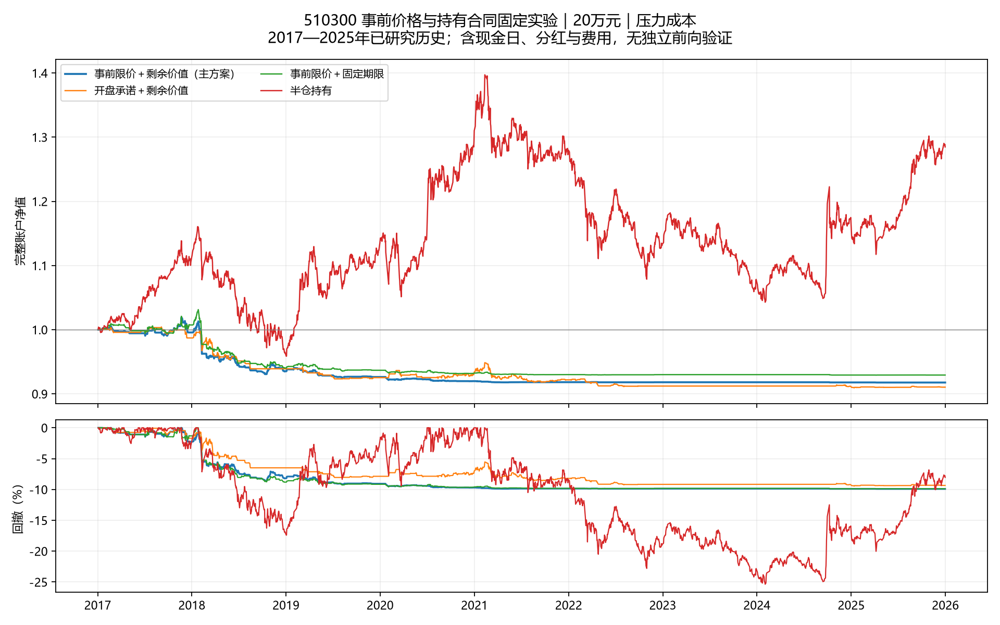

本轮未达到目标；冻结版本停止调参，目标尚未实现。20万元主方案在2017—2025年压力成本下，净夏普-0.710，日历复合年化-0.95%，最大回撤9.92%。完成的是一项价格与持有合同实验，不能把框架落地或实现测试通过称为已有稳定收益能力。

|方案|净夏普|日历年化|最大回撤|入场次数|
|---|---:|---:|---:|---:|
|主方案：事前限价＋剩余价值|-0.710|-0.95%|9.92%|130|
|对照：事前承诺开盘＋剩余价值|-0.637|-1.04%|9.44%|134|
|对照：事前限价＋固定期限|-0.557|-0.81%|9.90%|123|
|半仓买入持有|0.335|2.82%|25.37%|1|
|现金|未定义|0.00%|0.00%|0|

2万元主方案压力净夏普-0.957、日历年化-1.06%、最大回撤9.59%。两个本金、两档费用、三个实验方案和两个基准共20个完整账户情景全部保留，没有选择对照替代主方案，也没有拼接有利年份。

本轮落实了三件事：以已知收盘财富为锚估计未来清算场景；开盘之前确定最高买价与整手份额；已有持仓按原合同剩余期限比较继续持有和立即退出，不重复扣买入费用。开盘发生后，只应用事前限价、现金和T+1成交约束，不重算股数、择时取消低开买单或利用当日最高最低价。

五日标准化压力、二十日趋势及短长波动比沿用既有价格信息，固定126近邻、最近两日历年成熟训练、每天更新。最长标签已到期才训练，最短剩余期和最长原期限使用同一成熟样本池。它们不识别真实被迫卖出或政策传导；R/L只是候选解释，V因缺乏足够估值及催化证据未启用。与旧分布及剩余价值研究的差别在protocol.json中公开，本轮不重置历史试验量。

主方案夏普的20日区块95%区间为[-1.433, 0.054]。相对开盘对照的年化日均收益差为0.08%，配对区间为[-1.09%, 1.17%]。区块区间仍不消除长期反复研究的选择偏差。

主夏普保持242交易日，不接受附件的252日建议作为达标捷径；252换算和20阶HAC敏感性另列。CAGR用真实日历跨度，同时保存旧242日口径。现金收益与无风险基准均为0。原始价格成交，100份整手，0.001价位，T+1，方向封板保守不成交；分红资格、应收、到账和末日清算准备分别入账。BASE单边佣金万二、滑点万五；STRESS单边佣金万四、滑点千一，最低佣金均5元。

主方案产生130次入场，成交与未成交在orders.parquet中；压力费用佣金3409.54元，滑点7884.40元，平均收盘仓位2.30%。风险预算是在已知价格上事前约束，跳空和延迟卖出可能突破事后比例，最大回撤不是保证。

原始分红表覆盖核对13次公告来源。预测评价包含2180个成熟日原点，五日期末正收益概率Brier分数0.2553；这不是126个独立案例，也不是实际退出盈利概率。完整账户收益负责最后裁决。

后续按结果执行：本版本不改近邻数、窗口、方向、限价缓冲或退出期限。若未通过，保留失败，停止从同一历史上救援本版本；若历史通过，也必须另行积累冻结后新数据。当前独立前向样本0，外部审阅未进行，当前市场观点NO_VIEW，无交易授权，没有恢复计划采集，也未制作交付ZIP。

本轮只核对直接影响结论的来源、时间顺序、成交和账户恒等式。日线缺少集合竞价容量、排队和逐笔成交，限价触及仅是模拟近似。自由叙事、因果机制、当前市场机会和真实成交均未被验证。

方法参考：[夏普统计误差与序列相关](https://rpc.cfainstitute.org/research/financial-analysts-journal/2002/the-statistics-of-sharpe-ratios)；交易规则参考：[上交所股票ETF的T+1说明](https://www.sse.com.cn/assortment/fund/etf/question/c/c_20240118_5734755.shtml)、[交易单位与价格档位](https://www.sse.com.cn/assortment/fund/etf/question/c/c_20240118_5734754.shtml)。本轮在线读取官方说明，不据此宣称已复核2026年全部规则附件。
