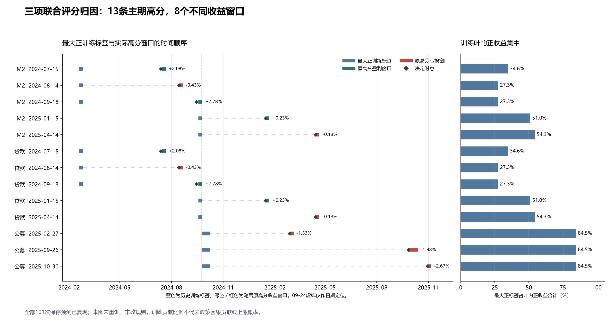

# 三项月度联合评分的共同收益来源归因

完成时间：2026-10-02T02:34:52.628172+08:00。这是已有模型的历史归因，没有新拟合、参数搜索、账户或交易建议。

**核心发现：M2与贷款主期五次高分是同一组价格窗口、相同叶成员和相同预测，实际路径只用融资五日净变化。公募新增了三个窗口，但全部亏损，且高分高度依赖另一条九月大涨训练标签。现有三项评分没有形成三份独立机制证据。**

全部101次评分实际对应61个不同入退出窗口；恢复761条训练叶成员使用记录，对应79个不同历史价格窗口。这些是不同窗口数量，不是独立样本数。原18条高分对应12个窗口；主期13条对应8个窗口。

| 研究 | 主期评分数 | 原高分数 | 高分实际路径 | 与另一研究重合 |
|---|---:|---:|---|---|
| M2 | 20 | 5 | 仅融资五日净变化 | 与贷款五笔完全相同 |
| 贷款 | 20 | 5 | 仅融资五日净变化；不含贷款预期字段 | 与M2五笔完全相同 |
| 公募 | 14 | 3 | 仅开放式混合基金份额月变 | 三个窗口均不与上述五笔重合，全部亏损 |

## 1. 九月经验不能解释所有高分

2024年7月12日、8月13日、9月13日的三次M2/贷款决定发生在九月大涨标签成熟之前，最大正训练标签是2024-02-19→02-26，净收益+2.7005%。它占对应叶内正收益合计约27.30%—34.57%，占带符号收益合计约32.15%—42.73%。

2024-09-18→09-25的+7.7751%标签，在成熟后进入2025年1月和4月高分的训练叶；分别占叶内正收益合计51.00%和54.31%，带符号收益合计56.54%和55.08%。这是真实的后续训练依赖，不能倒说更早的模型已经学过该行情。

公募三个高分最大的正标签是相邻的2024-09-25→10-09，净收益+22.4328%。它占三叶带符号收益合计91.10%、94.18%、99.07%，占正收益合计均为84.47%。两种分母不同，均不代表因果贡献或上涨概率。

## 2. 持有重合与训练重合分别成立

20万元及2万元保存账户中，M2与贷款主期各五个自然周期，五个完全同窗、各25个持有间隔全部重合。20万元账户这些日期的实际份额并不相同，因此不把两个账本利润视为相同，更不相加成组合收益。完整期两线分别7/8个周期，6个同窗，合计9个不同窗口。

主期高分两两关系中，跨研究有5对完全相同、50对分离，没有部分持有重叠。公募的三个实际亏损窗口与M2/贷款高分窗口分离；它与九月行情的联系来自训练。两条九月训练标签首尾相接，持有间隔没有交集，必须保留为相邻窗口。

## 3. 原高分与最大正训练标签

| 研究 | 原入场→退出 | 原净收益 | 最大正训练标签 | 占叶内正收益合计 |
|---|---|---:|---|---:|
| M2 | 2024-07-15→2024-07-22 | +2.08% | 2024-02-19→2024-02-26 | 34.57% |
| M2 | 2024-08-14→2024-08-21 | -0.43% | 2024-02-19→2024-02-26 | 27.30% |
| M2 | 2024-09-18→2024-09-25 | +7.78% | 2024-02-19→2024-02-26 | 27.30% |
| M2 | 2025-01-15→2025-01-22 | +0.23% | 2024-09-18→2024-09-25 | 51.00% |
| M2 | 2025-04-14→2025-04-21 | -0.13% | 2024-09-18→2024-09-25 | 54.31% |
| 公募 | 2025-02-27→2025-03-06 | -1.33% | 2024-09-25→2024-10-09 | 84.47% |
| 公募 | 2025-09-26→2025-10-13 | -1.98% | 2024-09-25→2024-10-09 | 84.47% |
| 公募 | 2025-10-30→2025-11-06 | -2.67% | 2024-09-25→2024-10-09 | 84.47% |

## 4. 接受与拒绝

- 接受：保存预测可重现；M2/贷款主期五笔共用同一训练叶和同一实际收益观察；公募高分在训练贡献上高度集中。
- 拒绝：把三项评分视作三份独立确认；把所有早期高分归于九月训练；把相邻九月标签算成同一价格观察；从本诊断推出新的交易策略。
- 原M2年化/次数不满足、贷款增量拒绝、公募表达拒绝等裁决全部保留；现有账户夏普未重算，完整目标没有完成。

## 5. 下一项问题

现阶段有实质意义的问题是：融资余额收缩为何发生——主动购买减少、偿还需求、供给约束或全市场成交规模变化，在当时能否被独立区分？原买入/偿还金额和事后月度成交分解已检验，不重新命名为新信息。

E2只有在找到原八/十变量没有表达、且历史决定前可得的一项原因字段后，才能冻结。先做小范围来源资格核对；确定连续事件、单位、发布时间和一个删除该字段的同池对照后，才看新分组收益。不以本轮盈利窗口挑样本或字段。没有新信息则不立项，而不是增加树深度或凑模型。

已进一步读取三项旧原因表达：贷款期限构成、住户存贷差额、银行贷款需求之外的审批条件，各12次原账户计算均无目标通过。主压力夏普分别0.299661、-0.362314、0.135432。银行审批已有32季/29公布日来源，不能当作本轮新字段再拟合；这些旧账户没有在本轮重算。证据见[E2旧来源复用核对](E2_旧来源复用核对.json)。

## 6. 本次必要核对

101次叶均值与保存预测最大误差9.89e-17，分数最大误差7.11e-15；训练成熟/已记录源时点检查无违例，原高分数量未变，36个固定输入在分析前后未改变。

这些核对覆盖保存数据与模型，不证明历史首版已经完整、政策因果关系已经识别、独立验证成立或真实成交已经取得。既有来源版本限制仍保留。

文件入口：[协议](protocol.json)、[机器结果](result.json)、[全部预测来源](01_全部101次预测来源.csv)、[全部叶成员](02_全部训练叶成员.csv)、[高分贡献](03_原高分机会与训练贡献.csv)、[高分窗口关系](04_高分持有窗口两两关系.csv)、[保存账户重合](保存账户重合摘要.json)、[必要核对](09_时间顺序及必要复核.json)。
