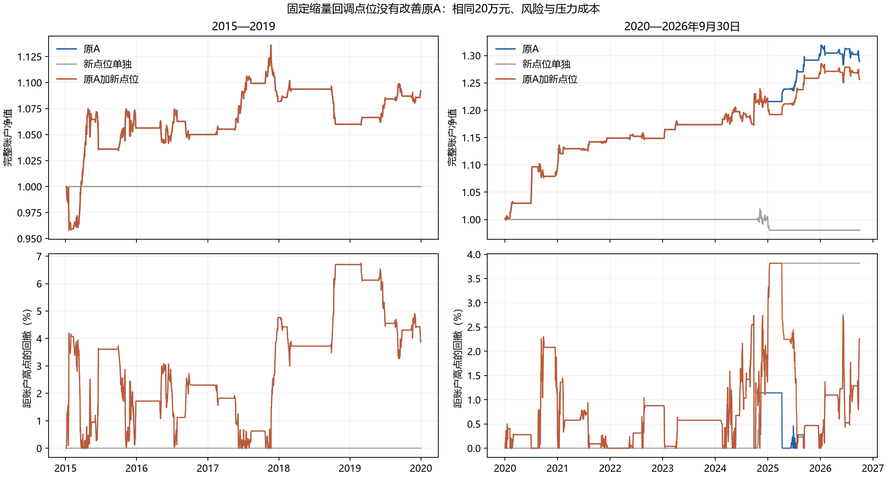
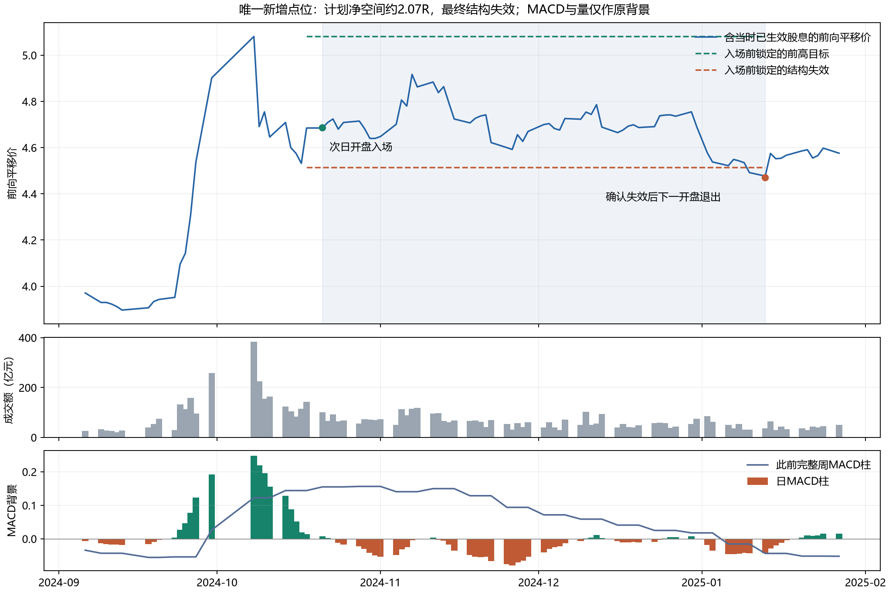

# 完整技术点位实验：缩量回调后转强没有改善收益与夏普

本轮已实际完成一个完整点位假说及8候选账户，结论为固定拒绝。它使近期A账户多完成1笔交易，但降低收益、夏普和实际净pB；早期没有新增交易。没有沿用公告来源或退出预测MSE作为本轮主评价。

## 固定规则与旧研究的区别

沿用原C04已知上涨段与回调阶段，前一日阶段平均成交额低于阶段前5日均额；首次收盘超过前日最高价时只判断一次。回调已知最低价减一刻度为失效，已确认前高收盘为目标，收盘计划与下一开盘实际报价的扣费计划收益风险比均至少2。失效/目标锁定，收盘确认后下一可卖开盘退出。

旧供给测试使用跌破前20日支撑后收复、第二次回测的单日缩量缩幅及合成2R目标；旧力度研究使用2/13平滑力度；旧C04是加入原退出模型的字段函数。本轮研究首次入场事件和完整账户，这些旧合同及失败均保留，不改其参数或补算其失败账户。

统一20万元、原50%上限/ES5/跳空/回撤风险、252日全日历夏普、现金比较率0、T+1和登记/应收/支付，两时期分别启动；两成本都完成。6项必要测试通过，原A四个账户的逐日金额、份额与订单精确复现；新账户资金库存恒等核对通过。

| 原时期 | 压力成本方案 | 净年化 | 净夏普 | 最大回撤 | 完整周期 | 实际净pB | 完整年均次数 |
|---|---|---:|---:|---:|---:|---:|---:|
| 2015_2019 | A_SAVED_WEIGHT | 1.84% | 0.438 | 6.75% | 22 | 0.611 | 4.40 |
| 2015_2019 | PULLBACK_ONLY | 0.00% | 不可估计 | 0.00% | 0 | 不可估计 | 0.00 |
| 2015_2019 | A_PLUS_PULLBACK | 1.84% | 0.438 | 6.75% | 22 | 0.611 | 4.40 |
| 2020_2026 | A_SAVED_WEIGHT | 3.99% | 1.217 | 2.75% | 32 | 1.073 | 4.17 |
| 2020_2026 | PULLBACK_ONLY | -0.30% | -0.256 | 3.82% | 1 | 不可估计 | 0.17 |
| 2020_2026 | A_PLUS_PULLBACK | 3.58% | 1.036 | 3.82% | 33 | 0.927 | 4.33 |

近期基础成本同样恶化：原A净年化4.24%/夏普1.290，组合3.83%/1.107。早期两个费用场景完全相同，无法证明严格改善；单独账户0交易时夏普不可估计，1亏0赢时平均盈利和盈亏比不可估计，不能填0或无穷大。

## 交易为何如此少

早期40个首次转强中，35个剩余原价空间不到2R、4个没有事前缩量，只剩1个结构事件；2018-12-12的原价计划比2.50，扣压力费用约1.74，收盘计划即取消。
近期48个首次转强中，29个空间不足、17个没有事前缩量，只剩2个结构事件。2024-10-18形成入场；2024-11-20事件发生时仍持有上一笔，按原协议忽略，不另计交易、不补仓换身份。

以上转强数只属于可定义的原回调阶段，未知/非阶段日及重复转强分别保留。原全部3488日的结构事件共3个，正式两时期覆盖2855个原交易日；没有删掉失败触发后重选时间点。

## 唯一新增交易的计划与实际

2024-10-18收盘触发，10月21日开盘原价4.017入场；入场时原价失效约3.845、原价目标约4.412，扣费计划比2.072。2025-01-13按结构失效退出，共59个持有交易区间。最终净回报-5.67%，组合内这笔净损益-4,767.87元。

这笔交易中日线/完整周MACD和量价背景可逐日查看，但它们不是本轮新增过滤器。中间曾有浮盈只是事后路径，不能将最高收盘当作可事前选中的退出，也不能看过这一笔后追加保护阈值营救。

近期压力期末少6,609.02元：实际份额毛损益少6,474.60元，费用多134.42元。新增交易净亏4,767.87元，其余原核心交易净损益再少1,841.15元。原A的32笔核心进出日期全部一致，不能把差异归因于被新仓位挤掉原A入场；损失改变了随后可用资本、风险余量和真实份额。

## 不确定性及后续取舍

预先固定20/252日循环区块、各2000次配对净收益/夏普增量区间均已保存。早期增量恒0，近期点值为负且描述区间跨0；区间不能把失败升级为支持，也没有解决历史反复使用或全局多重选择。

本固定规则结束，不改2R、金额基准、确认根数、目标/止损、退出或组合方式营救。它只否定这一完整用途，不能从一笔亏损否定全部缩量回调、MACD或技术分析。后续高盈亏比研究应先证明事前的上涨延续或净优势，不能只用最近前高的几何距离代替概率。下一不同完整技术假说必须与旧失败有实质区别再冻结；当前没有已接纳的新数值候选，不宣称待跑模型已经就绪。

原A/两前瞻登记不变，真实新账户日和完成点位仍0。本轮历史全部DEVELOPMENT_CALIBRATION，独立验证未成立、正式DSR/PBO未计算，去过拟合和完整收益夏普目标未完成。

直接结果：[协议](protocol.json)、[实际裁决与区间](summary.json)、[完整账户比较](results/完整账户共同口径比较.csv)、[全部新增实际点位](results/全部新增实际点位_四账户用途副本非独立样本.csv)、[全部结构事件的实际判定](results/全部结构事件_逐账户实际进入判定.csv)、[账户损益差分解](results/实际账户损益差分解.csv)、[原A精确复现](control_preflight.json)、[六测试回执](tests_receipt.json)。
