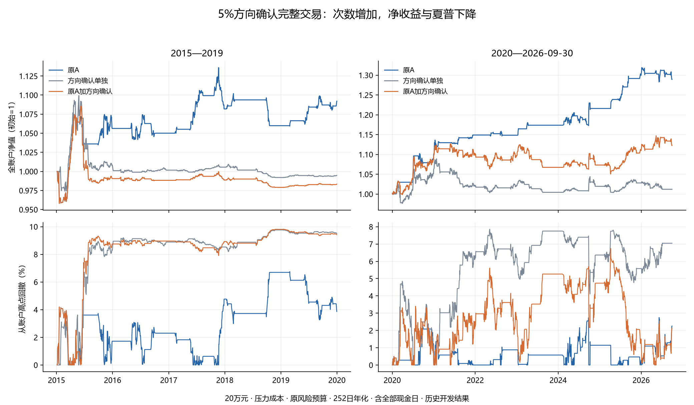

# 5%方向确认：完整账户结果与下一步

本轮真正运行8份新候选账户，固定规则失败。原A四份对照精确一致，6必要测试通过，0收益模型拟合/新训练标签；确认之后的交易次数增加，完整账户收益与夏普下降。

数据3488日，2012-05-28至2026-09-30；原两个时期分别以20万元现金启动，原风险预算、252日、基础/压力成本保持。未将过去低点或高点当作可交易日期。

| 时期 | 成本 | 用途 | 净年化 | 净夏普 | 最大回撤 | 完整周期 | 实际净pB |
|---|---|---|---:|---:|---:|---:|---:|
| 2015_2019 | BASE | 原A | 2.14% | 0.501 | 6.51% | 22 | 0.656 |
| 2015_2019 | BASE | 方向确认单独 | -0.04% | 0.004 | 9.72% | 26 | 0.628 |
| 2015_2019 | BASE | 原A加方向确认 | -0.27% | -0.062 | 9.77% | 37 | 0.498 |
| 2015_2019 | STRESS | 原A | 1.84% | 0.438 | 6.75% | 22 | 0.611 |
| 2015_2019 | STRESS | 方向确认单独 | -0.11% | -0.017 | 9.77% | 26 | 0.665 |
| 2015_2019 | STRESS | 原A加方向确认 | -0.35% | -0.084 | 9.81% | 37 | 0.494 |
| 2020_2026 | BASE | 原A | 4.24% | 1.290 | 2.63% | 32 | 1.178 |
| 2020_2026 | BASE | 方向确认单独 | 0.30% | 0.107 | 7.76% | 22 | 0.848 |
| 2020_2026 | BASE | 原A加方向确认 | 2.08% | 0.511 | 6.53% | 36 | 0.861 |
| 2020_2026 | STRESS | 原A | 3.99% | 1.217 | 2.75% | 32 | 1.073 |
| 2020_2026 | STRESS | 方向确认单独 | 0.18% | 0.073 | 7.85% | 22 | 0.814 |
| 2020_2026 | STRESS | 原A加方向确认 | 1.80% | 0.452 | 6.74% | 36 | 0.803 |

全3488日有61个向上确认，包含正式账户开始前的事件；不能全算新交易。八账户中的组合来源共有32个不同事件身份，费用副本不是独立样本。

| 时期/费用 | 期末权益差 | 新来源含末端持仓净贡献 | 原核心来源净贡献差 | 原核心入场日期未保留数 |
|---|---:|---:|---:|---:|
| 2015_2019/BASE | -24,173.76元 | -12,160.45元 | -12,013.31元 | 6 |
| 2015_2019/STRESS | -21,757.30元 | -12,013.45元 | -9,743.85元 | 6 |
| 2020_2026/BASE | -33,294.22元 | 6,524.72元 | -39,818.93元 | 13 |
| 2020_2026/STRESS | -33,337.71元 | 4,608.56元 | -37,946.27元 | 13 |

净差严格等于实际份额下毛损益差减佣金/滑点差。新来源完整及未完成持仓与核心来源的标记净损益也严格还原全账户。核心入场日期未保留说明合并后的实际路径不同；不能把表中金额冒充被错过交易的同份额反事实利润。

方向确认是一种价格事件时钟。所读[原论文](https://repository.essex.ac.uk/33750/1/s10462-022-10307-0.pdf)的实验为10分钟外汇、多阈值与优化算法，与本次日线510300单规则不同。文献和确认时钟正确均不证明本策略盈利。

固定20/252日配对区块各2000次的四场景区间保存在原summary；经济与稳定性门均失败。当前历史全是开发资料，独立验证NOT_ESTABLISHED、全搜索DSR/PBO NOT_COMPUTED、去过拟合未完成。

原A在当前技术线较早压力1.84%/0.438/净pB0.611、近期3.99%/1.217/1.073继续作为历史开发对照。本固定5%规则关闭，不改3%/7%、追加MACD/量/波动过滤、提前退出、改组合或选年份救回。下一实质不同完整机制尚未登记，新准入待跑0，目标active未完成。

冻结前曾把对照回执status错读成passed，登记失败及随后缺协议调用均在候选运行前结束，候选账户0；修正真实字段后才冻结，一次完成8账户。原失败源码和registration_fix_receipt保留，交易规则未因收益修改。

直接文件：[唯一协议](protocol.json)、[6测试](tests_receipt.json)、[原A精确对照](control_preflight.json)、[实际结果](summary.json)、[完整账户比较](results/完整账户共同口径比较.csv)、[实际资金与库存核对](results/实际账户资金库存核对.csv)、[来源损益差](results/实际账户损益与来源差分解.csv)、[核心入场逐例](results/原核心入场日期逐例对照.csv)。

## 原核心入场差异的当时状态说明

仅解释本轮已保存真实账户，不重新运行或修改规则。下表按原A入场对应的决策原点分类，使用实际前收盘库存，不以未来盈利推断应当成交。

| 时期 | 前收盘新增来源持仓 | 前收盘核心来源持仓 | 前收盘空仓 |
|---|---:|---:|---:|
| 2015_2019 | 6 | 0 | 0 |
| 2020_2026 | 13 | 0 | 0 |

19个原A入场日期未保留的当时，组合均已持有方向确认来源，真实决定继续该来源。这确认了持仓时段重叠；这些日期不是19笔独立样本，也不能把核心来源损益差等同于被错过交易的利润，更不能据此断言修改优先级就能改善收益。新增点位必须同时评估资本、风险余量与持仓重叠。逐例见[当时持仓表](results/原核心不同入场日期的当时持仓.csv)。
