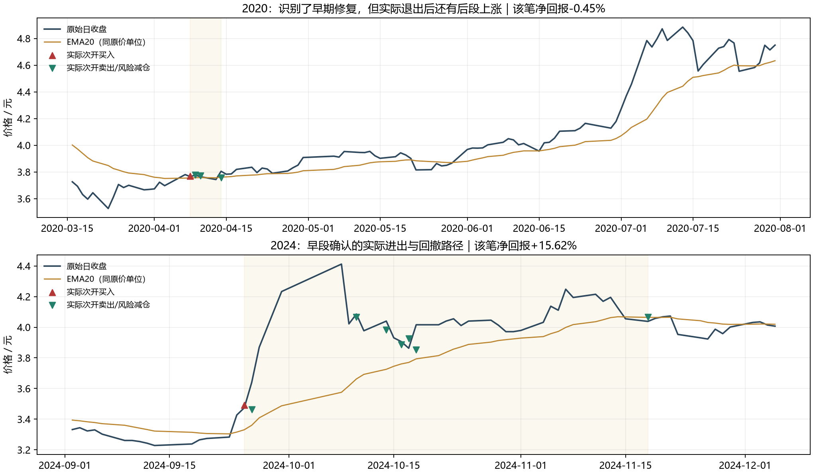

# 从具体上涨反推：量→MACD→价格确认的完整结果

这条固定顺序比单纯价格上穿得到更好的历史点位质量，但交易很少、盈利集中，完整账户没有同时超过原A的收益与夏普。TECH.R161拒绝该固定完整政策替代A，不否定有限顺序解释，也不宣称整个技术分析无效。

## 原假设与可识别时钟

2019/2020/2024案例依次出现当前量方向正段、当前日MACD正段和价格上穿EMA20。事后低点不是规则起点：只用当时已经发生的连续均线下区间，并且量和MACD正段必须由此前真实非正值转入、当前仍未失效。严格要求量先于MACD、MACD先于价格；没有同日/倒序的补救设置。

同一完整交易逻辑：空仓时次真实开盘尝试进场；买后价格收盘重新<=当日EMA20，次合法开盘退出，风险只减仓。不使用固定2R、20日到期、波动或放量筛选。周线仅作此前完整周背景，沿用原130周预热；没有拟合或新训练标签。

## 真实完整账户

各时期初始20万元、510300与现金、252日年化/现金0，原风险上限与T+1/100份/.001刻度/最低佣金5元；两费用全部保留。原A四账户日净值/份额/订单精确一致，八个新政策账户一次运行；频率是软目标。

| 时期 | 费用 | 政策 | 净年化 | 净夏普 | 回撤 | 完成次数 | 实际胜率 | 实际B | 实际pB |
|---|---|---|---:|---:|---:|---:|---:|---:|---:|
| 2015_2019 | BASE | 原A | 2.14% | 0.501 | 6.51% | 22 | 50.00% | 1.312 | 0.656 |
| 2015_2019 | BASE | 当前修复顺序 | 1.23% | 0.589 | 1.82% | 2 | 50.00% | 4.807 | 2.404 |
| 2015_2019 | BASE | 纯价格上穿 | 0.71% | 0.228 | 9.36% | 74 | 25.68% | 3.004 | 0.771 |
| 2015_2019 | STRESS | 原A | 1.84% | 0.438 | 6.75% | 22 | 50.00% | 1.222 | 0.611 |
| 2015_2019 | STRESS | 当前修复顺序 | 1.20% | 0.576 | 1.82% | 2 | 50.00% | 4.582 | 2.291 |
| 2015_2019 | STRESS | 纯价格上穿 | 0.49% | 0.167 | 9.59% | 74 | 25.68% | 2.697 | 0.692 |
| 2020_2026 | BASE | 原A | 4.24% | 1.290 | 2.63% | 32 | 62.50% | 1.885 | 1.178 |
| 2020_2026 | BASE | 当前修复顺序 | 0.73% | 0.264 | 5.09% | 7 | 14.29% | 21.518 | 3.074 |
| 2020_2026 | BASE | 纯价格上穿 | -1.04% | -0.330 | 8.46% | 112 | 19.64% | 3.503 | 0.688 |
| 2020_2026 | STRESS | 原A | 3.99% | 1.217 | 2.75% | 32 | 62.50% | 1.717 | 1.073 |
| 2020_2026 | STRESS | 当前修复顺序 | 0.65% | 0.241 | 5.04% | 7 | 14.29% | 17.591 | 2.513 |
| 2020_2026 | STRESS | 纯价格上穿 | -1.30% | -0.452 | 9.17% | 112 | 18.75% | 3.256 | 0.611 |

顺序规则相对纯价格政策的收益/夏普历史点值四场景均提高，实际pB四场景均>1；但是较早净年化低于A，近期净年化和夏普均低于A。全部整体门和历史稳定性门未通过，不能只以对较弱价格对照的改进宣布完成目标。20/252日各2000配对区间全部保存在summary.json。

## 全部九个真实点位

| 量当前正段开始 | 日MACD当前正段开始 | 价格确认 | 次开入场 | 退出 | 持有区间 | 实际净回报 | A当时持仓 |
|---|---|---|---|---|---:|---:|---|
| 2018-10-30 | 2018-11-01 | 2018-11-02 | 2018-11-05 | 2018-11-12 | 5 | -3.90% | 空仓 |
| 2019-01-04 | 2019-01-08 | 2019-01-09 | 2019-01-10 | 2019-03-27 | 49 | +17.89% | 空仓 |
| 2020-03-25 | 2020-04-01 | 2020-04-07 | 2020-04-08 | 2020-04-14 | 4 | -0.45% | 空仓 |
| 2021-08-02 | 2021-08-06 | 2021-08-09 | 2021-08-10 | 2021-08-13 | 3 | -0.38% | 已持有 |
| 2023-12-22 | 2023-12-25 | 2023-12-28 | 2023-12-29 | 2024-01-03 | 2 | -1.51% | 空仓 |
| 2024-01-16 | 2024-01-24 | 2024-01-25 | 2024-01-26 | 2024-01-30 | 2 | -1.73% | 空仓 |
| 2024-09-19 | 2024-09-23 | 2024-09-24 | 2024-09-25 | 2024-11-18 | 33 | +15.62% | 空仓 |
| 2025-01-16 | 2025-01-20 | 2025-01-24 | 2025-01-27 | 2025-02-05 | 1 | -0.44% | 空仓 |
| 2026-08-04 | 2026-08-06 | 2026-08-07 | 2026-08-10 | 2026-08-17 | 5 | -0.82% | 已持有 |

这些是压力费用的九个实际周期；基础/压力、原20日结果标签和原上涨段不是更多独立交易。2020年案例虽然整个事后上涨段涨38.54%，该固定规则2020-04-08进、04-14出，实际−0.45%。识别早段改善并不保证持有到后段加速。2019和2024真实赢家分别+17.89%和+15.62%，也不是从事后低点买到高点的39.13%/36.68%。

## 盈亏比好看但为何还不能接受

较早只有2笔、1盈1亏；近期7笔仅1盈6亏，实际胜率14.29%。近期pB2.513来自平均赢家约为平均亏损17.59倍，标准亏损单位期望1.656；高pB与高胜率是不同事实。由于仅一个赢家，不能把B17.59当作稳定未来分布。

2015_2019最大的唯一赢家14,805.37元，占全段净损益124.22%；其他交易合计抵减盈利。这是原真实交易损益比例，不是移除赢家后重跑的新账户。
2020_2026最大的唯一赢家12,500.70元，占全段净损益145.86%；其他交易合计抵减盈利。这是原真实交易损益比例，不是移除赢家后重跑的新账户。

2015_2019的2个信号原点，原A已持有0个、空仓2个。重合事实只描述已有库存；未将两账户收益相加，未计算或授权新的组合政策。
2020_2026的7个信号原点，原A已持有2个、空仓5个。重合事实只描述已有库存；未将两账户收益相加，未计算或授权新的组合政策。

其中2024-09-24原A库存虽为零，但当时已知仓位目标约31.92%；“尚未持仓”不能解释为“A没有入场意图”，更不能把这一赢家直接计为组合新增收益。完整原目标与库存均在九个实际点位表中保存。

顺序规则的完整年平均完成次数较早0.4、近期1.0；没有账户回撤停机，不是交易次数被年度配额限制。它过滤了很多价格上穿，但不足以提供足够连续的账户收益。

## 旧20日标签与真实交易必须分开

原186成熟价格事件中固定顺序只选9个；原20日标签整体正回报比例55.56%，平均正/负幅度2.724、标签pB1.513。2020—2023的3个标签pB仅0.802。实际价格失效退出后的近期胜率则为14.29%。旧固定终点标签不是可执行收盘成交、实际pB或策略夏普；完整账户已直接运行，没有用原退出MSE或该诊断门阻止。

## 处置与下一问题

保留当前修复顺序能从案例变为当时可识别规则、其有限历史点位质量及集中度事实；拒绝该完整独立政策已经改善原A的收益夏普。固定规则关闭，不改变顺序/EMA/MACD/量窗口/退出、加过滤/阈值、改成本或选年份营救。

下一问题回到具体路径：早段修复与后段加速之间发生了什么、哪些再次确认在当时可知、原A是否已经覆盖这些时段。先解释全体成功与失败路径，再判断是否存在不同完整机制；不能仅因2020这一个上涨案例退出过早而调长R161持有期，或因两笔赢家改仓位。下一金融实验尚未登记。

五项必要测试通过，八保存账户与全部3488原点顺序、三案例前缀和九实际点位时钟已核对，最大资金误差4.7e-11元，冻结来源39未改。报告阶段0新账户/拟合。

全部已用历史为DEVELOPMENT_CALIBRATION，价量与股息供应历史首版未认证；global DSR/PBO仍NOT_COMPUTED，独立验证/去过拟合未成立，完整目标未达。原失败与前瞻保持，0实盘授权。

[完整账户比较](results/完整账户共同口径比较.csv) · [全部实际点位与A库存](results/全部实际点位_量MACD价格顺序及A持仓.csv) · [逐年次数及净回报](results/逐年净收益与实际交易次数.csv) · [利润集中度](results/实际利润集中度.csv) · [唯一协议](protocol.json) · [实际裁决](summary.json) · [保存结果核对](saved_result_verification.json)
