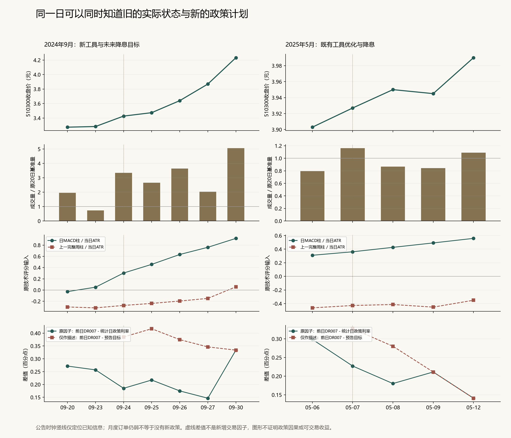

# 政策公告能否加入宏观与技术评分：实际核对结果

**政策预告确实是上一轮实际状态因子未表达的信息，但本地资料仍不足以准入新的政策分值。原14因子联合评分的失败保持，不能据2024年9月一段行情补一个利好分。** 本轮完成全部24节点原文/时钟、490目录、3488日、四原案例240行和61分段/49正式上涨的连接；不是新的金融回测。

## 一、上涨启动前后，具体知道什么

2024年9月23日收盘3.283元；当时已公布的新订单是8月48.9，较前次−0.4个百分点，融资余额五日变化约−0.92%。日MACD柱已经转正，上一完整周柱仍负。这些是较早的量价修复与尚弱的实际宏观状态，不能预先使用翌日政策。

9月24日收盘3.427元，相对9月23日上涨约4.39%；成交量约为原20日基准的3.338倍，日柱继续走强，上一完整周柱仍负。09:19:36的已存发布会段落已预告7天政策利率从1.7%降至1.5%，11:42:50前已补充5000亿元互换便利及3000亿元回购增持再贷款的首期金额。月度新订单仍是48.9，两类信息可以同时成立。

当天原资金因子是已可知的9月23日DR007 1.885%减统计日政策利率1.7%，得到+0.185个百分点。若只为说明而减去未来目标1.5%，差值反而变成+0.385个百分点。后者换了经济含义，不能把因子上升自动解释成更紧或更松，也不能把两个差值混作同一时间序列。

9月27日政策实际生效；原R02载体仅日期精度，保守来源上界23:59:59，不能凭这份材料在同日16:00确认细节。原因子该日仍匹配9月26日DR007和统计日1.7%利率，是既定滞后合同；9月30日已使用1.5%。本轮没有识别到原因子实现错误，不用公告目标覆盖统计日利率。

原保存评分在9月24日：纯技术估计胜率57.80%、估计p×B=0.8269；宏观联合估计胜率48.88%、估计p×B=0.6839。两者都未满足原p×B>1门。没有重新计算增加政策后的分数，也没有证明它能把这次漏掉的启动变为有效信号。

2025年5月7日是另一种信息：预告1.5%降至1.4%，优化两项既有工具并打通原8000亿元额度，不是新增8000亿元。最新4月新订单49.2、月变−2.6；日柱正、上一完整周柱负。5月8日实施已可知，但原DR007因子仍取5月7日统计值及其1.5%利率；5月9日才随新统计日确认1.4%。同日还已盘前确认中美会谈，5月12日有新增谈判进展，不能把全段收益归给降息。

5月6日政策尚未公布时，原纯技术已估计p×B=1.0943，联合模型为0.3234；5月7日仍相同。两模型差异早于本条公告，因此“漏了新闻”不足以解释所有差距。评分门满足也不是实际成交，实际账户另看R192保存账本。

图中上一完整周柱按当日ATR归一化，数值可随ATR变化；并未使用正在形成的一周。宣布日竖线不代表买点。两段固定日历只解释来源时钟，不测其新增收益。

2015、2019和2020的三个原固定案例在这套2024—2025政策链之外，全部180行保留为覆盖未知，没有给它们补0分或套入2024政策。原2024案例60行也完整保留，不只选择上涨日。

## 二、反例与旧金融结果保持

下表全部复用原七次历史研究的固定20日压力费用往返算例。每行是独立10万元事件示例，原算例退出为第20个后续交易日开盘；不能相加为组合、不能作为新账户夏普。

|首次宣布日|政策类型|公布前最新新订单|原20日费用后收益|
|---|---|---:|---:|
|2022-01-17|一般政策利率下调|49.7|-3.74%|
|2022-08-15|一般政策利率下调|48.5|-3.04%|
|2023-06-13|一般政策利率下调|48.3|+1.80%|
|2023-08-15|一般政策利率下调|49.5|-2.10%|
|2024-07-22|一般政策利率下调|49.5|-4.28%|
|2024-09-24|新设股票融资工具|48.9|+14.31%|
|2025-05-07|优化既有股票工具|49.2|+1.47%|

五次一般降息有4次为负，均值-2.27%；新设股票融资工具与优化既有条款只有两次，且行情已在此前研究中看过。2024较晚按旧利率记录日入场、使用同一退出日的原收益为−0.4785%，早起点+14.3087%；这说明时点重要，不构成新的独立验证。

旧资本市场支持工具固定20日完整账户压力夏普0.6896、年化4.61%、最大回撤7.20%，主方案三个完成机会，首笔约80.4%净盈利。账户采用旧242日年化/旧仓位合同，不能与R192的252日/50%上限账户混算；两个账户都未达各自目标。

LPR预期已有实际探索训练204次逐次拟合、五个最终模型和14个含基准的账户，候选往返交易0、未达目标；不降低门槛制造机会。PMI正意外账户压力夏普−0.6347、年化−2.2047%，加生产/订单条件后的压力夏普−1.0664，均保持拒绝。

操作量×资金压力旧主方案基础夏普−0.2264、压力−0.1753，旧16候选全部结果保留。这里的操作量不是净投放，也不是政策共识。另一个名为direct_policy_utility的旧研究学习的是交易动作的风险收益效用，其policy并非政策新闻分类；不能据名字把它当作已检验本轮预告目标。

## 三、当前来源为什么不能直接变成政策分值

24个节点对应20份不同已存原件、六条链；24个节点的事前政策共识状态全部为UNKNOWN。同一工具的宣布、申请、操作、执行进度不能伪装成24个独立政策试验。已存网页只能认证保存字节及定位，历史首版和全市场最早公开时点未认证。

490条固定官方目录记录全保留，但目录不是全部政策母集，跨来源去重/多动作拆分未完成，而且年终目录日期不能代替历史可知时钟。即使某日没有这24条节点，也不能标记为政策无变化。

LPR调查资料有84个月槽、56个月已保存调查、28个月缺失；各期限精确金额支持还不同。它测量贷款市场报价利率，不能当作7天逆回购目标的事前共识，更不能从LPR的少数超预期月份转交股票方向。

专属融资、实际净股票购买和净delta暴露的连接仍缺失。政策额度、申请、融资操作、账面股票价值不能直接视为新增510300净买入；本轮不重新翻同样报告补一个数。

## 四、裁决与下一步

TECH.R193登记、TECH.R194实际关闭本次政策评分准入：接受预告目标与实际状态是不同信息；接受把政策公告、已生效状态和市场预期分开保存；拒绝用选择链和缺失预期直接追加政策分值。只关闭此提案，不宣称所有宏观或政策机制无效。

若要进入下一数值实验，需要先有一个明确、可覆盖的公告系列及其当时原件/版本钟；若声称政策意外，还必须是同工具的事前共识。随后固定一个原研究未做过的完整用途、未知处理、成交流程和同账户比较，先解释全部上涨与失败，再一次检验。当前没有登记下一源申请或待跑金融候选，不自动换一套阈值营救。

原14因子用途已失败，原A/POINT策略与1008真实交易日前瞻协议不变。当前目标服务active、目标未完成；本轮0新账户/0拟合/0新股票标签/0网络请求，新夏普与收益NOT_COMPUTED，独立验证和去过拟合未建立。2026资金/融资缺失与原覆盖未知均保持，不用政策目录补成空仓或市场判断。

首次核对的Parquet保存因元数据amount数值/空字符串混合失败，原代码、协议和错误保留；只增加隔离格式适配，未修改任何来源钟、数值特征、规则或原金融结果。

文件入口：`protocol.json`、`format_adapter_protocol.json`、`summary.json`及`results/`全部CSV/Parquet。实际金融最近仍是TECH.R192；本次来源裁决不是收益改善。
