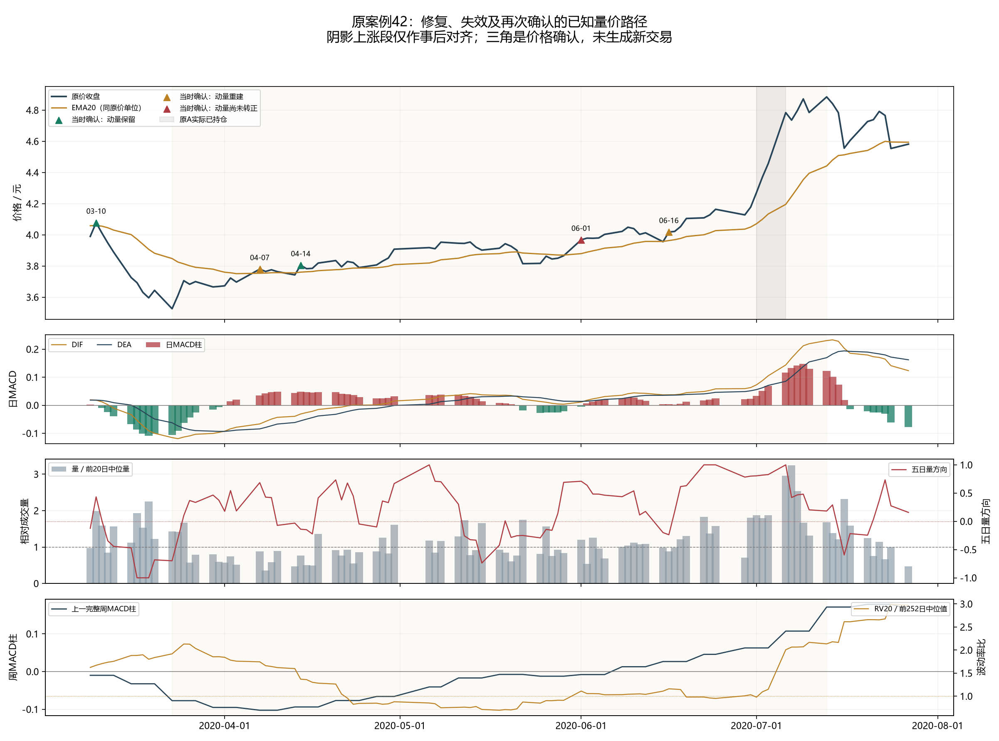
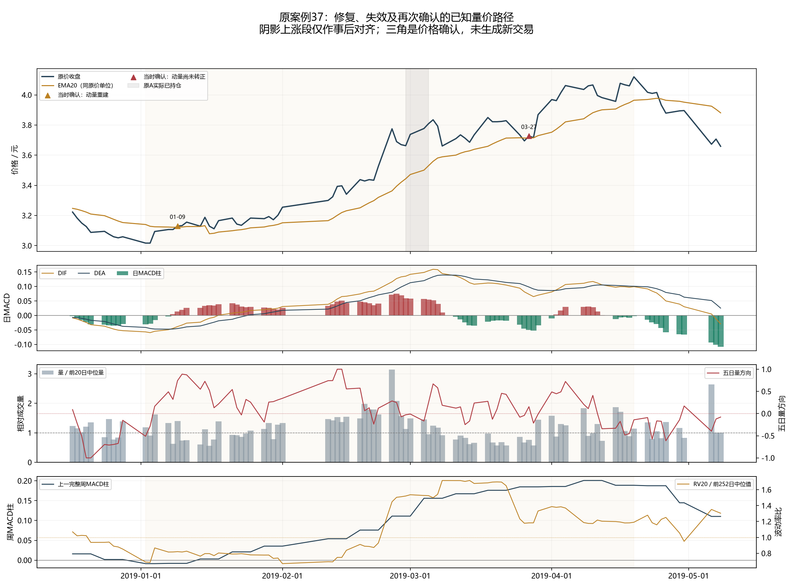
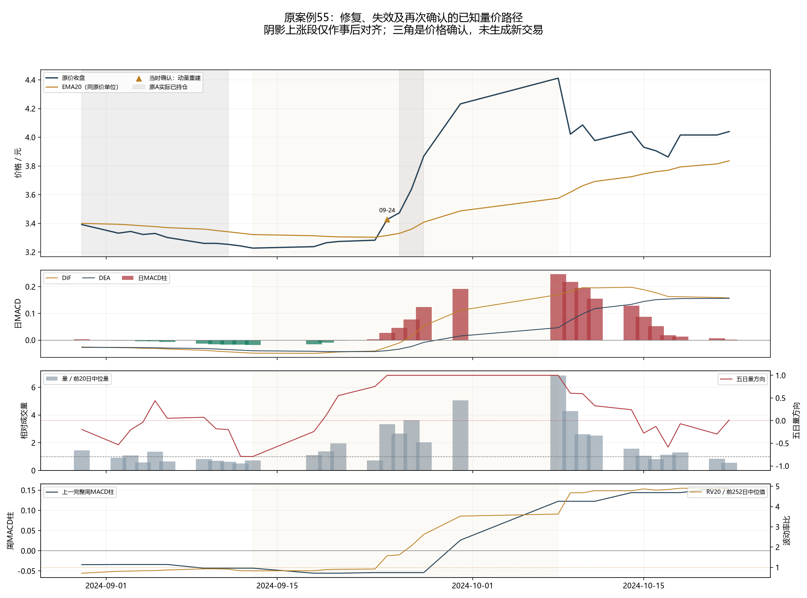
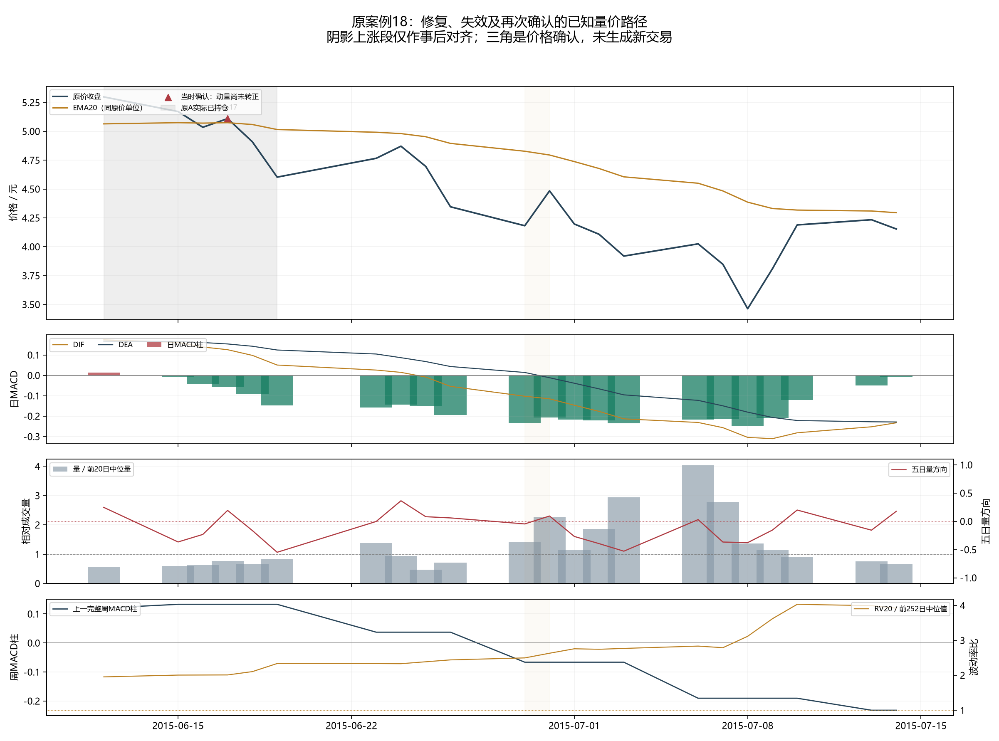

# 从具体上涨到全体修复、失效与再次确认

本轮完成TECH.R162路径解释，没有运行新策略账户，也没有提高已验证收益或夏普。全体动量保留再次确认的旧20日正结果比例62.07%，原实际价格对照交易胜率只有31.03%，平均净回报−0.18%、pB0.577；机械再次确认不足以支持新的高质量入场方案。

## 解释口径

先逐日生成只含当时字段的路径，再连接旧结果。当前3488日、2015起187价格确认全保留，其中原186成熟20日标签原样复用，另1尾部没有旧标签，不造新标签。原价格对照187实际周期保留186完成/1开放。只有既定动量路径一种分层，三原时期及全体一并报告；量、周线、波动仅展示原值，未搜索组合或阈值。

动量保留：当前MACD正段从上次价格确认之前开始，穿过此后价格跌回EMA20的失效而未中断；动量重建：MACD中途非正后再次转正；动量尚未转正：当前柱仍<=0。首个已知确认/连续性未知单列，未知中断关系，不能用两个正端点代替全路径。

## 2020：早修复与后段展开的不同状态

下表收益来自R161已有纯价格对照的实际周期，份额/费用/风险路径属于该原账户；不是新独立策略、不能与严格顺序账户或原A收益相加。

| 当时确认 | 动量路径 | 五日量方向 | 上一完整周MACD柱 | 原实际进入→退出 | 原周期净回报 |
|---|---|---:|---:|---|---:|
| 2020-04-07 | 动量重建 | 0.685 | -0.1025 | 04-08→04-14 | -0.45% |
| 2020-04-14 | 动量保留 | -0.139 | -0.0938 | 04-15→05-25 | -0.14% |
| 2020-06-01 | 动量尚未转正 | 0.710 | -0.0080 | 06-02→06-16 | +0.40% |
| 2020-06-16 | 动量重建 | -0.238 | 0.0266 | 06-17→07-27 | +13.65% |

4月7日是早段MACD重建、量方向正但周柱负，4月13日价格失效。4月14日再次确认时日MACD正柱仍保留，量方向却为负，相对量0.76；该原交易次开进入至5月25日，净−0.14%，不是后段赢家。6月1日价格已突破前20日最高收盘，日柱略负、量方向正、周柱接近零但仍负；原周期净+0.40%。6月16日再确认的周柱已正、日MACD重新为正，五日量方向仍负；原周期6月17日至7月27日净+13.65%。这一个实例不能支持把周柱正或量方向负反选为盈利过滤。

原A在上述四个确认原点均库存0/目标0；波段内仍于6月30日给出正目标，7月1/2/3/6日实际持仓，共4/75个波段收盘。应描述为覆盖短且时点不同，不能描述为完全没有参与。

## 全体分层能否支持点位质量

| 动量路径 | 旧20日标签数 | 旧标签胜率 | 旧标签pB | 原实际完成周期数 | 原周期胜率 | 原周期平均净回报 | 原周期pB |
|---|---:|---:|---:|---:|---:|---:|---:|
| 动量保留 | 29 | 62.07% | 0.619 | 29 | 31.03% | -0.18% | 0.577 |
| 动量重建 | 63 | 47.62% | 0.455 | 64 | 23.44% | 0.23% | 0.893 |
| 动量尚未转正 | 93 | 48.39% | 0.553 | 92 | 17.39% | -0.49% | 0.469 |

当时187事件为保留29、重建64、未正93、无上次确认1。三个常规组全体原实际pB均<1，不能仅因旧标签正比例较高晋级。2024—2026重建组原实际pB1.709，但2015—2019/2020—2023分别0.843/0.516；不得选择有利时期。全部40预定单元含空值一并保存，没有分组独立账户或策略夏普，也没有本轮置信区间/显著性检验。原账户子集的现金和份额路径会与独立分组策略不同，本结果不证明一个尚未运行的新独立策略必然亏损。

## 上涨段与原A实际覆盖

原61分段原admitted/status完全保留，正式49完整上涨段中：15段上涨区间没有原A库存，18段没有正目标，7段没有区间内EMA20价格确认。187确认中60个已有A库存或正目标，其余127个两者均无。这些是回顾覆盖事实，不是127可盈利新增点位。

2019波段原A实际持仓4/72收盘（2月28日、3月1/4/5日），两次价格确认原点均库存0/目标0。2024九月波段A持仓3/11收盘、正目标4日，9月24日虽库存0却已有正目标；已有意图与执行库存分别保留。2015六月短反弹原区间只有两个收盘，没有EMA价格确认；放量回升与事后达到5%仍不能当作持续趋势。

## 接受、拒绝及下一步

接受阶段时差、全体再确认分层、标签与实际退出差、原A覆盖短及部分上涨没有均线再确认等事实。拒绝将动量保留本身、20日标签62.07%胜率、2020后段赢家或2024有利组直接认定为更好的策略；不调整已终态R161的持有期或放宽顺序救回。

下一解释应覆盖价格已经站在均线上方之后的趋势展开，而不是只在原187个均线再确认点继续筛选。先核对旧RANGE20_BREAK、5%方向确认、压缩/回踩/供给与价量相关等完整用途，保留其固定失败；原49段的已确认阶段、区间内全部既有突破/量价扩张时点及失败对照都要显示，不能用事后高低点定义候选。实质不同机制成立前，不登记金融实验。当前下一金融候选0、独立证据未建立，真实前瞻保持。

三测试最终通过；初次前缀测试因未知天数None/NaN编码不同失败，已保留原实现和失败；登记前改为明确Int64空值，不改分类或放宽断言。四实际前缀与28冻结来源通过，四图已查看，0新账户/拟合/训练标签/采集。全部历史仍开发，首版未认证，全球DSR/PBO未算，完整目标未达。

[当时已知确认与A覆盖](results/全部价格确认_当时路径与A已知覆盖.csv) · [原20日标签与尾部未知](results/原186结果与尾部未知_仅事后解释.csv) · [原实际周期](results/原纯价格实际周期_路径归因而非新策略.csv) · [全部分层](results/动量路径分层_旧标签及原实际周期全部报告.csv) · [原61分段覆盖](results/原上涨段全集_完整路径及A覆盖回顾.csv) · [四案例逐日原值](results/四案例逐日原值_只作回顾图示.csv) · [唯一解释合同](protocol.json)
