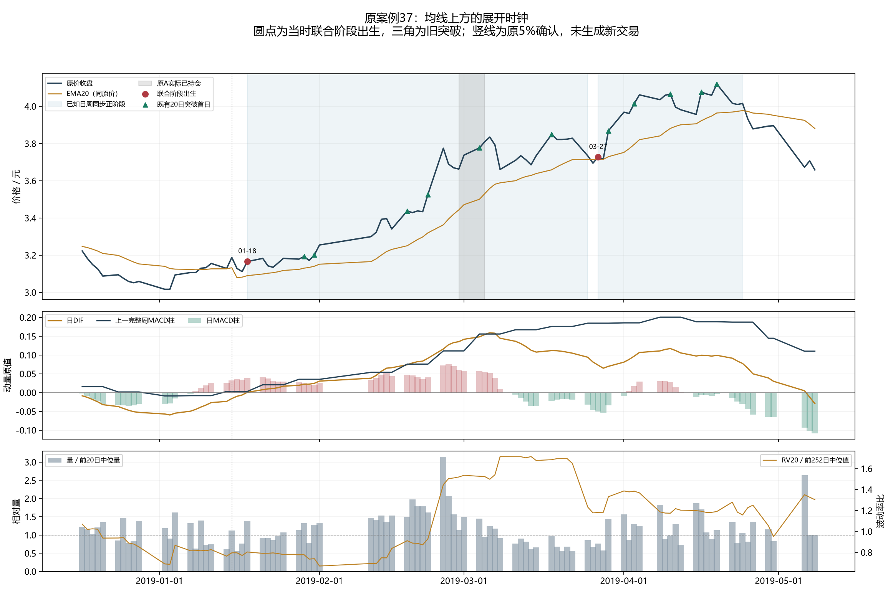
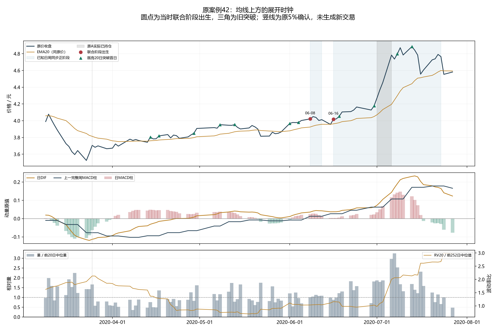
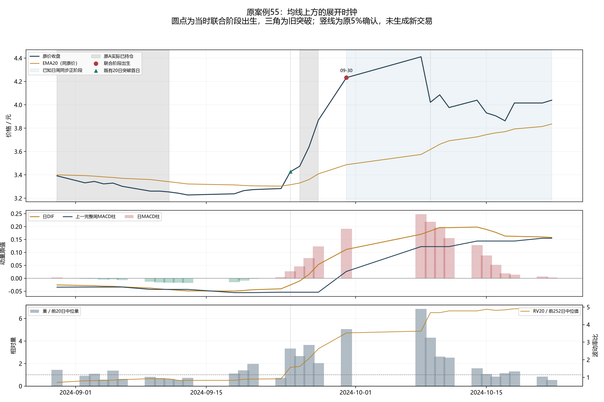
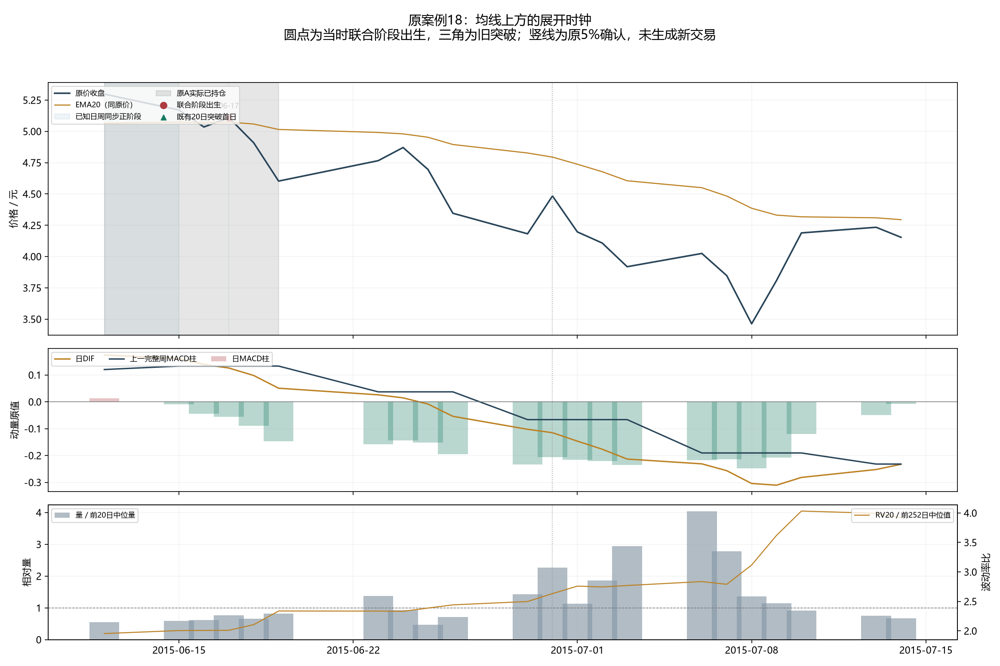

# 日周展开阶段解释：具体上涨、失败与当时识别时钟

本轮按用户“先解释具体上涨段的量价和指标，再反推能提前识别的点位”推进。解释完成，但**不能把指标同时转强称作高质量进场优势**：2015年以来共有85次当时可识别的联合阶段出生，原20日结果标签正比例45.88%、平均净参考回报−0.0083%、p×B=0.539。这里的标签仍是原固定20日参考结果，不是新阶段退出账户的胜率或夏普。

范围与定义已在[唯一协议](protocol.json)中固定，再连接既有结果。全部3488日线先生成当时阶段；2015起2855原点、原2846标签中的2826成熟及20末期未知全部保留，新增尾部9原点没有旧标签，未填造结果。原61分段、49正式上涨段不重分。上涨段低高点只用于图示对齐，不能用于信号计算。

## 先解释四条实际价格路径

**2019春季：修复先于完整展开。** 2019-01-18收盘3.166元，已经高于原EMA20；日DIF刚转正至0.000879，上一完整周2019-01-11的MACD柱为0.003062，三项第一次同时成立。相对量1.391倍、五日量方向0.218、原波动率比0.804，不是必须大幅放量或高波动才可确认的案例。它同时是原20日突破状态首日，却不是当天均线上穿。原A当日库存和已知目标均为0。后续3月26日价格跌回均线下、3月27日再次回到联合正阶段；3月27日的日MACD柱为负，日DIF仍为正。**DIF正与柱正表达不同状态**，不能互换，也不能据后面的上涨把负柱删掉。

**2020春夏：早段修复与六月后段不是同一进场。** 2020-06-08收盘4.022元，日DIF0.035693，上一完整周2020-06-05柱0.012836；上周柱的更新使日周第一次同时正，价格此前已在均线上方。相对量1.010倍、量方向0.436、波动率比1.033，原突破状态已成立，但该日不是突破首日。6月15日价格条件失效；6月16日再确认时日DIF0.037342、上一周柱0.026600均正，日柱只有0.003056、量方向却为−0.238。已保存纯价格账户的六月后段赢家来自6月17日至7月27日，不是四月早段交易的收益，也不能仅据这个赢家要求量方向为负。

**2024九月：完整周确认有实际延迟。** 2024-09-30收盘4.233元，日DIF0.111594，上一完整周2024-09-27柱0.026454，此时联合阶段才第一次成立；相对量5.058倍、量方向1.000、波动率比3.529。原价格已较事后低点上涨约31.13%，这个涨幅只用于说明确认迟到，不进入实时条件。该日并非原价格上穿、突破或放量首日。次交易日为10月8日，能否买到须由真实开盘限价、费用和风险账户判断，不能把9月末收盘当可成交入场。

**2015六月：两项MACD偏强仍会迅速失败。** 2015-06-17收盘5.110元，日DIF0.125920、上一完整周2015-06-12柱0.133182均正；日柱已是−0.056322，相对量0.762倍、波动率比2.011。当时也发生价格再确认，但随后价格失效、日周状态转弱，六月末的短反弹没有重建本联合阶段。原A当日已有10300份、约24.79%暴露，已知目标25.81%。这种库存事实不能被描述成完全未参与，也不能从失败案例事后加波动率门槛。

四图及逐日原值如下；蓝色区间为当时联合阶段，红点为联合阶段出生，绿三角为既有突破首日，灰色为原A实际持仓，竖线是原5%确认。图中尚未生成新策略交易：

## 全体事件保留后得到什么

当时可用字段只取既有EMA20、日MACD12/26/9的DIF，以及上一完整周MACD柱。价格在均线上时分日/周正或非正四象限；均线下和未知各单列。当前三项同时正，且前一原点已知但未全部正，才叫出生；预热初始正状态或未知恢复不会伪造出生。周值必须来自本周开始前已完成的一周。

同时把原20日突破状态第一次成立、原相对量至少1.5倍第一次成立作为观察通道，全体事件都保留；**没有据三个通道的结果选择策略**。

|既有事件|全体事件/成熟旧标签|旧20日正比例|旧标签平均净参考回报|旧标签p×B|
|---|---:|---:|---:|---:|
|日周联合阶段出生|85 / 85|45.88%|−0.0083%|0.539|
|原20日突破首日|182 / 182|52.75%|0.4362%|0.570|
|原相对量扩张首日|275 / 274|52.19%|0.2365%|0.532|

联合阶段的较早/2020—2023/2024—2026标签p×B分别0.481/0.827/0.374，最近组平均−0.5892%。放量最近组旧标签较好仍不满足p×B>1，且较早和中段不同；没有挑最近组、切换通道、修改原阈值或拼接赢家。原20日标签的平均、胜率与新持有失效策略不能相互替代。

## 从解释到金融检验的固定边界

在读取这些旧标签结果前，协议已写明唯一未来完整用途：**JOINT_PHASE_START，在联合阶段出生后的次真实开盘尝试；持有时任一条件在已知收盘不再成立则次合法开盘退出，风险只减，不设置2R或20日到期。** 未知本身不迫使卖出，不据旧标签挑另一个政策。该用途与已失败的严格量正段→日柱正段→均线上穿顺序不同，也不是旧MA60连续确认、周牛状态的20日突破/ATR加仓退出、压缩或突破回踩的参数改写。

这只说明有一个已事先声明的不同完整用途可检验，不能宣布其有效。后续金融登记/结果单独放在[日周展开完整账户目录](../510300_trend_expansion_phase_study_v1/)，使用原20万元、共同两费用/两时期、相同现金股息风险和全日历收益口径，对照原A和原纯价格政策。旧20日标签失败保留，不把它改成未经声明的金融入组门；完整政策最终也必须满足收益、夏普、回撤、实际p×B及稳定性门。

解释层实际执行三项必要测试、三个真实前缀核对、28项冻结来源和四图查看，新增拟合、训练标签、金融账户、行情请求均为0。首版历史数据未认证、所有历史已被用于开发，独立验证未建立。全局DSR/PBO未计算，去过拟合与提高收益夏普目标均不能因本解释宣布完成。

直接结果：[实际解释摘要](summary.json)、[全体原值事件](results/全部展开突破与放量事件_当时原值.csv)、[全部时期旧标签诊断](results/三类原事件_全时期旧标签诊断.csv)、[四案例逐日原值](results/四案例逐日阶段原值_只作回顾对齐.csv)、[原61段展开覆盖](results/原61分段_确认之后完整展开覆盖.csv)。
