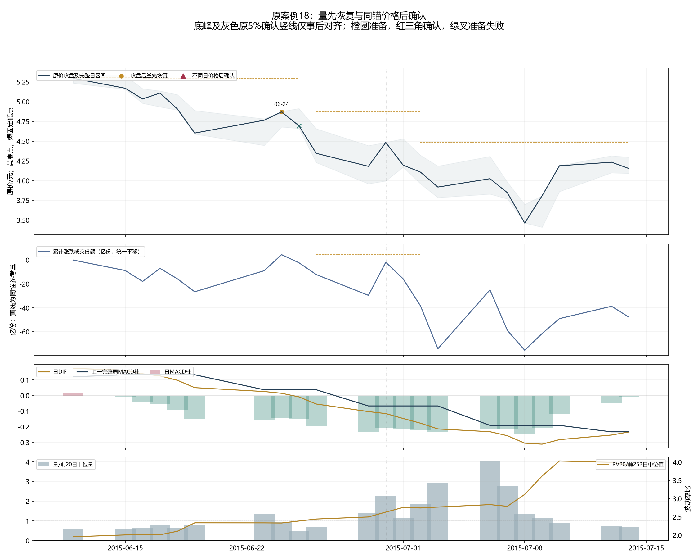
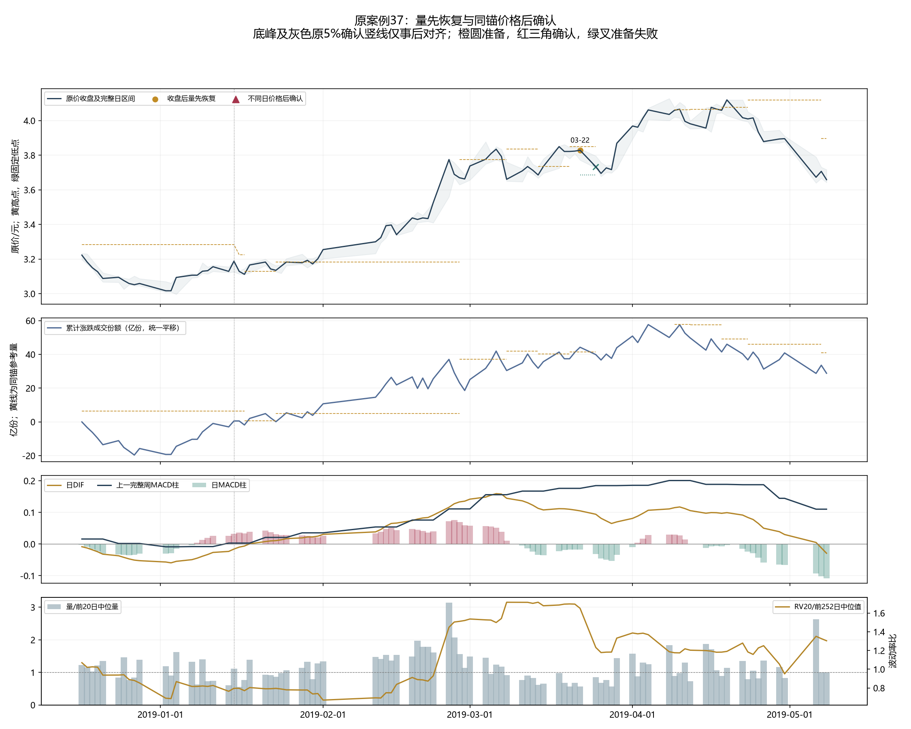
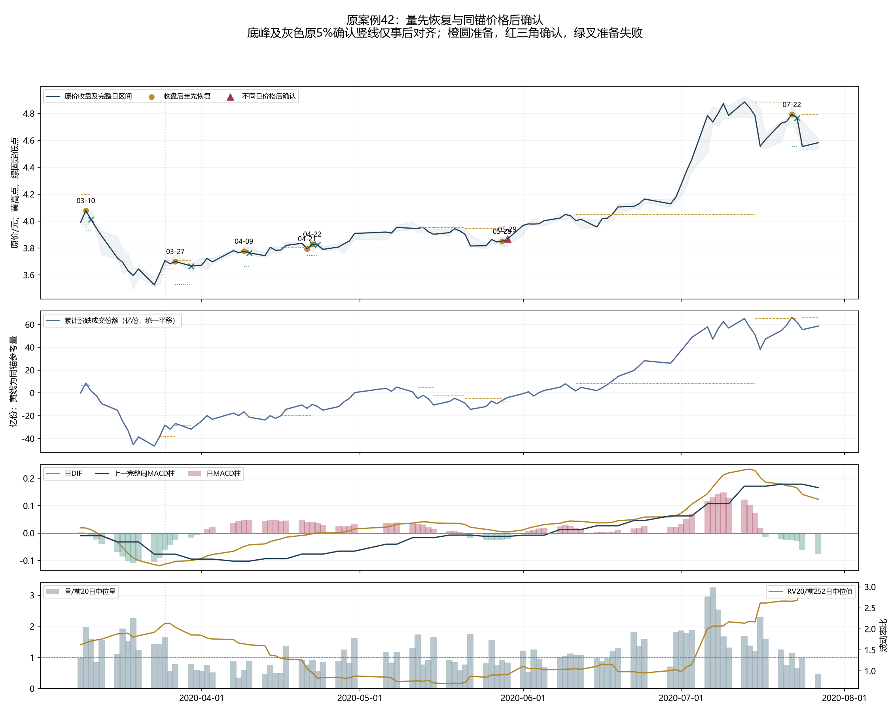
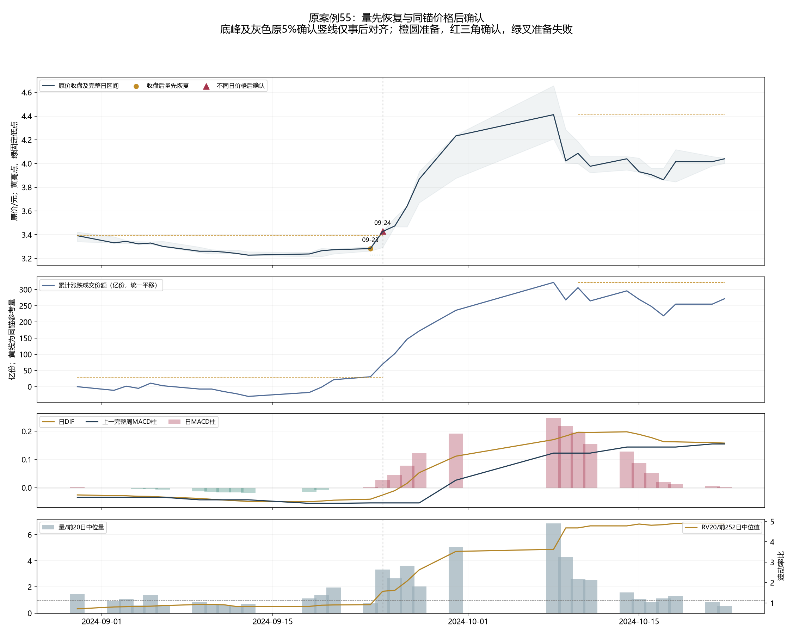

# 具体上涨量价解释：累计量先恢复、价格后确认

完整用途在新状态计算和结果连接前固定，下面先展开原案例与所有失败。本文件没有新金融账户，不能报实际交易胜率或夏普。

累计线为涨日加真实成交份额、跌日减、平日不变，方向按已发生分红现金平移；量恢复不能当成主动买单、资金净流入或上涨原因。参考高点中心日后两日才可知。日周MACD、相对量和波动均为观察，不选门槛过滤。

## 原案例18：2015-06-29至2015-06-30

原底峰涨幅7.22%、5%确认日2015-06-30只用于事后定位。原前后各10交易日窗口中的全部准备与确认如下。

| 收盘日期 | 阶段 | 参考高点中心/当时确认 | 当前收盘 | 同锚高价 | 固定低点 | 量超参考/百万份 | 相对量 | 日DIF | 日柱 | 上周柱 | RV比 |
|---|---|---|---:|---:|---:|---:|---:|---:|---:|---:|---:|
| 2015-06-24 | 量先恢复 | 2015-06-12/2015-06-16 | 4.871 | 5.298 | 4.603 | 449.448 | 0.935 | +0.014746 | -0.144007 | +0.037162 | 2.333 |

2015-06-24处于原底峰上涨之前，日柱负、上一完整周柱非负，相对量0.935、RV比2.333。只是准备，尚无进场确认。这些背景不能反过来证明量领先有效，后来的底峰涨幅不是本点位的实际回报。

失败准备也保留：2015-06-24准备在2015-06-25以VOLUME_LEAD_LOST_BEFORE_CONFIRM结束，未产生价格确认。

## 原案例37：2019-01-02至2019-04-19

原底峰涨幅39.13%、5%确认日2019-01-15只用于事后定位。原前后各10交易日窗口中的全部准备与确认如下。

| 收盘日期 | 阶段 | 参考高点中心/当时确认 | 当前收盘 | 同锚高价 | 固定低点 | 量超参考/百万份 | 相对量 | 日DIF | 日柱 | 上周柱 | RV比 |
|---|---|---|---:|---:|---:|---:|---:|---:|---:|---:|---:|
| 2019-03-22 | 量先恢复 | 2019-03-18/2019-03-20 | 3.829 | 3.850 | 3.686 | 285.311 | 0.567 | +0.104977 | -0.018108 | +0.176042 | 1.651 |

2019-03-22处于原上涨分段内，日柱负、上一完整周柱非负，相对量0.567、RV比1.651。只是准备，尚无进场确认。这些背景不能反过来证明量领先有效，后来的底峰涨幅不是本点位的实际回报。

失败准备也保留：2019-03-22准备在2019-03-25以VOLUME_LEAD_LOST_BEFORE_CONFIRM结束，未产生价格确认。

## 原案例42：2020-03-23至2020-07-13

原底峰涨幅38.54%、5%确认日2020-03-25只用于事后定位。原前后各10交易日窗口中的全部准备与确认如下。

| 收盘日期 | 阶段 | 参考高点中心/当时确认 | 当前收盘 | 同锚高价 | 固定低点 | 量超参考/百万份 | 相对量 | 日DIF | 日柱 | 上周柱 | RV比 |
|---|---|---|---:|---:|---:|---:|---:|---:|---:|---:|---:|
| 2020-03-10 | 量先恢复 | 2020-03-05/2020-03-09 | 4.078 | 4.200 | 3.933 | 186.018 | 1.983 | +0.018313 | +0.000045 | -0.009953 | 1.669 |
| 2020-03-27 | 量先恢复 | 2020-03-25/2020-03-27 | 3.700 | 3.706 | 3.526 | 135.890 | 0.787 | -0.103551 | -0.026093 | -0.077174 | 2.036 |
| 2020-04-09 | 量先恢复 | 2020-04-07/2020-04-09 | 3.776 | 3.780 | 3.666 | 106.626 | 0.588 | -0.049391 | +0.047470 | -0.102531 | 1.644 |
| 2020-04-21 | 量先恢复 | 2020-04-14/2020-04-16 | 3.795 | 3.805 | 3.743 | 648.136 | 0.772 | -0.006678 | +0.041058 | -0.076810 | 1.045 |
| 2020-04-22 | 量先恢复 | 2020-04-20/2020-04-22 | 3.829 | 3.835 | 3.743 | 52.914 | 0.922 | -0.002323 | +0.039815 | -0.076810 | 0.957 |
| 2020-05-28 | 量先恢复 | 2020-05-26/2020-05-28 | 3.850 | 3.863 | 3.815 | 52.874 | 0.929 | +0.004534 | -0.025173 | -0.012293 | 0.912 |
| 2020-05-29 | 价格后确认 | 2020-05-26/2020-05-28 | 3.866 | 3.863 | 3.815 | 303.793 | 0.833 | +0.003780 | -0.021344 | -0.012293 | 0.910 |
| 2020-07-22 | 量先恢复 | 2020-07-13/2020-07-15 | 4.792 | 4.885 | 4.556 | 110.094 | 1.148 | +0.170601 | -0.025215 | +0.178317 | 2.656 |

2020-03-10处于原底峰上涨之前，日柱非负、上一完整周柱负，相对量1.983、RV比1.669。只是准备，尚无进场确认。这些背景不能反过来证明量领先有效，后来的底峰涨幅不是本点位的实际回报。

2020-03-27处于原上涨分段内，日柱负、上一完整周柱负，相对量0.787、RV比2.036。只是准备，尚无进场确认。这些背景不能反过来证明量领先有效，后来的底峰涨幅不是本点位的实际回报。

2020-04-09处于原上涨分段内，日柱非负、上一完整周柱负，相对量0.588、RV比1.644。只是准备，尚无进场确认。这些背景不能反过来证明量领先有效，后来的底峰涨幅不是本点位的实际回报。

2020-04-21处于原上涨分段内，日柱非负、上一完整周柱负，相对量0.772、RV比1.045。只是准备，尚无进场确认。这些背景不能反过来证明量领先有效，后来的底峰涨幅不是本点位的实际回报。

2020-04-22处于原上涨分段内，日柱非负、上一完整周柱负，相对量0.922、RV比0.957。只是准备，尚无进场确认。这些背景不能反过来证明量领先有效，后来的底峰涨幅不是本点位的实际回报。

2020-05-28处于原上涨分段内，日柱负、上一完整周柱负，相对量0.929、RV比0.912。只是准备，尚无进场确认。这些背景不能反过来证明量领先有效，后来的底峰涨幅不是本点位的实际回报。

2020-05-29处于原上涨分段内，日柱负、上一完整周柱负，相对量0.833、RV比0.910。价格确认收盘后才知，最早次开尝试。这些背景不能反过来证明量领先有效，后来的底峰涨幅不是本点位的实际回报。

2020-07-22处于原上涨分段之后，日柱负、上一完整周柱非负，相对量1.148、RV比2.656。只是准备，尚无进场确认。这些背景不能反过来证明量领先有效，后来的底峰涨幅不是本点位的实际回报。

失败准备也保留：2020-03-10准备在2020-03-11以VOLUME_LEAD_LOST_BEFORE_CONFIRM结束，未产生价格确认。

失败准备也保留：2020-03-27准备在2020-03-30以VOLUME_LEAD_LOST_BEFORE_CONFIRM结束，未产生价格确认。

失败准备也保留：2020-04-09准备在2020-04-10以VOLUME_LEAD_LOST_BEFORE_CONFIRM结束，未产生价格确认。

失败准备也保留：2020-04-21准备在2020-04-22以REPLACED_AFTER_LEAD结束，未产生价格确认。

失败准备也保留：2020-04-22准备在2020-04-23以VOLUME_LEAD_LOST_BEFORE_CONFIRM结束，未产生价格确认。

失败准备也保留：2020-07-22准备在2020-07-23以VOLUME_LEAD_LOST_BEFORE_CONFIRM结束，未产生价格确认。

## 原案例55：2024-09-13至2024-10-08

原底峰涨幅36.68%、5%确认日2024-09-24只用于事后定位。原前后各10交易日窗口中的全部准备与确认如下。

| 收盘日期 | 阶段 | 参考高点中心/当时确认 | 当前收盘 | 同锚高价 | 固定低点 | 量超参考/百万份 | 相对量 | 日DIF | 日柱 | 上周柱 | RV比 |
|---|---|---|---:|---:|---:|---:|---:|---:|---:|---:|---:|
| 2024-09-23 | 量先恢复 | 2024-08-26/2024-08-28 | 3.283 | 3.394 | 3.228 | 126.602 | 0.736 | -0.040757 | +0.003830 | -0.053959 | 0.917 |
| 2024-09-24 | 价格后确认 | 2024-08-26/2024-08-28 | 3.427 | 3.394 | 3.228 | 4045.118 | 3.338 | -0.026019 | +0.026645 | -0.053959 | 1.574 |

2024-09-23处于原上涨分段内，日柱非负、上一完整周柱负，相对量0.736、RV比0.917。只是准备，尚无进场确认。这些背景不能反过来证明量领先有效，后来的底峰涨幅不是本点位的实际回报。

2024-09-24处于原上涨分段内，日柱非负、上一完整周柱负，相对量3.338、RV比1.574。价格确认收盘后才知，最早次开尝试。这些背景不能反过来证明量领先有效，后来的底峰涨幅不是本点位的实际回报。

## 全体、失败与下一步

全部3488日、2015起2855原点；全历史434个高点锚、151次量先恢复、53次价格后确认。全部锚终态{'REPLACED_BEFORE_LEAD': 282, 'VOLUME_LEAD_LOST_BEFORE_CONFIRM': 59, 'CONFIRMED_PRICE_AFTER_VOLUME': 53, 'REPLACED_AFTER_LEAD': 20, 'FIXED_LOW_FAILED_BEFORE_CONFIRM': 19, 'OPEN_UNARMED': 1}。49正式上涨中31段底峰间无确认，35段5%确认至峰间无确认，不能称全部上涨启动的共同规律。

累计量先严格超过已确认高点中心日的累计量、价格仍低于高点且高于已确认低点；固定准备时低点。准备后的不同日价格严格超过同一高点、量仍超过，消耗确认。准备前后新高点替换旧锚；准备后到/低于固定低点或参考量则消耗失败，不重试。空仓次真实开一次、开盘到/低于固定低点或坐标未知取消。持有固定低点、高点和参考累计量，已知收盘到/低于低点，或量到/低于参考且价格到/低于原高点共同失效，次合法开退出；未知本身不出、原风险只减，无加仓/抬线/目标/时间退出/期末清仓/指标过滤或混A。

所有旧标签/固定失效路径只解释，不代表实际交易净收益；持有中减仓、取消次开、重叠信号、股息和订单成本必须在4原口径完整账户中测量。下一步只允许这一完整用途的唯一开发测量，旧失败不重跑、不按案例量比或MACD改过滤。

现有历史DEVELOPMENT_CALIBRATION，first-vintage NOT_CERTIFIED，独立NOT_ESTABLISHED/global DSR/PBO NOT_COMPUTED，尚不能称提高收益夏普或去除过拟合。

基础公式来源：[TradingView官方OBV说明](https://www.tradingview.com/support/solutions/43000502593-on-balance-volume-obv/)。其说明支持基础公式及分析思路，510300有效性由项目实验决定。
